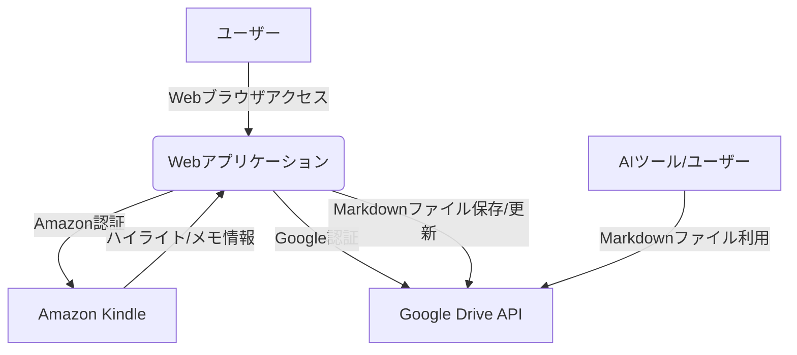

### 1. はじめに

#### 1.1. プロジェクトの背景
多くの読書家がKindleを利用して電子書籍を読み、重要な箇所にハイライトを付けています。これらのハイライトは知識の集約であり、再利用価値が高い情報です。しかし、Kindle標準機能だけでは、これらの情報を外部で活用しやすい形で一元管理し、特にAIによる分析や要約に適した形式で蓄積することが困難です。

#### 1.2. プロジェクトの目的
本プロジェクトは、ユーザーがKindleで行ったハイライトとメモを自動的に抽出し、構造化されたMarkdown（.md）形式のファイルとしてGoogle Driveの指定フォルダに保存するWebアプリケーションを開発することを目的とします。生成されるMarkdownファイルは、書籍ごとに1つのファイルとして管理され、読書の進捗に合わせて追記・更新されます。また、その内容はAIによる処理を容易にするため、一貫性のある構造を持つものとします。

#### 1.3. 期待される効果
*   Kindleハイライトの手動による転記作業の撤廃と効率化。
*   Google Driveを通じたマルチデバイスでのハイライト情報へのアクセス性向上。
*   AIによる書籍内容の要約、分析、知識抽出などが容易になる、構造化されたデータセットの構築。
*   読書から得た知識の長期的な保存と活用促進。

### 2. 用語定義

| 用語             | 説明                                                                 |
| ---------------- | -------------------------------------------------------------------- |
| ハイライト       | Kindle上でユーザーがマーキングしたテキスト部分。                               |
| メモ             | Kindle上でハイライトに紐付けてユーザーが記述したコメント。                       |
| Webアプリケーション | 本プロジェクトで開発する、Kindleハイライト抽出・Google Drive保存機能を提供するシステム。 |
| ユーザー         | 本Webアプリケーションを利用するKindleユーザー。                                |
| Markdownファイル  | 「.md」拡張子を持つ、構造化されたテキストファイル。                              |
| Google Drive     | ユーザーがMarkdownファイルを保存する先のクラウドストレージサービス。                 |
| AIリーダブル     | AIが解釈しやすく、情報抽出や分析に適したデータの構造や形式のこと。                 |

### 3. システム概要

本システムは、ユーザーのAmazonアカウントとGoogleアカウントへの認証を通じて、Kindleのハイライト情報を取得し、指定された形式でMarkdownファイルとしてGoogle Driveに保存するWebアプリケーションです。**本アプリケーションはDockerコンテナとしてパッケージ化され、Google Cloud Run上でのスケーラブルな運用を前提として設計されます。**ユーザーはWebブラウザ経由で本システムにアクセスし、初期設定と同期状況の確認を行います。一度設定が完了すれば、ハイライトは定期的に自動同期されることを目指します。



### 4. 機能要件

#### 4.1. ユーザー認証機能
*   **FR1.1 Amazonアカウント連携:**
    *   ユーザーが安全にAmazonアカウント情報を入力し、Kindleのハイライト情報へのアクセス許可を行えること。
    *   Amazonの適切なリージョンを選択できること。
*   **FR1.2 Googleアカウント連携:**
    *   ユーザーが安全にGoogleアカウント情報を入力し、Google Driveへのファイル操作許可を行えること。
    *   必要なスコープ（ファイル作成、更新、フォルダ指定など）のみを要求すること。
*   **FR1.3 アカウント管理:**
    *   連携したAmazonアカウントおよびGoogleアカウント情報をユーザーが確認・解除できること。

#### 4.2. Kindleデータ抽出機能
*   **FR2.1 ハイライト・メモ取得:**
    *   ユーザーのKindleアカウントから、全ての書籍のハイライト及び関連するメモ情報を取得できること。
    *   これには書籍タイトル、著者名、ASIN/ISBN、ハイライトされたテキスト、ハイライト日時、メモ内容、位置情報（もし取得可能であれば）を含む。
*   **FR2.2 定期自動同期:**
    *   設定された間隔（例: 1日1回、6時間に1回など、ユーザーが選択可能）で、新規または更新されたハイライト・メモを自動的に取得できること。
*   **FR2.3 手動同期:**
    *   ユーザーが任意のタイミングで同期処理を開始できること。

#### 4.3. データ整形・Markdown生成機能
*   **FR3.1 書籍ごとのファイル生成:**
    *   各書籍ごとに1つのMarkdownファイル（例: `書籍タイトル.md`）を生成すること。ファイル名はユーザーが命名規則を設定できることが望ましい（例: `[書籍タイトル] - [著者].md`）。
*   **FR3.2 構造化されたMarkdown形式:**
    *   生成されるMarkdownファイルは、以下のようなAIリーダブルな構造を持つこと。
        *   **メタデータブロック（YAML Frontmatter形式を推奨）:**
            *   書籍タイトル
            *   著者
            *   ASIN/ISBN
            *   最終同期日時
            *   （任意）書籍の表紙画像URL（取得可能であれば）
        *   **ハイライトとメモのリスト:**
            *   各ハイライトは明確に区切られること。
            *   ハイライトされたテキストを引用形式（例: `> ハイライトされたテキスト`）で記述。
            *   ハイライト日時、位置情報（ページ番号など、取得可能であれば）を付記。
            *   ハイライトにメモが付随する場合、その直下にメモ内容を記述。
            *   例:
                ```markdown
                ---
                title: "書籍のタイトル"
                author: "著者名"
                asin: "B0XXXXXXXX"
                last_synced: "YYYY-MM-DD HH:MM:SS"
                ---

                ## ハイライトとメモ

                > これは最初のハイライトです。
                *日時: YYYY-MM-DD HH:MM*
                *位置: No.XXX*

                これは最初のハイライトに対するメモです。

                --- (区切り線)

                > これは二番目のハイライトです。
                *日時: YYYY-MM-DD HH:MM*
                *ページ: XX*

                --- (区切り線)
                ```
*   **FR3.3 追記・更新処理:**
    *   既存の書籍Markdownファイルがある場合、新規ハイライトはそのファイルに追記されること。
    *   ハイライトの順序は、Kindle内での出現順またはハイライト日時の昇順であることが望ましい。
    *   メタデータブロック内の「最終同期日時」は更新されること。
    *   （高度）もしKindle側でハイライトが削除・編集された場合、それを検知しMarkdownファイルに反映する機能（実装難易度とKindle側の制約を考慮）。

#### 4.4. Google Drive連携機能
*   **FR4.1 フォルダ指定:**
    *   ユーザーがGoogle Drive内の特定のフォルダをハイライト保存先として指定できること。
    *   指定フォルダが存在しない場合は新規作成するオプションを提供すること。
*   **FR4.2 ファイル保存・上書き:**
    *   生成されたMarkdownファイルを指定フォルダに保存すること。
    *   既に同名のファイルが存在する場合（同一書籍の場合）、新しい情報でファイルを上書き（追記更新した内容で）すること。
*   **FR4.3 差分同期の効率化:**
    *   Google Drive上のファイルとKindleのデータを比較し、変更があった書籍のファイルのみを更新することで、APIコール数や処理時間を最適化すること。

#### 4.5. 通知機能
*   **FR5.1 同期結果通知:**
    *   同期処理の開始、成功、失敗（エラーメッセージを含む）をユーザーに通知すること（例: Webアプリケーション上の通知、メール通知）。
*   **FR5.2 アカウント連携期限切れ通知:**
    *   AmazonやGoogleのアカウント連携の有効期限が近づいている、または切れた場合に通知すること。

#### 4.6. 設定機能
*   **FR6.1 同期頻度設定:**
    *   ユーザーが自動同期の頻度を選択できること。
*   **FR6.2 Markdownテンプレートカスタマイズ（将来的な拡張）:**
    *   ユーザーがMarkdownの出力形式（ヘッダー情報、ハイライトの区切り方など）をある程度カスタマイズできる機能。
*   **FR6.3 対象書籍選択（将来的な拡張）:**
    *   同期対象とする書籍を選択できる機能（デフォルトは全書籍）。

### 5. 非機能要件

#### 5.1. ユーザビリティ
*   **NFR1.1 直感的な操作:**
    *   初期設定や同期状況の確認が、技術的な知識が少ないユーザーでも容易に行えること。
*   **NFR1.2 明確なフィードバック:**
    *   システムの動作状況やエラー内容がユーザーに分かりやすく表示されること。

#### 5.2. パフォーマンス
*   **NFR2.1 同期時間:**
    *   一般的な量のハイライト（例: 数百件/書籍）であれば、数分以内に同期が完了すること。大量の書籍やハイライトを持つユーザーでも現実的な時間で処理が完了すること。
*   **NFR2.2 Webアプリ応答性:**
    *   Webアプリケーションの画面表示や操作に対する応答が速やかであること（例: 3秒以内）。

#### 5.3. セキュリティ
*   **NFR3.1 認証情報保護:**
    *   AmazonおよびGoogleの認証情報（トークン等）は暗号化して安全に保管し、不正アクセスや漏洩を防ぐこと。
*   **NFR3.2 通信の暗号化:**
    *   ユーザーのブラウザとWebアプリケーションサーバー間、およびWebアプリケーションサーバーと外部API（Amazon, Google）間の通信は全てHTTPSで暗号化すること。
*   **NFR3.3 権限の最小化:**
    *   AmazonおよびGoogle APIへのアクセス権限は、本システムが必要とする最小限のスコープに留めること。

#### 5.4. 拡張性・保守性
*   **NFR4.1 モジュール化された設計:**
    *   将来的な機能追加や仕様変更に対応しやすいよう、システムがモジュール化されていること。**Dockerコンテナ化により、開発環境と本番環境の一貫性が保たれ、ポータビリティが向上します。**
*   **NFR4.2 Amazon/Google仕様変更への対応:**
    *   Amazon KindleのWebサイト構造やGoogle APIの仕様変更があった場合に、比較的容易に修正・対応できる設計であること。
*   **NFR4.3 ログ取得:**
    *   システムの動作状況やエラー発生時の調査のために、適切なログが記録されること。**ログは標準出力（stdout）および標準エラー出力（stderr）に出力され、Google Cloud Runなどのコンテナプラットフォームでのログ収集に対応します。**
*   **NFR4.4 デプロイメントと運用:**
    *   アプリケーションはDockerコンテナとしてビルド可能であること。
    *   Google Cloud Runでの動作に対応していること（例: PORT環境変数をリッスンする、ステートレスであること）。
    *   主要な設定（APIキー、データベース接続情報など）は環境変数を通じて行うことができること。

#### 5.5. 可用性
*   **NFR5.1 安定稼働:**
    *   システムが安定して稼働し、ユーザーがいつでも利用できる状態を目指すこと（例: 稼働率99.5%以上）。**Google Cloud Runへのデプロイにより、スケーラビリティと高可用性が確保されます。**

#### 5.6. 法的準拠・倫理的配慮
*   **NFR6.1 各社利用規約の遵守:**
    *   AmazonおよびGoogleの利用規約を遵守すること。特にスクレイピング行為に関する規約には注意を払う。
*   **NFR6.2 プライバシー保護:**
    *   ユーザーデータ（ハイライト内容、アカウント情報）のプライバシーを尊重し、適切に取り扱うこと。

### 6. 制約事項
*   本システムはAmazon Kindleの公式APIを利用するものではなく、主にKindle Cloud Reader等のWebページからの情報抽出（スクレイピング）に依存する可能性がある。このため、Amazon側の仕様変更により機能が影響を受けるリスクがある。
*   ユーザーのネットワーク環境やAmazon/Google側のサービス障害により、一時的に同期が失敗する可能性がある。
*   DRMで保護されたコンテンツの解除や、著作権を侵害するようなデータの利用を助長するものではない。
*   **ローカルでの開発およびテストは、Dockerコンテナ環境を基本とする。**
