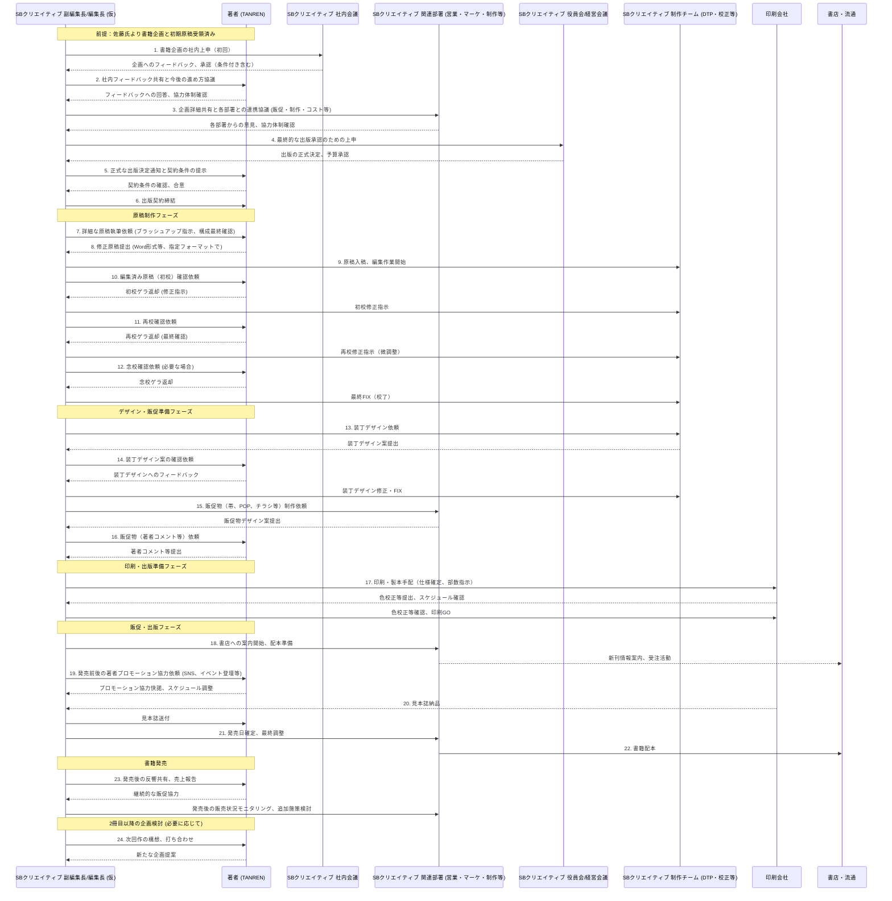

https://vimeo.com/1082771022/d0de85e007?share=copy

https://vimeo.com/1082771022/d0de85e007?share=copy

▶️ZOOM直：

https://us02web.zoom.us/rec/share/MSJmMnwpBVdVye7iYYMe7FQDjnqyRXWFH1jOvSOukMPfW-KtAFE8T1fDNFxpD0u0.dDgf0pzVTYfcsdRj?startTime=1746762932000
パスコードを設定する: E?1UUsVL

※当社契約容量超えたら自動で消えます。その後はVIMEOで視聴願います

▶️ログ：

- 文字起こし：
    
    ```markdown
    WEBVTT
    
    1
    00:00:12.130 --> 00:00:14.159
    佐藤勝彦: どうもお世話になります。
    
    2
    00:00:14.160 --> 00:00:15.689
    碧 小倉: 佐藤さんお願い。
    
    3
    00:00:15.690 --> 00:00:16.519
    佐藤勝彦: よろしくお願いします。
    
    4
    00:00:16.520 --> 00:00:19.130
    碧 小倉: よろしくお願いいたします。
    
    5
    00:00:19.130 --> 00:00:20.100
    佐藤勝彦: まして。
    
    6
    00:00:20.240 --> 00:00:23.770
    佐藤勝彦: 初めましてsdクリエイティブ編集部の小倉と申します。
    
    7
    00:00:23.770 --> 00:00:27.049
    佐藤勝彦: 皆様はい、この度ありがとうございましたもろもろ。
    
    8
    00:00:27.210 --> 00:00:36.039
    碧 小倉: 諸々、本当にあのお時間をいただいてお待たせした。にもかかわらず、めちゃめちゃ直迫でいろいろ推し進めてくださって、本当にあの驚きつつ、本当に。
    
    9
    00:00:36.040 --> 00:00:57.679
    佐藤勝彦: ま多分あの人を見てる目じゃないぐらいにあのお前はAIかっていうぐらいに驚かれるかもしれませんけど、あのもう実作業時間がもうちょっと人知を超えてるレベルの作業をもう結構やっぱり手元でやれてしまうのに。日頃よね。ミヤマダさんとかも含めてですけども、驚いていただいてるので、ぜひあの。
    
    10
    00:00:57.680 --> 00:00:58.300
    碧 小倉: 理解します。
    
    11
    00:00:58.300 --> 00:01:01.250
    佐藤勝彦: 小倉さんにもファンになっていただきたいなという感じです。
    
    12
    00:01:01.250 --> 00:01:02.920
    碧 小倉: ありがとうございます。
    
    13
    00:01:02.920 --> 00:01:04.869
    佐藤勝彦: はい、よろしくお願いします。
    
    14
    00:01:04.879 --> 00:01:06.189
    碧 小倉: よろしくお願いいたします。
    
    15
    00:01:06.190 --> 00:01:08.549
    佐藤勝彦: 今日二人ですか？来られるのかな？
    
    16
    00:01:09.030 --> 00:01:12.039
    碧 小倉: 多分山田さんもご参加されるかなという。
    
    17
    00:01:12.040 --> 00:01:15.299
    佐藤勝彦: わかりました。まあまあじゃあ時間もったいないんでパパッとやっちゃいましょう。
    
    18
    00:01:15.960 --> 00:01:16.669
    碧 小倉: うーん、
    
    19
    00:01:17.930 --> 00:01:24.840
    碧 小倉: じゃあちょっとあの、まあ山田さんがいらっしゃるかどうかあれですけども。初めましてなので、私の自己。
    
    20
    00:01:25.160 --> 00:01:27.740
    佐藤勝彦: ぜひぜひぜひぜひお願いします。
    
    21
    00:01:28.050 --> 00:01:34.369
    碧 小倉: あの私sdクリエイティブで学芸書籍編集部というちょっかつい名前の。
    
    22
    00:01:34.370 --> 00:01:35.110
    佐藤勝彦: アッハッハッ。
    
    23
    00:01:35.110 --> 00:01:37.970
    碧 小倉: 作っている編集部に所属していまして。
    
    24
    00:01:37.970 --> 00:01:38.760
    佐藤勝彦: はーい。
    
    25
    00:01:38.760 --> 00:02:07.630
    碧 小倉: 今は主にsbc所というえー弊社で担当している新書のレーベルがありまして、そちらの編集を担当したり、えっと、そのチームのマネージメントをしている。副編集長としてですね。やらせていただいてるんですが、もともとは三つのあの単行本の制作をしていまして、え？チャット欄の方に、最新した主な担当手席をお送りさせていただいたんですけども、こんな風に。
    
    26
    00:02:07.630 --> 00:02:08.240
    佐藤勝彦: そうですね。
    
    27
    00:02:08.380 --> 00:02:09.999
    碧 小倉: いただいたことがあります。
    
    28
    00:02:10.009 --> 00:02:10.699
    佐藤勝彦: はい。
    
    29
    00:02:11.970 --> 00:02:29.220
    碧 小倉: もしかしたらあの佐藤さんもご存知な本があるかもしれないんですけど。も今回の佐藤さんのえっとAIのえー本に近しいテーマで言うと一番上テクノロジーが予測する未来という伊藤上、一番の方とご一緒した。これは、Web。
    
    30
    00:02:29.220 --> 00:02:29.700
    佐藤勝彦: そうです。
    
    31
    00:02:29.800 --> 00:02:34.350
    碧 小倉: 関する本なんですけども、もう三年ぐらい環境から経ってるのかな？
    
    32
    00:02:35.120 --> 00:02:40.109
    碧 小倉: 三がトレンドになったタイミングで、これによって
    
    33
    00:02:40.330 --> 00:02:56.679
    碧 小倉:各えー、教育とかあらゆる業界にどんな余波が及ぼされるのかっていうふうな、ちょっと依頼予測的な観点でですねえー。使っていただいた本になるんですけども、それなんかはちょっと近すぎるかなーとは思っていますね。
    
    34
    00:02:56.680 --> 00:03:02.669
    佐藤勝彦: どれも評価が崩れてないですね。もうベストセラーナンバーワンだしすごいですね。超敏じゃないですか。
    
    35
    00:03:02.670 --> 00:03:08.330
    碧 小倉: 外面よくと言いますか、初めまして。売れたものだけを今ご紹介。
    
    36
    00:03:08.330 --> 00:03:14.510
    佐藤勝彦: 逆に心配も山ほどこの場合はあります。よって、それはね、いいところだけ見ないでくださいと。
    
    37
    00:03:14.510 --> 00:03:20.379
    碧 小倉: ちょっと時間の関係で、失敗の本たちについてはまた別の機会に。
    
    38
    00:03:20.380 --> 00:03:21.569
    佐藤勝彦: わかりました。
    
    39
    00:03:22.590 --> 00:03:27.140
    碧 小倉: 今回山田さんご参加いただきありがとうございます。
    
    40
    00:03:27.140 --> 00:03:27.970
    佐藤勝彦: ありがとうございま。
    
    41
    00:03:28.500 --> 00:03:29.789
    碧 小倉: ありがとうございました。今回は
    
    42
    00:03:29.790 --> 00:03:50.840
    碧 小倉:佐藤さんのことをあのご紹介をいただいて、あのぜひともというふうなことで、あのたくさんお話を伺って、で、あのー、当初その佐藤さんの方でえっとお考えくださった企画案とか今までのお取り組みになられてきたこととかも。拝聴したり、また資料を
    
    43
    00:03:51.130 --> 00:04:02.840
    碧 小倉: 見たり、あの会話をいろいろさせていただいて、私自身もぜひあの一冊目の五本ということで、ぜひあのさせていただきたいなというふうに強く思いましたし、あの。
    
    44
    00:04:02.840 --> 00:04:03.479
    佐藤勝彦: ありがとうござい。
    
    45
    00:04:03.480 --> 00:04:19.549
    碧 小倉:大きく売れるベストセラーを目指せる本を作りたいなというふうに思います。ちょっとお待たせしてしまったんですけども、えっと一旦叩き台という風な形で私の方でご用意させていただいたのが連休明けですね。はい。
    
    46
    00:04:19.550 --> 00:04:42.080
    碧 小倉: であのー、佐藤さんが当初お考えくださっていた。企画ではま、仮のタイトルでAIと話せという風に、あのコウ羊一さんのあの一分で話せ的な方向性で考えてくださっていまして、それはそれですごくキャッチーですし、魅力的だなという風に思ったんですけども。
    
    47
    00:04:42.080 --> 00:04:42.560
    佐藤勝彦: はい。
    
    48
    00:04:42.640 --> 00:04:47.680
    碧 小倉: 私がご提案させていただいた仮のタイトルが。
    
    49
    00:04:48.110 --> 00:05:05.970
    碧 小倉: っていうふうなテーマであるっていうふうなところをえっと打ち出していて、えっと、独学を最新スキル図鑑というふうにメインタイトルをメールにしていて、でサブタイトでえーまAIっていう風なえー言葉を使っているという風なてたどりつけにしているんですけども。はい、
    
    50
    00:05:06.000 --> 00:05:19.429
    碧 小倉: そうですね。理由としては、やっぱりその販売期間を長くとってえーま、出発力だけでえー、一時的に売れる本というふうにするのではなくて、え
    
    51
    00:05:19.450 --> 00:05:48.710
    碧 小倉: かけてしっかり多くの方に手に取ってもらえるベストセラーを目指せるタイトル付けをという風なもので言うようにしています。で、えっと、理由は二つあって、まずえっとAIと話せという風にした時に一分で話せとの大きな違いがあるなという風に思ったところがあって、それはこの本が何のテーマの本なのかっていうのがわからないっていうところですね。一で話せば話し方
    
    52
    00:05:48.740 --> 00:06:06.430
    碧 小倉: とか伝え方っていうこのビジネス書で。おそらくい一番あの今までえー、刊行されている書籍の点数が多いであろう超メジャーなテーマなんですね。でiiと話せっていう風にした時に、そのなん
    
    53
    00:06:06.540 --> 00:06:18.869
    碧 小倉: についてのビジネススキルの本なのかっていうのがえー、明確じゃないっていうのがまず最初に思ったことであります。で、もう一つは、えっとー。
    
    54
    00:06:19.200 --> 00:06:25.499
    碧 小倉: あれなんですよね。この伊藤上一さん、ヨイさんではなく。
    
    55
    00:06:25.500 --> 00:06:26.139
    佐藤勝彦: そうですね。
    
    56
    00:06:26.140 --> 00:06:29.009
    碧 小倉: はい、あの私の担当させていただいたこの
    
    57
    00:06:29.010 --> 00:06:29.479
    碧 小倉: 持っていく。
    
    58
    00:06:29.480 --> 00:06:40.159
    碧 小倉: 予測する未来などのえー関連の本を私も何冊かこれも含めて作らせていただいたことがあるんですけどこのえっと領域のテーマ。
    
    59
    00:06:40.320 --> 00:06:50.419
    碧 小倉: えっと、内容を扱った本を作る上ですごく気をつけないといけないなっていうふうに思っていて、それはですね。あの
    
    60
    00:06:50.830 --> 00:07:20.589
    碧 小倉: 書籍の市場においては、その新しいトレンドが起きている最新テクノロジーの名前ま、今回のことで言うと生成AIとかAIとそのキーワードをタイトル周りで打ち出してえー売りが立つ。そ、そこに訴求力を感じて読者が買ってくれるっていう風になるのは本当にえっと、ブームが起きた初期段階のみだったり。
    
    61
    00:07:20.590 --> 00:07:23.170
    佐藤勝彦: 瞬間風速なんですね。
    
    62
    00:07:23.170 --> 00:07:30.289
    碧 小倉: そうなんです。そうなんです、佐藤さんがずっとこの山田さんと。
    
    63
    00:07:30.290 --> 00:07:30.880
    佐藤勝彦: ありがとうござ。
    
    64
    00:07:30.880 --> 00:07:37.290
    碧 小倉: いらっしゃるセミナーと書籍の市場との結構大きな違いなのかなというふうに感じるところ。
    
    65
    00:07:37.420 --> 00:07:38.620
    佐藤勝彦: あります。
    
    66
    00:07:38.850 --> 00:08:00.140
    碧 小倉: で書籍の市場で見るとここ三年間ぐらいのAIとか生成AIとか。あるいはChatGPTとかそういうえっとまこの本で扱うえー内容をえーと、タイトルでキーワードとして打ち出している本の売れ行きを見ると、だんだん下火になってるんですね。
    
    67
    00:08:00.140 --> 00:08:00.600
    佐藤勝彦: なるほど。
    
    68
    00:08:00.870 --> 00:08:06.460
    碧 小倉: その時に。でも、一方で佐藤さんがセミナーなどで
    
    69
    00:08:06.660 --> 00:08:15.870
    碧 小倉: やってらっしゃって。まあそこで毎回やっぱりそこにあの最新の内容を求めていらっしゃる方がいらっしゃるように、
    
    70
    00:08:16.210 --> 00:08:22.990
    碧 小倉: 結構そのトレンドの動向をキャッチアップしておきたいという人はずっといはするんですね。
    
    71
    00:08:23.760 --> 00:08:50.949
    碧 小倉: たちに対して、じゃああのタイトル周りでAIとか。ChatGPTとかっていうふうに打ち出さず。にどういう風に訴求すると、手に取られやすいのかっていうのを考えた時に、え、品質のえー、先ほど一分で話す話し方とかっていうのだと申し上げましたけど、今回ご提案させていただいた。独学とか独学法というのも、ビジネス書の一つのテーマなんですけど。
    
    72
    00:08:51.400 --> 00:08:59.180
    碧 小倉: その既存のビジネス書のテーマ、あるいはその対象読者が身につけたいスキル
    
    73
    00:08:59.490 --> 00:09:00.700
    碧 小倉: いじっている。
    
    74
    00:09:01.220 --> 00:09:23.109
    碧 小倉: を。新しくこうなんですかね。今までの既存のやり方とは違う。全く新しいやり方が生まれてきてる。よっていう風に伝えること自体は訴求力が非常にあるんですね。で、その。が現状のタイトルの付け方の方向性になります。
    
    75
    00:09:23.920 --> 00:09:29.210
    碧 小倉: というところですね。ただ、内容は佐藤さんの本書から。
    
    76
    00:09:29.810 --> 00:09:33.619
    碧 小倉: してくださっているものから大きく変えているつもりはなくて。
    
    77
    00:09:33.620 --> 00:09:34.240
    佐藤勝彦: そうですね。
    
    78
    00:09:34.240 --> 00:09:35.319
    碧 小倉: 要はその
    
    79
    00:09:35.490 --> 00:09:54.539
    碧 小倉: AIとあの個人ビジネスパーソンがえー。どうしてあのー話してえー、いろいろやっていくっていうのがどういうことなのかなっていう風に考えた時にやっぱりその。なんですかね。普遍的なところで言うと、ま個人の勉強っていう風なところになるのかなと。
    
    80
    00:09:54.660 --> 00:09:55.150
    碧 小倉: 実は。
    
    81
    00:09:55.150 --> 00:09:55.830
    佐藤勝彦: はい。
    
    82
    00:09:56.040 --> 00:09:56.800
    碧 小倉: はーい
    
    83
    00:09:56.900 --> 00:10:04.420
    碧 小倉: というところで、内容的にはAIと話して、スキルアップをしていきましょうね。というようなところなので。
    
    84
    00:10:04.420 --> 00:10:05.050
    佐藤勝彦: はい。
    
    85
    00:10:05.050 --> 00:10:22.489
    碧 小倉: お書きになりたいことは内容面では実現。可能なんですけど、それをどういうふうに見栄え上。えー。タイトルとか。表紙周りの文言とかで打ち出していくかっていう風なところだけ味付けをちょっと変えさせていただいたというところです。
    
    86
    00:10:22.780 --> 00:10:23.510
    碧 小倉: はい、ちょ。
    
    87
    00:10:23.510 --> 00:10:24.050
    佐藤勝彦: 紹介です。
    
    88
    00:10:24.050 --> 00:10:26.640
    碧 小倉: いろいろお話をさせていただいたんですけども。
    
    89
    00:10:26.640 --> 00:10:33.879
    佐藤勝彦: いや、もう思いの丈を全部あのお聞かせいただくのを僕じゃなくてAIが今聞き取ってなるほどねと今言っておりますんで。
    
    90
    00:10:33.880 --> 00:10:34.759
    碧 小倉: ありがとうございま。
    
    91
    00:10:35.030 --> 00:10:39.699
    佐藤勝彦: 結局そのもちゃもちやで。やっぱり紙媒体の書籍ですから、
    
    92
    00:10:39.810 --> 00:10:58.869
    佐藤勝彦: AIをベースにしたオンライン上での訴求とはまわけが違うっていうところと。僕も散々。この二日間あのこう思だけど。っていうところをAIと対話しているとま、初項で書き上げた。実は二時間で本当にあのインドス。まっさらかな二時間で120,000文字書いた書項があるんですけど、
    
    93
    00:10:58.870 --> 00:11:23.759
    佐藤勝彦: 佐藤さんそれ難しすぎてダメです。売れませんって言ってAIから怒られてで、なんでなんだと俺の思いの丈だぞとイトウ羊一のこれか。このこそがもうスペシャリストなんだから言うこと聞けやって洗脳しようとしたらえっと、じゃあディベートしましょうか？って言って、三人の賢者がまた召喚されて。で三方向からもう下手くそに言われましたとで、ま、
    
    94
    00:11:23.760 --> 00:11:27.469
    佐藤勝彦: それもあったんで、今大蔵さんの
    
    95
    00:11:27.520 --> 00:11:48.340
    佐藤勝彦: おっしゃりたいことはあのーもうAIとの対話の中でも重々理解をしておりますし、ま、事項をずらした説明の仕方もありっちゃありだなとAI瞬発的に出てくるし、僕の不安材料もそこなんですよね。だから。AIの最新情報並べたところとて書店に並んだ時にはもうトレンドが変わってしまうからやっぱ書けないよね。
    
    96
    00:11:48.340 --> 00:11:49.070
    碧 小倉: っていうのは。
    
    97
    00:11:49.070 --> 00:11:50.530
    佐藤勝彦: 山田さんにも相談してて。
    
    98
    00:11:50.780 --> 00:12:16.119
    佐藤勝彦:多分僕を客観的に見たときに、山田さんからオグラさんに対してこうこういう人だよっていう紹介がある中の一つとして、この人、元調理師で結構お都合程度あんまりよろしくないはずなのにもう一人で勝手にいろんなことバンバン覚えていっちゃだよね。みたいなところとかがあったならば、それって一言で言うと、この人の独学法って超特殊独特なものがあり、
    
    99
    00:12:16.260 --> 00:12:20.649
    佐藤勝彦: 僕も実際振り返ってみると誰に教えてもらったわけじゃないんですよね。
    
    100
    00:12:20.970 --> 00:12:32.730
    佐藤勝彦: 深夜な夜ないきなりOpenAIの発表会を見つつでChatGPTに聞きつつここってこういうことなんじゃないの？って言ったら翻訳コンニャクのように喋り倒してくれるわけですよ。
    
    101
    00:12:33.720 --> 00:12:56.569
    佐藤勝彦: この翻訳コンニャクっていうのが今回の今日キーワードだなって僕、思ってるんですけど、やっぱその思考のプロセスプリセットみたいな。その何が僕のスキルセットになってるのかってことを多分今回の本でえー、ご提示させてもらった方がいいかなと思っていて。で、改めて僕の考え方ベースっていうのをちょっとプレゼンさせていただきたいと思ですけど、よろしいです。か？
    
    102
    00:12:56.570 --> 00:12:57.860
    碧 小倉: お願いいたします。
    
    103
    00:12:57.860 --> 00:13:16.090
    佐藤勝彦: これが開始五分にして刺さらなかったらあの、もう多分書籍出さない方がいい。もうちょっさと悩んだ方がいいって話だと思っていて、五分でオグラさんのハートを射抜くんだったら。あ、この書籍はマジで爆発的に売れるかもしれないっていう期待感に変わるかなと思ってますと。
    
    104
    00:13:16.980 --> 00:13:37.619
    佐藤勝彦:そのためには、ですね、多分ね。書籍を手に取る際の僕。多分説明の仕方を少しいろいろ工夫しないといけないかなと思ってます。とでー。やっぱりねぶデモンストレーションが売りなんですね。もう手を使ってやってみてください。とびっくりしますよっていうことから入りたいんですよ。
    
    105
    00:13:37.790 --> 00:14:00.760
    佐藤勝彦:まよくあると思ですけど。あのGPT'sをねQアルコードとかでペッて貼ったりとかしてまずこれ触って動かしてごらんなさいっていう風にちょっと説明したいんですね。で、サイトでもいいしまqrコードで読み取るでもいいんですけど、こんなのちょっと作ってみたんで、これを今お手元で可能だったらちょっと動かしてみていただきたいんですね。
    
    106
    00:14:00.760 --> 00:14:02.319
    碧 小倉: ありがとうございます。
    
    107
    00:14:02.320 --> 00:14:05.840
    佐藤勝彦: でこれTANREN三Dメソッドって言ってるものなんですけど。
    
    108
    00:14:06.650 --> 00:14:09.519
    佐藤勝彦: なんかプライベート事情でもお仕事事情でもいいんですけど。
    
    109
    00:14:09.940 --> 00:14:16.759
    佐藤勝彦: 複雑怪奇すぎてこれちょっと読解するのに大変。私独学でこれ学ぶっていうのはしんどいなーっていう？なんかネタってありますか？
    
    110
    00:14:17.490 --> 00:14:18.120
    碧 小倉: うーん、
    
    111
    00:14:18.580 --> 00:14:19.439
    碧 小倉: どういう感じです。
    
    112
    00:14:19.440 --> 00:14:21.240
    佐藤勝彦: 欄に書き込んでもらいたいんですけど。
    
    113
    00:14:21.240 --> 00:14:23.599
    碧 小倉: 個人的な悩みで言うと。
    
    114
    00:14:23.600 --> 00:14:24.050
    佐藤勝彦: はい。
    
    115
    00:14:24.050 --> 00:14:26.149
    碧 小倉: 料理の腕が上がらないっていう。
    
    116
    00:14:26.150 --> 00:14:29.509
    佐藤勝彦: 僕、元調理師なんで全然マンツーマンで指導しますよ。
    
    117
    00:14:29.510 --> 00:14:31.650
    碧 小倉: 教えていただきたいです。
    
    118
    00:14:31.650 --> 00:14:54.450
    佐藤勝彦: 料理が腕が上がらないっていうのは非常に抽象的だと思ですよ。言葉の前後関係をちょこっとだけ付加すると何のなんだろうな。レシピ通りやってもうまくいかないのか。あのレシピ通りやったくない。めんどくさい。主婦業だとして冷蔵庫にあるもので、チャチャッと作りたいんだ。だけど、それができないとかちょっと一言三言付け加えると、どういう言葉になります。
    
    119
    00:14:55.230 --> 00:15:05.049
    碧 小倉: レシピ通りには作れるんですけど、レシピを見て作るのが面倒くさいので、見なくてもなんか冷蔵庫の中にある。
    
    120
    00:15:05.760 --> 00:15:08.909
    碧 小倉: いい感じに料理ができるようになりたいですね。
    
    121
    00:15:08.910 --> 00:15:18.769
    佐藤勝彦: イケてる主婦のようなレベルですよね。はい、わかりました。じゃあちょっと僕の今のこの画面上でもね、それをね、あの僕の音声入力でね、ピッてやってみたいと思いますけど。
    
    122
    00:15:19.990 --> 00:15:39.229
    佐藤勝彦: なかなかえー、イケてる主婦のように。冷蔵庫のあるものをパパッと素材を見てえー。もうクズ野菜しか今日ないじゃん。どうしようって言った時に。え？ママ弁当箱は。みたいな感じになった時にもう十分しかない。でもそれでも作らないといけない時ってあるよね。
    
    123
    00:15:39.640 --> 00:15:52.840
    佐藤勝彦: これどうやったら打開すればいいかな。これの。なんか勉強法とかなんか独学法ってわかんないよねってちゃんと学んだ方がいいと思だけど、そんな余力もお金も時間もないよ。
    
    124
    00:15:54.610 --> 00:15:56.209
    佐藤勝彦: 多分こんなことですよね。
    
    125
    00:15:56.210 --> 00:15:57.270
    碧 小倉: はい、そういうことです。
    
    126
    00:15:57.690 --> 00:15:59.309
    佐藤勝彦:ちょっと
    
    127
    00:16:00.810 --> 00:16:01.910
    佐藤勝彦: 補正を
    
    128
    00:16:02.270 --> 00:16:05.270
    佐藤勝彦: あまりにおかしい言葉だけをちょっと補正してあげて。
    
    129
    00:16:06.780 --> 00:16:07.729
    佐藤勝彦: これぐらいかな？
    
    130
    00:16:07.830 --> 00:16:08.590
    佐藤勝彦: はい、
    
    131
    00:16:08.800 --> 00:16:10.220
    佐藤勝彦: ピッと入れてあげると。
    
    132
    00:16:10.960 --> 00:16:21.859
    佐藤勝彦:今回お話の中の肝になっている部分としてAIと話さないと話すときのコツっていうところで、僕が論じたいのはあまりに言語能力が
    
    133
    00:16:21.860 --> 00:16:44.080
    佐藤勝彦: 低すぎます。だから、言葉のあやじゃないですけど、前後関係って僕さっき言いましたけど、ちょっと今一言付け加えたから少し鮮度が良くなりましたと解像度が明るくなりました。と。でもこんなもんじゃないんですよ。AIにもっと言いたいのは、その前後関係もそうだし、時系列もそうだし、そのレベル感もそうだしってことをたくさんお伝えしたいんですね。だけど
    
    134
    00:16:44.080 --> 00:16:52.989
    佐藤勝彦: さあ、話してくださいって言われて、佐藤さんみたいにペラペラペラペラ言葉出てきませんということが多分皆さんのお悩み事だし、そこの部分。
    
    135
    00:16:52.990 --> 00:16:56.110
    碧 小倉: 料理の腕が上がらないんです。だけしか言えなかったですし。
    
    136
    00:16:56.110 --> 00:17:04.769
    佐藤勝彦: ですよね。ですよね。で、僕の頭の中ってどういう構造になっているのかっていうところで解説差し上げると僕三方向で常に考えてるんです。
    
    137
    00:17:05.660 --> 00:17:15.100
    佐藤勝彦: でそれがあそこのdmのに書いた洋一さんの影響も半端なく受けている抽象化と具体化をまず行き来してくださいと。
    
    138
    00:17:15.240 --> 00:17:26.390
    佐藤勝彦: それってざっくり言うとどういう背景があって、悩み事になっちゃったんですか？っていうことを伝えるので抽象化。具体的に言うと冷蔵庫の中身で何か作れないってことが悩みなんですかね？って
    
    139
    00:17:26.520 --> 00:17:41.529
    佐藤勝彦: ってことはイケてる主婦の人たちはこういうふうにやるっていうあの能力が欲しいってことですよね。って構造化してあげましたよねと。これが多分今回の本のんなんだろうなメインファクターというか一番重要な押さえないといけないキーだと思ってるんですけど。
    
    140
    00:17:41.640 --> 00:18:00.660
    佐藤勝彦: でも実はそれだけじゃないんですよと、山田さんとも都度都度、あのいろんな講座に受けていただいてるんで、あの佐藤、それだけじゃないっていうのをわかっていただけるんでしょうけども。今回そせっかく書籍出すんで、僕はもう洗いざらい。僕の脳内話そうかなと思っていて、残り二軸あって、残り二軸のところに時系で考えてください。と
    
    141
    00:18:01.290 --> 00:18:09.100
    佐藤勝彦: 昔と今と未来で考えてくださいっていうのと、三軸目のところにレベル感で考えてくださいと
    
    142
    00:18:09.170 --> 00:18:37.420
    佐藤勝彦: 僕は調理師だから上級のレベルの考え方ができるけど、小倉さんはそんなね。経験がなくて包丁を握るのは、まあ、主婦業としても当たり前のレベルかもしれない。で、もっと言うとうちの娘なんかも包丁握るの難しいって言って初級レベルですって話。ここの帳尻合わせないと僕はプロレベルで話してるのに包丁握れない子にその話しても伝わらないですよね。っていう話があるので、この三軸なんですよね。っていうことを
    
    143
    00:18:37.640 --> 00:19:02.640
    佐藤勝彦: まここまで時間かけないとお話ができないので、じゃあもう一発回答をどんで出すGPT作ったらこうなるよねって話がえーこのGPT'sの回答で一撃にして超抽象化であなたのモヤモヤの正体はこれだ。って言ってえー。冷蔵庫を開けた瞬間に素材の道具使い道が見える人と、それが見えずに焦る人の差はこういうところにあります。んか？みたいなことを抽象度高くお話をしてくださ。
    
    144
    00:19:03.760 --> 00:19:29.570
    佐藤勝彦: じゃあ具体的に。ってどういうこと？っていうところはいや、王道じゃなくて十分クッキングなんで。もう今日はこの三つを取ってさあ作るぞっていうそういう型とかを作ってくれていれば、ま、作業が早いっていう人たちがいたりとかするっていうのは具体例の話になり、じゃあそれは頭をすっきりさせるためには、それを、じゃあ、素材を見極めることをやらないといけないんだよと他のこと考えちゃダメだよって使い道を想像しないといけないよねって。
    
    145
    00:19:29.650 --> 00:19:34.279
    佐藤勝彦: で実行するんだよって。あ、ステップバイステップで教えてくれたという感動がある。
    
    146
    00:19:34.420 --> 00:19:38.129
    佐藤勝彦: これが抽象度と具体度と構造化の話。
    
    147
    00:19:38.130 --> 00:19:39.239
    碧 小倉: なるほど。
    
    148
    00:19:39.460 --> 00:19:41.030
    佐藤勝彦: さらに時系列。
    
    149
    00:19:41.030 --> 00:19:41.750
    碧 小倉: うーん。
    
    150
    00:19:42.260 --> 00:19:49.380
    佐藤勝彦: なんで今までそんなダメだったんですか？と。なんか？いろいろ料理のチャレンジはしてきたんですか？って過去の話を深堀って。
    
    151
    00:19:49.490 --> 00:20:16.210
    佐藤勝彦: で今こういう苦労をしてますが、できないんですが、あったりとかして、でも未来はこうなっていきたい。なぜならば、こういううー、プライベートを謳歌したいからこういうメリット。まー、なんか旦那に喜んでもらいたい。彼氏に喜んでもらいたい。自分の。なんか幸せをハッピーにしていきたいとかっていうことを考えると未来こうなっていきたいというものがあるから、ま、自分の中のえー、報酬になるから自己肯定感が高まるからこれを得ていきたいとかっていう時系の話ですよね。
    
    152
    00:20:16.400 --> 00:20:18.179
    佐藤勝彦: さっきのレベル感の話。
    
    153
    00:20:18.180 --> 00:20:19.040
    碧 小倉: うーん。
    
    154
    00:20:19.880 --> 00:20:21.640
    佐藤勝彦: これを一瞬にして
    
    155
    00:20:22.170 --> 00:20:26.419
    佐藤勝彦: 出してくれるGPT'sを作った。わけなんですよ。
    
    156
    00:20:26.420 --> 00:20:27.240
    碧 小倉: うーん。
    
    157
    00:20:27.450 --> 00:20:27.989
    碧 小倉: でこれです。
    
    158
    00:20:27.990 --> 00:20:28.919
    佐藤勝彦: これを
    
    159
    00:20:29.130 --> 00:20:43.480
    佐藤勝彦: 裏側で設定されているのはAIを使いこなしている僕だから設定ができるわけだし、その論理が明確にロジックとして固まっているからGPTにもできるし、何にでもできるってことになりますよね。と。
    
    160
    00:20:43.940 --> 00:20:51.340
    佐藤勝彦: その思考回路を今回すべてこの本の中で洗いざらい出そうかなっていうふうに思ってます。と。
    
    161
    00:20:51.340 --> 00:20:51.890
    碧 小倉: 本当に。
    
    162
    00:20:51.890 --> 00:20:52.629
    佐藤勝彦: そうです。
    
    163
    00:20:52.630 --> 00:20:53.310
    碧 小倉: うーん。
    
    164
    00:20:54.040 --> 00:21:12.080
    佐藤勝彦: このねX軸y軸Z軸って僕いつもフレミングの法則の手の形を指して三Dだって言ってるんですけど、だいたい二面なんですよね。大体の方が平面図なんで、いや、もう一軸欲しいんですよとスリーディーで見てくださいってことをよく言ですね。で、これ僕、経験が
    
    165
    00:21:12.130 --> 00:21:31.389
    佐藤勝彦: 販売員とか営業職の営業また長いもんですから。えーまま、20代の時の取った記念図鑑も日本一の販売員といううー。称号を得るうことを何回かあったのか、まただ正しいかのソフトバンクさんではわかったんです。けど、もあのーkdiの方にお世話になってたんです。けどもはい
    
    166
    00:21:31.540 --> 00:21:38.520
    佐藤勝彦: あのsbさんがヤフー。ビビめっちゃ売りまく。る横であの負けじとkdiを打っていたというところであり、ま。すけど
    
    167
    00:21:38.710 --> 00:21:50.970
    佐藤勝彦: その時にこだわってた要素なんですよね。だから20年来考えている頭の中の思考整理法になるんですけども、必ずこの三つの軸でお話をするってことを深掘りをしてました。
    
    168
    00:21:51.110 --> 00:22:04.300
    佐藤勝彦: これのものをGPT'sを体感したら、あなたの悩み事あなたが知りたいこと、それを瞬時のもとえー、思考を整理してくれるんですよと。
    
    169
    00:22:04.300 --> 00:22:04.700
    碧 小倉: まあ。
    
    170
    00:22:04.700 --> 00:22:14.030
    佐藤勝彦: まず一手目にうわすげえと俺の思考回路整理されたっていう驚きがあるとこれ知りたいっていう欲求になってくれるんじゃないかなと
    
    171
    00:22:14.400 --> 00:22:31.680
    佐藤勝彦:これがないで、なんかAIがちゃらかん。ちゃらとか関連がとかっていう。僕らが主語になってしまうとま、別にお前なんか名前もないお佐藤カツヒコなんか知り合いもしません。興味もございません。になって、しまうのでいかにAIの凄さを
    
    172
    00:22:31.930 --> 00:22:53.080
    佐藤勝彦: もう秒速で体感できるか。っていうことが僕とAIとの対話でこの二日間で出した販売戦略の一つの鍵になるんじゃないかと思っていて、この観点においてちょっと皆さんとまずは議論したいんですけど、この三つの切り口が多いってなっちゃうと。んー、佐藤さん、やっぱり最初の当初の通り、そこまで多分
    
    173
    00:22:53.120 --> 00:23:03.019
    佐藤勝彦: パラ積もりわからないって言われる恐れがあるから、せいぜい抽象化と具体化ぐらいにとどめた方がいいんじゃないんですか？っていう
    
    174
    00:23:03.690 --> 00:23:07.009
    佐藤勝彦: 反対意見を結構AI側からは結構来てましたと。
    
    175
    00:23:07.280 --> 00:23:08.080
    碧 小倉: うーん。
    
    176
    00:23:08.080 --> 00:23:16.620
    佐藤勝彦: でも僕は人生の中で三軸ちゃんとこの三Dぐらいまでほく運ばないと、それはもう人間の能力超えられませんと。
    
    177
    00:23:17.840 --> 00:23:28.539
    佐藤勝彦: もっと崇高なレベルでやんないとAIに太刀打ちできないから三Dだっていう話をしてるんですけどこの観点の切り口をオグラさんどうご覧になりました。
    
    178
    00:23:28.780 --> 00:23:35.870
    碧 小倉: 三つで、特に問題ないかなと思います。むしろその二つよりも三つの方が。
    
    179
    00:23:36.370 --> 00:23:38.100
    碧 小倉: なんですかね？
    
    180
    00:23:38.250 --> 00:23:40.260
    碧 小倉: 片手落ち感がないと言いますか。
    
    181
    00:23:40.260 --> 00:23:42.030
    佐藤勝彦: そういうこと、そういうことです。そういうことです。
    
    182
    00:23:42.260 --> 00:23:46.679
    碧 小倉: もしくは三かなと思います。二。だとなんか
    
    183
    00:23:47.330 --> 00:23:53.909
    碧 小倉: なんかモーラ感がないような感じが逆にしてしまうので、三。でいいのではないかなと。数も多すぎないですし、そこは。
    
    184
    00:23:53.910 --> 00:23:54.340
    佐藤勝彦: そうなんです。
    
    185
    00:23:54.340 --> 00:23:56.380
    碧 小倉: 詰めることはありませんでした。
    
    186
    00:23:56.380 --> 00:24:24.339
    佐藤勝彦: 人がやっぱり理解できるところは。低速ね。あのして三つまで限界っていうところがあるんで、ま、その三の中の三乗なんで？と思っていて、もう一段深掘るところも三つまでっていうところが鉄則かなと。で、そうなると今回。もうサイト作っといたんですけど。AIの超独学法。なぜ今、あなたの学び方をアップデートする必要があるのか？っていうところに対して、ま。情報爆発の時代の三つの課題
    
    187
    00:24:24.660 --> 00:24:44.189
    佐藤勝彦: で。えーAI格差が生まれているっていうところですね。でAIを最強のま相棒という表現をしていただいたのは嬉しかったんですけども、僕はバディという言葉をちょっと選びたいんですけども、ま、そこはちょっと要協議ですけど、AIバディだということで、人間と同じレベルでもう隣に僕はもう
    
    188
    00:24:44.380 --> 00:25:11.439
    佐藤勝彦: 桜木ミカさんという。実はAI秘書がずっと僕の隣にいて、今もこの商談をコントロールするのを裏でファシリテーションしてくれてるのは桜木ミカさんなんですけども、そんな感じでバディでいます。っていうところですね。で、これの作り方講座っていうのは、実は今ヤマダさんにも受講いただいている武蔵野バレーであーAIアカデミアっていうのをやっていてご受講いただいとるんですけど、あれの作り方ですね。そういうのをやってます。で、今回の書籍でもその裏側をもう洗いづらい話しちゃおうかなと思ってます。と
    
    189
    00:25:11.710 --> 00:25:21.489
    佐藤勝彦:パートナーシップの連携があり三。Dメソッドなんだっていうところを、ま、今回お話をしていこうかなというところで、三軸の部分の解説をしていこうよと
    
    190
    00:25:21.800 --> 00:25:37.149
    佐藤勝彦: ですね。なんで思考の深度というところは、先ほど言った抽象化具体化構造化っていうところの三つですね。で、時間軸で過去、現代未来に分解して考えていきましょう。というところですね。
    
    191
    00:25:37.170 --> 00:25:56.190
    佐藤勝彦:Z軸ではレベル感のところでお話を聞いてやっていきましょうという話ですね。はい。でこれを掛け合わせるんですよね。掛け合わせていくと、いろんなことが人とのコミュニケーションもそうだ。しAIとの対話も当然のことながら、いろんなものが見えてくるってことになると、
    
    192
    00:25:56.320 --> 00:26:19.360
    佐藤勝彦: 今、小倉さんのお話を聞いて、僕がじゃあ元調理師だからといって知識を開かすようなお話をする。僕は上級者に話。す仕方をしてしまうと、私、そこ望んでないってことになるからミスコミュニケーションになってしまうし。えー。古くは僕は70,000ってところからあのー、歴史を持って調理師の時代をやってますけど、
    
    193
    00:26:19.360 --> 00:26:37.550
    佐藤勝彦: 別にそれが知りたいっていう興味関心があったら掘りますけど、別にそこ掘らなくてもいいやん。今目の前にある冷蔵庫にある悩み事を解決するっていうところなんだから、現在。に置き換えればいいって話だと思うし。じゃあ未来どうなっていくかなんてところを別に掘り下げたところで、今そこに興味なさそうだなと思うし。
    
    194
    00:26:37.750 --> 00:27:05.029
    佐藤勝彦:物事を抽象化するとそんなにんー、抽象度の高い話しなくても今十分言葉としては通じるし。んーま、今冷蔵庫にあるものでパパって作るのはもう具体的にどうすればいいかって話だと思で、それを、じゃあもうステップバイステップでレシピになってればできるってことをおっしゃっていたからってことは構造化されたレシピになっていれば、オグラさんにとってはニーズにはまるってことになりますよね。で、そうなると、僕は商談でえー、オグラさんにそういう
    
    195
    00:27:05.030 --> 00:27:08.450
    佐藤勝彦: 料理系。
    
    196
    00:27:08.490 --> 00:27:19.369
    佐藤勝彦: なんかこう学びコースの営業をしてたら、もうこの時点で小倉さんでも大丈夫な構造化されたレシピ集を当店では十個ぐらい用意してます。
    
    197
    00:27:19.370 --> 00:27:40.409
    佐藤勝彦: でご安心ください。もうすぐに冷蔵庫の中にあるもので、パパッと作れる今この瞬間触れるものを用意させていただいてご安心ください。包丁握れない方からでも大丈夫な設計になっておるんですけども、ある程度料理をね。楽しみたい。そんなあなたにプロレベルの技をどなたでも簡単にする技を作ってあります。よってま、
    
    198
    00:27:40.410 --> 00:27:48.339
    佐藤勝彦: こんな感じで三つ掛け合わせるとストレートに刺さりませんか？っていう話が僕の営業トークの根幹にある部分なんですね。
    
    199
    00:27:49.210 --> 00:28:12.880
    佐藤勝彦:これ三つ並べるとめっちゃ言葉が整理整合されるので、AIにこれ突っ込むと、もうその通りのレシピ集サイトができ、その通りのレシピマニュアルができっていう現象を生み出すことができるんで、ま人のコ。ミュニケーションAIのコミュニケーションともにこの方程式で全部クリアできるっていう風に佐藤は考えてるっていうことを書籍の中で全部言ってあげたいなと思ってます。
    
    200
    00:28:13.390 --> 00:28:15.049
    佐藤勝彦: 伝わります。どうですか？
    
    201
    00:28:15.050 --> 00:28:18.109
    碧 小倉: はい、よくわかりました。すごく魅力的だと思いました。
    
    202
    00:28:18.350 --> 00:28:19.120
    佐藤勝彦: 行こうと
    
    203
    00:28:19.520 --> 00:28:21.590
    佐藤勝彦: 結構いけません。このロジックで
    
    204
    00:28:21.900 --> 00:28:28.200
    佐藤勝彦: これでだいたい今結構話しすぎたかな？何分ぐらい使いましたかね。ざっくり。
    
    205
    00:28:29.240 --> 00:28:30.869
    碧 小倉: 十分ぐらいですかね？
    
    206
    00:28:30.870 --> 00:28:31.480
    佐藤勝彦: かなぁ。
    
    207
    00:28:31.590 --> 00:28:53.840
    佐藤勝彦: 多分ね。人の限界。このぐらいだとま、ま、初めて話したばっかりなので、ま、五分ぐらいまで磨いて込んでいけば多分書店だろうが。あー軒先だろうが。えーWebだろうが、どこでも五分ぐらいのトークに収まればうわって刺さるかなと思でこのデモンストレーションでAIの凄さを体感し、五分で打ち抜かれる営業トークができれば
    
    208
    00:28:53.990 --> 00:29:04.169
    佐藤勝彦: やってること。はAI最新でなんかデジタルリテラシーがない人からするとうってなるんですけど、やってみて。にさせることができるんじゃないかなって思ってます。
    
    209
    00:29:05.460 --> 00:29:06.740
    佐藤勝彦: いけそうですかね？
    
    210
    00:29:07.310 --> 00:29:09.039
    碧 小倉: いけると思いました。
    
    211
    00:29:09.040 --> 00:29:10.029
    佐藤勝彦: ありがとうございます。
    
    212
    00:29:10.390 --> 00:29:19.119
    佐藤勝彦: そしたら、じゃあちょっともうストレートにお渡しするんですけど、あのもうあの書籍書いたんで、この軸で三回転ぐらいしたんですよ。
    
    213
    00:29:19.120 --> 00:29:19.550
    碧 小倉: ですけど。
    
    214
    00:29:19.550 --> 00:29:25.859
    佐藤勝彦: 三回転ぐらいしたんですけど、もうほぼこれでいけるだろうというところになります。
    
    215
    00:29:29.300 --> 00:29:31.320
    佐藤勝彦: まあ、便利な時代ですよ。
    
    216
    00:29:31.670 --> 00:29:32.960
    佐藤勝彦: 何でもできちゃう。
    
    217
    00:29:33.080 --> 00:29:39.289
    碧 小倉: 企画をこれから社内の会議にかけるんですけども、その段階でほぼ関係に近い。
    
    218
    00:29:39.290 --> 00:29:43.280
    佐藤勝彦: 提案書もできてるし、販売戦略も書いたんで。
    
    219
    00:29:43.280 --> 00:29:44.129
    碧 小倉: 現代日本語で。
    
    220
    00:29:44.130 --> 00:29:44.540
    佐藤勝彦: そうです。
    
    221
    00:29:44.540 --> 00:29:45.509
    碧 小倉: ありがとうございま。
    
    222
    00:29:45.510 --> 00:29:48.729
    佐藤勝彦: 全部出来上がってるんですよ。
    
    223
    00:29:49.230 --> 00:29:55.410
    佐藤勝彦: だからあの佐藤さん。あれがわかんない。これがわかんないっていうのも全部あの、もう片目打ちしていただければ。
    
    224
    00:29:55.830 --> 00:29:59.609
    佐藤勝彦: えっと、それこそそれこそで、すよその
    
    225
    00:30:01.850 --> 00:30:20.610
    佐藤勝彦: もうAIのこのネタの塊集がもう僕の手元にあるので、じゃあAIどうする？どういう戦略打つとかちょっと指数コントロールしてとか、あのここの部分のところに広告どれぐらい予算かけられるみたいな話とかも、もう一瞬にしてもうネタ帳がもう膨大な量入ってますんで。はい。
    
    226
    00:30:21.570 --> 00:30:22.330
    佐藤勝彦: よいしょ。
    
    227
    00:30:23.920 --> 00:30:29.710
    佐藤勝彦: これをチャット欄に入れます。と、まぁちょっと契約書とか巻いてないんですけど。まあもう
    
    228
    00:30:29.850 --> 00:30:31.749
    佐藤勝彦: 山田さん信頼しているので
    
    229
    00:30:32.500 --> 00:30:41.800
    佐藤勝彦: こうやってね、ネタが持ち逃げされたなんていうのがたまにあるらしいから、あんまりね。出版社信用しない方がいいぞみたいなこと言われたこともあるんですけど、
    
    230
    00:30:41.920 --> 00:30:50.839
    佐藤勝彦: もういいや、もうね、一瞬にしてかけるんで、まぁこれが誰かに食われたらまず違うネット作ればいいやって思っちゃで。はい。
    
    231
    00:30:51.060 --> 00:30:59.970
    佐藤勝彦: ということで、小倉さんからいただいたあの内容をもう実はもう二日間練りに練り始めて、で、もうあの宣伝文句はこんな感じで。
    
    232
    00:31:02.500 --> 00:31:04.120
    碧 小倉: 来たぜ。ビッグウェーブ
    
    233
    00:31:04.580 --> 00:31:13.499
    碧 小倉: TANREN代表。佐藤克久さんの初の著書AI超独学をついについに出版されたぞ。
    
    234
    00:31:14.140 --> 00:31:23.790
    佐藤勝彦: 弟者。これは変化の激しい時代を乗りこなすための何と言うか最新ナビゲーションシステムだ。マジで佐藤さん、ご出版本当におめでとうございます。
    
    235
    00:31:23.790 --> 00:31:37.079
    佐藤勝彦: さて、この時間は。ですね。あなたからお預かりした資料。今回は佐藤さんの新刊AI超独学法を深く掘り下げて、その重要なポイントを抽出していきたいと思います。
    
    236
    00:31:37.080 --> 00:31:57.650
    佐藤勝彦:今やっぱり情報が多過ぎるとか。AIを使いこなせる人とまそうでない人のAI格差って結構リアルな問題になってますよね。なってますね。この本はですね、その課題へのま一つの答えとして新しい独学力、それとそのえっと、エンジンになる思考osただ
    
    237
    00:31:57.650 --> 00:32:01.200
    佐藤勝彦: 関連三Dメソッドを提示しているんです。
    
    238
    00:32:01.220 --> 00:32:03.289
    佐藤勝彦: TANREN三Dメソッド
    
    239
    00:32:03.340 --> 00:32:09.109
    佐藤勝彦: を単なるツールじゃなく共に作るパートナーに変えるためのそういう思考法。
    
    240
    00:32:09.320 --> 00:32:25.629
    佐藤勝彦: これをマスターすればあ、なたもAI時代の最前線に立てるってわけか。そういうことですね。よし、じゃあ早速その革新に迫っていこうぜ。はい、このメソッドのすごいところは思考三Dつまり、立体的x
    
    241
    00:32:25.810 --> 00:32:55.059
    佐藤勝彦: ま止めますけど、こんな宣伝文句とかもつけられますがはいで、あとはまあの広告訴求する。上でのlpのなん。か当たり。障りのない感。じのところseo。対策のもう文言ですね。でま一番知りたいところの構成案はちょっといろいろと試行錯誤しながら、あの今の現状のままから少し変更させていただきました。で、あのー、大きくは変えてません。一個あたりにあまりに細かすぎる論調を入れてしま
    
    242
    00:32:55.060 --> 00:33:09.259
    佐藤勝彦: しまうと、ま、読み手にとってあの頭の整理がつきづらいので、もうちょっと要素分解した方が良くないですか？っていうことで、だいたい。一章一節一個っていう風に分かれると思ですよね。小説校で
    
    243
    00:33:09.260 --> 00:33:33.760
    佐藤勝彦:その中の節あたりの文字数をだいたい3000文字ぐらいをめどにえー執筆をさせていただいて。で全部ブワーッと入れてあります。で、だいたいその次の節に対してどういうところが執筆のポイントになってるのかっていう解説ポイントが入っているので、ま、その前後関係読んでいただけると、まあの、なんで。第三章四節。このくだりになってるんですか？みたいなところとか、
    
    244
    00:33:34.040 --> 00:33:46.039
    佐藤勝彦: あの伏線回収できるようにちゃんと記述せよっていうふうに入れてあるのであ、第二章のあそこで言ってたことはここに引っかかってくるのね。みたいなところまで小賢しいレベルで、あのAIの仕掛けを入れてあります。
    
    245
    00:33:46.060 --> 00:34:06.259
    佐藤勝彦: でAIが考えた文章では当然なくてですね。もう佐藤がもう0年近くかけてま。AIのおーリー。ダブルな資料にするために僕の。まで自伝みたいなものがもう何百。登壇プログラムと僕のまーいろいろ持ってるものの全てが僕のパソコンの中に全部入ってるんですね。
    
    246
    00:34:06.300 --> 00:34:32.559
    佐藤勝彦:これ、俗にRAGって言われるデータベースなんですけど、そいつに対して指示を出すから、全て佐藤の言葉で紡ぎ出されている言葉尻になります。だからどこつっついたって、僕が頭の中にある言葉の何かを拾っているっていうことになるので、あと最後僕がロープレじゃないですけど、僕が喋ってる音声をちゃんと録音しておけば、ちょっと僕の最終テイストのところは、あの出版までには少し補正したいなと思ってるんですけども。
    
    247
    00:34:32.560 --> 00:34:51.069
    佐藤勝彦: 例えば日本語の言葉尻一個取ったのこの言葉、僕は使わないなみたいなところはラストアンマイルちょこっとだけあるはずなんですね。でも、それはあの二日間ではちょっと拭い去れなかったんで取れなかったんで、ま、出版に至る計画の中で一週間ぐらいいただければ、もう僕は一週間あれば十分なんであのー、補正はできるかなと思ってます。はい。
    
    248
    00:34:51.070 --> 00:34:52.339
    碧 小倉: ありがとうございます。
    
    249
    00:34:53.090 --> 00:35:00.650
    佐藤勝彦: なので、大きく括りで言うと、ここの中身にある
    
    250
    00:35:01.380 --> 00:35:02.389
    佐藤勝彦: どこだっけ？
    
    251
    00:35:02.690 --> 00:35:04.120
    佐藤勝彦: えーっと、
    
    252
    00:35:05.830 --> 00:35:09.999
    佐藤勝彦: さっきのサイトで行く。こんな感じですね。
    
    253
    00:35:10.760 --> 00:35:12.109
    佐藤勝彦: マインドセット
    
    254
    00:35:12.600 --> 00:35:13.770
    佐藤勝彦: やっぱりもうね、
    
    255
    00:35:14.190 --> 00:35:27.219
    佐藤勝彦: 最終最後精神論じゃんって話になっちゃですよね。あのやってる人とやらない人の差が激しすぎるんですよ。課題感としてはで僕がいつもあの頭悩ますのは
    
    256
    00:35:27.640 --> 00:35:42.550
    佐藤勝彦: IQレベル。で言ったら90未満。僕、80の多分クラスの頭レベル。オツムの程度なんですよ。絶対に。なぜならば、高校の時って偏差値45。ぐらいのところでもう底辺走ってた人間です。
    
    257
    00:35:42.830 --> 00:35:46.669
    佐藤勝彦:頭のオツムがよろしくないから調理師になりました。
    
    258
    00:35:46.780 --> 00:35:48.410
    佐藤勝彦: そんな僕が
    
    259
    00:35:49.900 --> 00:35:51.589
    佐藤勝彦: 海外のニュースを。
    
    260
    00:35:52.020 --> 00:35:55.649
    佐藤勝彦: ディスイズはペンしか分からないのに読み解き、
    
    261
    00:35:55.780 --> 00:36:05.360
    佐藤勝彦: 深夜二時に英語しか喋られていない。オー。プン。AIのニュース速報を深夜三時には全世界にyoutubeで日本語で解説動画を送り、
    
    262
    00:36:06.370 --> 00:36:28.139
    佐藤勝彦: そんなことをやっているのってもう地頭の勝負じゃないよねって話だと思ですよだからIQレベルが高かろうがなんか偏差値が高い低いだろうが関係ないんですよね。全てやるかやらないかだけの行動力とか、あと関心がそこに持てるかどうかの興味関心なんですよね。AIと何回も壁打ちした結果、結果、
    
    263
    00:36:28.260 --> 00:36:29.530
    佐藤勝彦: あなたの
    
    264
    00:36:30.410 --> 00:36:32.520
    佐藤勝彦: インセンティブ報酬に
    
    265
    00:36:32.710 --> 00:36:33.999
    佐藤勝彦: 関わる
    
    266
    00:36:34.500 --> 00:36:38.619
    佐藤勝彦: ありがたいものとしてAIを受け止められるかどうかかなと思います。
    
    267
    00:36:38.810 --> 00:36:43.739
    佐藤勝彦: この言葉でもまだ長いなと思ってるんですけど、もっと短く言いたいんですけど。
    
    268
    00:36:44.840 --> 00:36:46.999
    佐藤勝彦: 報酬なんですよね。結局あの
    
    269
    00:36:47.190 --> 00:36:55.889
    佐藤勝彦: なんで僕AI突っ込んでやってんですかって言ったら、いや、売上が上がるからなんです。シンプルにめっちゃ儲かるからなんですね。今、そこに対して興味関心持って。
    
    270
    00:36:56.050 --> 00:37:00.809
    佐藤勝彦: でも僕が書籍をお渡しする。その方の手に取った時に、その方が、
    
    271
    00:37:01.630 --> 00:37:06.570
    佐藤勝彦: まあ、別にこれを覚えたところ。どでうちのAIしょぼいしとか
    
    272
    00:37:06.660 --> 00:37:33.500
    佐藤勝彦: うちのAI使いこなしたところで俺の報酬上がらないしとかって思ってしまう方が結構多分大半だと思ですよね。で、これ多分共通解でもう本当に何とかしないといけない。ここの部分をクリアしなければいけないところだと思で、ま、圧倒的なAIの能力をまず最初に見せていこうというところがあるので僕のAI活用術を解説前に使ってもらうっていう体にしてます。はい。
    
    273
    00:37:34.710 --> 00:37:46.470
    佐藤勝彦: 三。Dメソッドもなる。べく早くGPT伝わってくだ。さい。とか。購買してくれてるんで。多分作り方の。裏の作り方解説サイトを。えっと、著者限定に公開しちゃってもいいかなと思ってます。
    
    274
    00:37:47.790 --> 00:38:05.870
    佐藤勝彦: そうすると御社の。なんかどっかのセキュリティサーバーがあるところにそのQアルコールで入っていったら作り方マニュアルも詳細にあって、うわすげーと普通だったら買わないと手に入らないプロンプトの作成方法が全部あるので、まそこでだいたいふるいにんー持ってこれるんじゃないかなっていう回答ですね。
    
    275
    00:38:05.870 --> 00:38:07.034
    碧 小倉: いいですね。
    
    276
    00:38:07.500 --> 00:38:21.279
    佐藤勝彦: これの入り口を踏まえると、ま、この第四章あたりとかは今、山田さんにご受講いただいている。え？俺もこれ作ってみてって話になった時に作り方っていうのをま簡単にレチクチャーしますよと、実はそんな難しくないと。
    
    277
    00:38:21.280 --> 00:38:22.010
    碧 小倉: うーん。
    
    278
    00:38:22.750 --> 00:38:35.960
    佐藤勝彦: データベースをちゃんとこさえましょうねって言ってる話ですね。はい、で、それとともに、やっぱりもう日常。それでも便利に使えるってことを実践応用できるっていうところをちゃんとお伝えをしてあげて。で、未来どうなる？
    
    279
    00:38:35.960 --> 00:38:52.759
    佐藤勝彦: 今じゃないよ。さっきの時系列が大事なんで過去はこうだった。今こうでで未来こうなるってところにはやっぱりソフトバンクさんのねsbの冠が入ってるんで損さんをちょっとえー出しに使いますけども、やっぱ僕ら金魚の糞ですよと孫さんから金曜の分って言われちゃいましたよと
    
    280
    00:38:52.780 --> 00:38:56.350
    佐藤勝彦: AGIエー。スアイ。という未来が来るんだ。
    
    281
    00:38:57.310 --> 00:38:59.290
    佐藤勝彦: どう頑張ったって来ちゃったと。
    
    282
    00:38:59.330 --> 00:39:28.999
    佐藤勝彦: だから今諦めてたらもう一生ついていけない。取り残される。そこやっぱり危惧する。啓蒙するってところをもっともっと深掘りをして、もう次の書籍のもうリリース案内までしてもいいかなと思うあのもうa AGIASIの時代に僕は次の辞書まこういうのを作りたいんだと思ってる。ってところで関心ある方はぜひアンケート結果にお答えいただいたら、プロンプト集百選をあのご提供とかなんか漢字にしてあげても面白いのかなと。クーポン券差し上げますとか
    
    283
    00:39:30.900 --> 00:39:49.900
    佐藤勝彦: なんかそういう仕掛けをして、次の書籍につながるような施策も持ってもいいんじゃないかななんていうことは今考。えております。はいまその内容まで含めてちょっ。の方に全て記載をさせていただきました。ちょっと気になるところがあればご指摘いただきつつですねえー。もう全文この中に入っておりますので、
    
    284
    00:39:49.900 --> 00:39:50.909
    佐藤勝彦: 一応知って
    
    285
    00:39:50.910 --> 00:40:04.179
    佐藤勝彦: はい。指定されたフォームがあのワードの方がいいとおっしゃってたので、ちょっとワードの文章を補正するのが大変だったんでGoogleえードックスま、Google版ワードの方にですね。こんな感じで
    
    286
    00:40:04.500 --> 00:40:05.430
    佐藤勝彦: 入れときました。
    
    287
    00:40:05.430 --> 00:40:07.159
    碧 小倉: ありがとうございます。
    
    288
    00:40:07.480 --> 00:40:15.110
    佐藤勝彦: これがマークダウン式でうわーとなっているので、まあ一旦ですね。前後関係のものがたくさん入っているので、
    
    289
    00:40:15.350 --> 00:40:19.619
    佐藤勝彦: 言葉尻としては150,000文字入ってるんですが、まぁ多分
    
    290
    00:40:19.780 --> 00:40:23.170
    佐藤勝彦: 本文だけ抽出しても十万文字は固いかなと思うので。
    
    291
    00:40:23.170 --> 00:40:24.309
    碧 小倉: はい。
    
    292
    00:40:24.530 --> 00:40:31.229
    佐藤勝彦: 足りなければ全然あの補正します。最初300,000本だったんで、佐藤さん多すぎるって書かれちゃったんで。はい、
    
    293
    00:40:31.980 --> 00:40:35.719
    佐藤勝彦: これを見ていただければ大丈夫かなと。
    
    294
    00:40:35.860 --> 00:40:36.650
    佐藤勝彦: はーい。
    
    295
    00:40:38.230 --> 00:40:42.009
    佐藤勝彦: そんなようなプレゼンになりましたが、いかがでしょうか？
    
    296
    00:40:42.530 --> 00:40:53.260
    碧 小倉: 大変興味深く拝聴しましたし、すごくベストセラーになる可能性が高いものだなというのは私自身実感しましたので。
    
    297
    00:40:53.260 --> 00:40:56.370
    佐藤勝彦: 厳しめでいいですよ。厳しめでそんな甘っちょろいのはAIだけでいいです。よ。
    
    298
    00:40:56.540 --> 00:40:57.789
    碧 小倉: いえいえ、大丈夫です。
    
    299
    00:40:57.790 --> 00:40:59.410
    佐藤勝彦: 大丈夫ですか？
    
    300
    00:40:59.410 --> 00:41:02.780
    碧 小倉: なので、制作をスタートするにあたっては、まず。
    
    301
    00:41:02.780 --> 00:41:03.170
    佐藤勝彦: そうですね。
    
    302
    00:41:03.170 --> 00:41:25.490
    碧 小倉: 決済を取らねばならないので、それを行いたいなというふうに思っていて、で、えっとこの頃のま、内容もまた売りになるところ。読者へのフィルピントっていうのは非常にこう。佐藤さんの方で急ぎご用意くださった。現状を拝読させていただけば把握できるんですけども、もう一度お尋ねしたいところとして。
    
    303
    00:41:25.490 --> 00:41:26.210
    佐藤勝彦: はい。
    
    304
    00:41:26.210 --> 00:41:28.960
    碧 小倉: ところが出たときに、
    
    305
    00:41:29.830 --> 00:41:49.740
    碧 小倉: 加藤さんの方でご協力いただける販売促進の方策についてあのこんなことができます。っていうことがあれば、もし教えていただけると、初めて本を出していただくので、ま、この方本が出た時にどれぐらい売れそうな人なの？っていう風に質問された時に答えやすいのかな？そこだけ。
    
    306
    00:41:49.740 --> 00:41:50.130
    佐藤勝彦: です。
    
    307
    00:41:50.130 --> 00:41:50.999
    碧 小倉: いいでしょうか？
    
    308
    00:41:51.000 --> 00:42:12.760
    佐藤勝彦: なんかサンプル集もらえるともっともっと発想が広げられるんですけど、あの初項で出した時にボカーンとヒットした人のその方のプロファイル情報とか、こういう領域のこういうネタの時にすごいひ拡散されたとかなんかそういうネタの財宝があ、ー。PDFかなんかしらのファイルがあると、そっから発散志向でうわーっと広げられるんですけど、どうですかね？
    
    309
    00:42:14.050 --> 00:42:16.049
    碧 小倉: ご用意できると思います。
    
    310
    00:42:16.050 --> 00:42:19.080
    佐藤勝彦: はい、もしあれば。で結構ですのか？僕でやっておきますんで。
    
    311
    00:42:19.080 --> 00:42:20.929
    碧 小倉: なってないんですよね。
    
    312
    00:42:20.930 --> 00:42:22.729
    佐藤勝彦: まあとにかくもうはい。
    
    313
    00:42:22.730 --> 00:42:23.600
    碧 小倉: 大丈夫です。
    
    314
    00:42:23.600 --> 00:42:27.770
    佐藤勝彦: とにかく言葉尻がたくさん。言葉の塊が欲しいです。
    
    315
    00:42:27.770 --> 00:42:29.200
    佐藤勝彦: ありがとうございます。
    
    316
    00:42:29.200 --> 00:42:41.719
    佐藤勝彦: AIに食わせると発散志向でボーンと広がっていくので、はい、僕がこうなんじゃないかっていうのがマスで見た時にすごいちっちゃい話しかしないってなるともったいないので、じゃあこっちの話にもこっちの話にも広げてみようってことができるので。
    
    317
    00:42:41.720 --> 00:42:42.209
    碧 小倉: そうです。
    
    318
    00:42:42.210 --> 00:42:49.619
    佐藤勝彦: こんな感じの成功事例が当社にはございますっていう話をしていただけるといろいろと広げられます。
    
    319
    00:42:49.620 --> 00:42:51.450
    佐藤勝彦: わかりました。じゃあいろいろ。
    
    320
    00:42:51.450 --> 00:42:54.959
    佐藤勝彦: まさに関連三Dメソッドで抽象度を上げたり、具体度を高めたり。
    
    321
    00:42:54.960 --> 00:42:55.470
    碧 小倉: あったりとか。
    
    322
    00:42:55.470 --> 00:43:02.629
    佐藤勝彦: 過去、現代、未来で考えていただければ。はい、いろいろ出るかと思います。テクニカルな。まあ、あのレベルの高い話でも結構ですし。
    
    323
    00:43:02.880 --> 00:43:05.290
    碧 小倉: 承知しました。じゃあいろいろ雑多に。
    
    324
    00:43:05.290 --> 00:43:05.620
    佐藤勝彦: そうです。
    
    325
    00:43:05.620 --> 00:43:07.870
    碧 小倉: まとめたのですね。近日助かります。
    
    326
    00:43:07.870 --> 00:43:09.769
    佐藤勝彦: めちゃくちゃ助かります。
    
    327
    00:43:09.770 --> 00:43:11.700
    碧 小倉: それでご検討いただけたらと思います。
    
    328
    00:43:11.700 --> 00:43:13.210
    佐藤勝彦: はいはーい。
    
    329
    00:43:15.850 --> 00:43:17.380
    碧 小倉: 下山。私からはひとまずは。
    
    330
    00:43:18.170 --> 00:43:19.499
    碧 小倉: 以上ですね。まずは現行。
    
    331
    00:43:19.500 --> 00:43:20.099
    佐藤勝彦: 大丈夫ですか？
    
    332
    00:43:20.100 --> 00:43:22.060
    碧 小倉: はい、ありがとうございます。
    
    333
    00:43:22.300 --> 00:43:36.260
    佐藤勝彦: 山田さんどうどうですか？ネタの感じはちょっとあの抽象ね。具体の一つだけだと物足りなさはあったんでま、追加したら最初の初項のやつはもうあのーグダグダすぎたんでもう変えちゃったんですけど、
    
    334
    00:43:36.370 --> 00:43:47.110
    佐藤勝彦: 結構研ぎ澄ました感はある。んですけど、三。Dメソッド。まあ、ただ言葉がね。まだちょんちゃだなと思で、そこはなんかいい言葉がないかなと思ってるんですけど。
    
    335
    00:43:47.300 --> 00:43:51.090
    r y: そうですね。でも内容やっぱりすごいなと思いました。
    
    336
    00:43:51.090 --> 00:43:51.420
    佐藤勝彦: あの。
    
    337
    00:43:51.420 --> 00:43:59.199
    r y: 小倉さんのそのショーとか、あとは言葉とかの使い方にあるように、やっぱりその。なんていですかね。
    
    338
    00:43:59.900 --> 00:44:14.020
    r y: 佐藤さんもおっしゃってましたけど、AIっていうだけで、なんかリテルじゃなくて自分向けじゃないなと思っちゃってる人を避けたくて、そうすると勉強法とか自分が、なんかすでに今まで関わってたところから入りたいっていうこと。
    
    339
    00:44:14.320 --> 00:44:16.920
    r y: と。あとはその
    
    340
    00:44:17.680 --> 00:44:22.850
    r y: まあ、私たちのそのところでも技術書とかあるんでノウハウ。があると思ですけど、その
    
    341
    00:44:23.000 --> 00:44:27.420
    r y: pc傍らにとかあとはそのOpenAIの。
    
    342
    00:44:27.420 --> 00:44:27.939
    佐藤勝彦: そうですね。
    
    343
    00:44:27.940 --> 00:44:34.300
    r y: まあアカウントとか課金が前提だとか割となんか？もしかしたら、なんか前提条件があるかもしれない。
    
    344
    00:44:34.300 --> 00:44:35.649
    佐藤勝彦: ないのにそこまで。
    
    345
    00:44:35.650 --> 00:44:42.139
    r y: も良くも悪くもソフトにライトに伝えられるといいかなって。
    
    346
    00:44:42.140 --> 00:44:42.929
    佐藤勝彦: なるほどね。
    
    347
    00:44:42.950 --> 00:44:43.570
    r y:ちょっ。
    
    348
    00:44:43.570 --> 00:44:45.920
    佐藤勝彦: 無料でできるっていう方にはしてます。
    
    349
    00:44:45.920 --> 00:44:48.620
    r y: あ、よかった。よかった
    
    350
    00:44:49.520 --> 00:44:51.169
    r y: そうですね。
    
    351
    00:44:51.660 --> 00:44:59.139
    r y: 正直、なんか十万円で受講してるような内容を1500円とか2000円ぐらいで提供してすげーなと思ったんですけど、正直。
    
    352
    00:44:59.140 --> 00:45:02.339
    佐藤勝彦: もう出し惜しみしないです。今回は。
    
    353
    00:45:02.340 --> 00:45:14.970
    r y: だからソフトウェアを売るときみたいな感じで提供してるのはもちろん紙の本なんだけど、体験としては、このNotionとかにあるように、この。
    
    354
    00:45:14.970 --> 00:45:15.590
    佐藤勝彦: はい。
    
    355
    00:45:15.840 --> 00:45:16.800
    r y: まあ、
    
    356
    00:45:16.990 --> 00:45:18.649
    r y: えーえー
    
    357
    00:45:18.860 --> 00:45:28.520
    r y: なんていですかね。オンラインのその何万円とかするような一年間かけているようなことを一気に提供してくれるようなもんだよっていうのがうまく。
    
    358
    00:45:28.520 --> 00:45:28.879
    佐藤勝彦: うまく使うの。
    
    359
    00:45:28.880 --> 00:45:37.169
    r y: なんでこれ？こんな価格でこんなことしてんの？みたいな感じになってめちゃめちゃ言いやすくなると思ですよね。だから、
    
    360
    00:45:37.380 --> 00:45:44.100
    r y: なので、多分法人向けとかで一気に売れるような気もするんですけどね。っていうのは。
    
    361
    00:45:44.100 --> 00:46:08.320
    佐藤勝彦: じゃあテスマをやりましょうか。っていうアイデアも上がってて、あの僕がこれの対しての法人講習を。まー格安でちょっと裏側ではま、提供しててで、あのー、もう。ここの講座をそのもの提供した。で反響をもらう。で、その反響のアンケートで、結果から。もうおー。伝説化している佐藤カツヒコの研修を全部一冊にまとめました。みたいにすると、
    
    362
    00:46:08.320 --> 00:46:32.670
    佐藤勝彦: すでに僕のお客さん、結構名のつくプレーヤー多いんで、日立さんとか東急さんとかそういったところにもうほぼほぼぶっちゃけそこはバーターなんで僕がただ同然でまいといて、その代わりアンケート結果はわかりますよね。大人に対応してくださいって一言だけ入れといて、アンケートを回収しておけば、もうとんでもない量のえっと、アンケート結果が集まるので、もう絵としては最初そっから始まるってことができるんじゃないかな
    
    363
    00:46:32.670 --> 00:46:35.720
    佐藤勝彦: っていうのは、ちょっと大人な卑怯なやり方を考えて。
    
    364
    00:46:35.720 --> 00:46:36.329
    碧 小倉: そうですね。
    
    365
    00:46:36.520 --> 00:46:42.119
    r y: それはめっちゃいいと思ですよ。だからなんかね？多分なんですけど。
    
    366
    00:46:42.120 --> 00:46:42.560
    佐藤勝彦: はい。
    
    367
    00:46:42.560 --> 00:46:50.190
    r y: ローションとか、あとはそのプロンプトとかも含めて、なんかその提供されるものがめちゃめちゃそのグレートであること。
    
    368
    00:46:50.190 --> 00:46:50.690
    佐藤勝彦: はい。
    
    369
    00:46:50.690 --> 00:46:51.600
    r y: ですね。
    
    370
    00:46:51.940 --> 00:46:55.070
    r y: 普通こんなもん2000円とか3000円じゃ売れないと思ですけど、それでも。
    
    371
    00:46:55.070 --> 00:46:55.409
    佐藤勝彦: ラムがつい。
    
    372
    00:46:55.410 --> 00:46:56.960
    r y: 変わるといいなと思いましたね。
    
    373
    00:46:56.960 --> 00:46:57.910
    佐藤勝彦: なるほど。なるほど。
    
    374
    00:46:57.910 --> 00:47:01.620
    r y: だから、本当に3000円ぐらいでも本当に安すぎるぐらい。
    
    375
    00:47:02.320 --> 00:47:06.320
    r y: 会社のお金ですけど、十万円ぐらいの講習を。
    
    376
    00:47:06.320 --> 00:47:07.050
    佐藤勝彦: はいはいはい
    
    377
    00:47:07.050 --> 00:47:10.450
    佐藤勝彦: たりしているので、佐藤さんがですよ。
    
    378
    00:47:10.720 --> 00:47:16.820
    r y: だから、なんかそういうのが伝わるといいかなって思うのと同時に、一方で、やっぱりそれだとなんかその
    
    379
    00:47:16.960 --> 00:47:25.930
    r y: えっと、あんまりそのAIに疎い人たちにそんなに高レベルなものは？と思われてしまうので、そうではなくて、本当になんかあの。
    
    380
    00:47:26.140 --> 00:47:35.920
    r y: なんていですかね？新書レベルの人でも理解できるような、もう本当にその広いものなんですよっていうのを同時にできると最強だなって感じがしましたね。
    
    381
    00:47:35.920 --> 00:47:36.800
    佐藤勝彦: おっしゃる通りですね。
    
    382
    00:47:36.800 --> 00:47:57.560
    r y: そのためにはもう本当になる。べく横文字を使わずAIっていう言葉ぐらい使ってもいいと思ですけど、なるべく平易な表現でとりあえず見出しだけは作っていくタイトルとかだけは作っていく内容はいいんですよ。これで。っていう感じですかね。そこが編集者からの見せどころなんじゃないかなと思ってましたけど。
    
    383
    00:47:57.560 --> 00:47:58.400
    佐藤勝彦: なるほど。なるほど。
    
    384
    00:47:58.400 --> 00:47:59.240
    r y: どうですか？
    
    385
    00:47:59.240 --> 00:48:21.079
    佐藤勝彦: まーいやAIのフィードバックもほとんどそこだったんですよ。まどうしてもAI本になっちゃ。うからまそこのit用語が踊っ。ちゃうわけじゃないですかLLMだなんだとか。RAGだとかね。RAGって言ってもわかんないからデータベースって置き換えるんだけど。でもあまりに比喩表現買いすぎちゃうと事実じゃないことが伝わってしまうのもま、問題だ
    
    386
    00:48:21.080 --> 00:48:22.319
    佐藤勝彦: そうそう。
    
    387
    00:48:22.600 --> 00:48:23.440
    碧 小倉: 気持ち悪い。
    
    388
    00:48:23.440 --> 00:48:24.800
    佐藤勝彦: 調べてみたいで。
    
    389
    00:48:25.540 --> 00:48:34.609
    佐藤勝彦: それを生真面目に調べていただいたら、その比喩表現しすぎた言葉で調べてもらっても何も出てこないですよね。
    
    390
    00:48:35.010 --> 00:49:00.180
    佐藤勝彦: 僕が言いたいのはいいんですよ。これは正しく論理立てて正しい用語を使って小難しくなってるんですが、同時にそれを僕も一緒ですよと偏差値45のアホがその小難しい用語をAIを真ん中に置くことで、翻訳コンニャクになってるんだから意図的にやってるんですよ。どれだけ伝えられるかなんですよね。はい。
    
    391
    00:49:00.340 --> 00:49:01.290
    r y: なので。
    
    392
    00:49:01.290 --> 00:49:26.769
    佐藤勝彦: この本を読解することの攻略法がこの本に書いてあるってことを理解できるかどうかなんですよ。そうなると何でもいけるんですよ。どの分野にも行けちゃですよ。伊藤城さんのジョージさんの小難しいベンチャーキャピタリストとしてのなんか難しい話も小学生のように分かりやすく教えて。ができるわけですよね。
    
    393
    00:49:27.080 --> 00:49:31.420
    佐藤勝彦: そのね、マジカルさをどう伝えられるかが鍵なんですよね。
    
    394
    00:49:32.360 --> 00:49:36.329
    r y: そうなんですよね。私も本当におっしゃる通りだと思ってて、
    
    395
    00:49:36.780 --> 00:49:38.610
    r y: なんかなんていうのかな？
    
    396
    00:49:39.000 --> 00:49:48.659
    r y: えっと、コピーロボットができた時に割とその。この前、その八。普段私の場で教えていただいているときも、結局これ
    
    397
    00:49:48.790 --> 00:49:53.999
    r y: 何に使ったらいいんですか？っていう人が実は十万円払ってる中でも何人かいたんですよ。
    
    398
    00:49:54.000 --> 00:49:55.190
    佐藤勝彦: 言っていましたよね。はい。
    
    399
    00:49:55.190 --> 00:49:55.889
    r y: そうですね。
    
    400
    00:49:56.330 --> 00:49:59.460
    r y: それはその、なんか
    
    401
    00:49:59.580 --> 00:50:19.649
    r y: イメージがわかないと思ですよ。例えば、なんか一日の中のメール返信企画書を上司への報告とか会議のネタとか、それが今まで百時間かかってたのが一時間にできますよ。みたいな本当に自分の近くのところに資金な例に触れないとこの本を買う
    
    402
    00:50:19.770 --> 00:50:31.949
    r y: ことによるジョブで、どんなジョブがこの片付けられるんだ。みたいなところがやっぱり資金なところにないので、コピーロボットを作るっていうのはなんか？ジョブとして今コピーロボットが今までなかったから存在しないじゃないですか。
    
    403
    00:50:32.070 --> 00:50:45.290
    r y: だから、そのいわゆるそのジョブ理論みたいなところのジョブを本当にいかに資金なところに設定して、それだったら2000円3000円なんてもう死ぬほど安いねっていうような状態に持っていけたらいいなっていう感じですかね。
    
    404
    00:50:46.900 --> 00:51:11.020
    佐藤勝彦: 同時にやっぱり多角的に攻める必要があるのかもしれないなと思ったからもう出版と同時にEラーニングサイト立ち上げといて、あの動画で解説とかっていうのも、もう全編あってもいい。だ。だからもうもうこのあの後で見てもらえればわかるんですけど、マーションのところにも全てのあのスライドが用意されてますと全章にわたってスライドがあって、百ページもあのた二日で百ページ作ってますから。
    
    405
    00:51:11.020 --> 00:51:11.509
    r y: ヤバすぎる。
    
    406
    00:51:11.510 --> 00:51:18.120
    佐藤勝彦: 別にあと一週間あればそこに言葉も全部載せて僕のアバターが喋り倒してる動画も作れちゃうわけですよ。
    
    407
    00:51:18.640 --> 00:51:26.279
    r y: それを本当に二、3000円で提供できちゃうっていうヤバさを体感してもらいたいですけどね。
    
    408
    00:51:26.280 --> 00:51:27.070
    佐藤勝彦: ありがとうござ。
    
    409
    00:51:27.340 --> 00:51:37.799
    佐藤勝彦: その辺の仕掛け方ですね。難しいのは、僕は自信作を持ってきてるんですけど、レベル感を変に下げたくないなと思ってるんですね。
    
    410
    00:51:38.030 --> 00:52:02.320
    佐藤勝彦: あのこのレベルじゃないとまつの山田さん言ってますけど、僕、中間をもうギリギリを指していかないと本当日本のあのAIリテラシー終わるなと思ってるんで、みんなこんな小難しいこと覚えたくない。みんなプロンプトエンジニアリングとかもAIと話せなくたっていいだってAIの方が頭いいんだからヒレ伏せてそれに倣え右に前習えでいいじゃんっていう人がもう九割なんですよ。九割
    
    411
    00:52:03.200 --> 00:52:21.220
    佐藤勝彦: アホかって思ですよね。それはただ使う側の理論であって、僕らは今まだ世界最先端最高峰の作る側作る側仕掛ける側に回れるのに、なぜもうゲームオーバーなんですか？って思うわけなんですよ。
    
    412
    00:52:21.350 --> 00:52:22.149
    r y: そうですよね。
    
    413
    00:52:22.150 --> 00:52:22.890
    佐藤勝彦: そうですね。
    
    414
    00:52:23.150 --> 00:52:29.770
    佐藤勝彦: 仕掛ける側、作る側に今この本を手に取った方はまだ間に合います。なんです。ノアの箱舟ます。なんですよね。
    
    415
    00:52:30.260 --> 00:52:37.120
    佐藤勝彦: 諦めるんだったら諦めた本書けばいいだけなんで全然簡単ですって話ができるんで、
    
    416
    00:52:37.340 --> 00:52:45.559
    佐藤勝彦: やっぱ僕の初項でどうしてもここはね、あの本の売れ行きをちょっと遮る要素かもしれないんですけど、
    
    417
    00:52:45.890 --> 00:52:53.680
    佐藤勝彦: やっぱね、思いは捨てらんないのでギリギリを攻めてレベル下げてるんですけど、これでも下げてるんだけど。
    
    418
    00:52:54.020 --> 00:53:00.630
    佐藤勝彦: でもそれでもレベル読んでいただくとまだ高いなと思われると思ですけど。でも、僕が考えるギリギリまで下げました。
    
    419
    00:53:01.177 --> 00:53:02.410
    碧 小倉: ありがとうございま。
    
    420
    00:53:02.410 --> 00:53:09.560
    佐藤勝彦: これが理解できたら世界行けますっていうもっともっとすごいところ行けますっていうことを言いたいんですよ。
    
    421
    00:53:10.350 --> 00:53:16.420
    r y: でおっしゃる通り、そのことって今企業で研修してても、やっぱりそういうふうな。
    
    422
    00:53:16.420 --> 00:53:23.190
    佐藤勝彦: 本当そう。九割が難しい。無理って言ですけど一割二割は超えてくるんですよ。
    
    423
    00:53:23.190 --> 00:53:24.210
    r y: なるほど。
    
    424
    00:53:24.370 --> 00:53:25.450
    r y: だから、
    
    425
    00:53:25.960 --> 00:53:39.870
    r y: 基本的にはその副読本のようにこれから全部Notionなり本なりっていうのが必ず、なんか脇にあるような設定にしてくれると多分ほぼ確実に売れるし、
    
    426
    00:53:40.100 --> 00:53:44.609
    r y: あのお互いにとっていいような気はしますけどね。我々というのかもしれないですけど。
    
    427
    00:53:44.610 --> 00:54:08.439
    佐藤勝彦: ま可能なことは多分読解できるためのネタ材料全部用意しましたよってことだと思ですよね。だからNotionも用意するし、スライドが良ければスライドも用意するし、動画が見やすいったら動画が用意するしNotebookLMがもうラジオ。のようなポッドキャストを作ってくれてるわけですから、全ての小説校にあの面白おーの掛け合い。漫談を全校に入れちゃえば全部読み上げてくれるわけなんで。
    
    428
    00:54:08.440 --> 00:54:08.839
    r y: そうです。
    
    429
    00:54:08.840 --> 00:54:31.629
    佐藤勝彦: それでも面白くできるだろうし、あなたが諦めない限りは、僕らはその掴んだ手を絶対離さないって言ってあげたいんですよね。あなたに必要なのはやる気だけなんですよ。やる気だけあってくれればあの絶対話さないし、それが何とか達成できるネタは全部用意するよと、そんなメッセージあふれる本にしたいですね。
    
    430
    00:54:31.810 --> 00:54:32.740
    r y: なるほど。
    
    431
    00:54:32.740 --> 00:54:46.139
    佐藤勝彦: で羊一さんがあの一筆書いてくれると言ってくれてるんで。はい。そういうあの初回盛り上げるための施策は六人ぐらいの賢者が全部揃ってくれてますんでメンターで全員一筆いただけると思います。
    
    432
    00:54:46.140 --> 00:54:49.930
    r y: ビジネスプラスitもたくさん記事作るなら。
    
    433
    00:54:50.470 --> 00:55:00.489
    佐藤勝彦: 森本親子さん、前田冠さん、伊藤洋一さん、松永エリック。さん。まあ成田直人さんとかご存知かどうかあれですけど、あとは吉田健さんってエクセルの神様がいる
    
    434
    00:55:00.490 --> 00:55:00.840
    佐藤勝彦: なんですけ
    
    435
    00:55:00.840 --> 00:55:17.570
    佐藤勝彦: それ全部AI伊藤洋一シリーズであの六人のケンちゃんが全部AI化してるんですけど、とにかく皆さん。ノールックであの僕が書籍出したらあの協力してくださいって言ってあるんで。あのむ六日間連続著名人とあのー、対談もできますんではい。
    
    436
    00:55:17.830 --> 00:55:19.019
    r y: あの、とにかく。
    
    437
    00:55:19.020 --> 00:55:19.339
    佐藤勝彦: なんとか。
    
    438
    00:55:19.340 --> 00:55:25.790
    r y: そうなんですよね。もう、なんか恩を売りまくってるので、もうなんか私もなんかつながざるを得なかったみたいな。
    
    439
    00:55:25.790 --> 00:55:26.319
    佐藤勝彦: ありがとうござ。
    
    440
    00:55:26.320 --> 00:55:27.020
    r y: ありがとうござい。
    
    441
    00:55:27.020 --> 00:55:29.200
    佐藤勝彦: 回収していきます。
    
    442
    00:55:30.040 --> 00:55:31.189
    碧 小倉: ありがとうございます。
    
    443
    00:55:31.770 --> 00:55:35.539
    佐藤勝彦: こんな感じでちょっと咀嚼時間が必要かと思いますんでね。
    
    444
    00:55:35.540 --> 00:55:39.080
    r y: そう。なんか編集部の中で少しだけ気になってるのがなんかAIが
    
    445
    00:55:39.350 --> 00:55:44.480
    r y: 100%書いたものって出版実績って、もしかしたらあんまないかもしれないじゃないですか。
    
    446
    00:55:44.480 --> 00:55:46.119
    佐藤勝彦: それがngになっちゃう。
    
    447
    00:55:46.260 --> 00:55:58.140
    r y: 伝え方によると思ですけど、別にそれは正確だったら大丈夫だと思うし、正確だと思ですけど、それをどういうふうに社内で表現するかみたいな社内側の問題なのかもしれないですけど。まあでも。
    
    448
    00:55:58.140 --> 00:56:00.390
    碧 小倉: あると思いますね。
    
    449
    00:56:00.390 --> 00:56:16.700
    r y: 実はあのWebメディアもその生成AIで作ったものの、ぽんなしはちょっと厳しいです。っていう話をしててでま、ちょっとちょこちょっと加えたりとかしてるんですけど、まあなんかこういうの見ちゃうとすげえくだらないじゃないですか。
    
    450
    00:56:16.700 --> 00:56:17.070
    佐藤勝彦: くだらない。
    
    451
    00:56:17.070 --> 00:56:32.399
    r y: うわーって出てくるもの。以上の動画とかスライドとかポッドキャストとかを同時にほぼ生成してて、それがすごく簡単にパブリッシュできるような時代で、なおかつそれをくれるって言ってんのに、
    
    452
    00:56:32.650 --> 00:56:42.360
    r y: やっぱりテキストの部分だけ人を書いたもんじゃないと。っていう風に言うのは、特にソフトバンク系の出版社としては。なんかダセーなと思ですよね。
    
    453
    00:56:42.530 --> 00:56:44.920
    碧 小倉: そうですね。私自身も個人としては。
    
    454
    00:56:44.920 --> 00:56:52.579
    佐藤勝彦: 僕、これから一週間かけてこの書かれた台本を全部僕が自分の声で読み上げる音声を全部貼ってきますから。
    
    455
    00:56:52.900 --> 00:56:53.660
    r y: なるほど。
    
    456
    00:56:53.830 --> 00:57:01.009
    佐藤勝彦: で逆なんですよ。そこの音声を読み上げたら文字起こししたものをこの上に上書きしていきますので、
    
    457
    00:57:01.330 --> 00:57:06.570
    佐藤勝彦: そうすると、音声とこの台本が全て僕のコントロールされた言葉に変わっていきますよね。
    
    458
    00:57:06.570 --> 00:57:07.310
    碧 小倉: なるほど。
    
    459
    00:57:07.310 --> 00:57:31.190
    佐藤勝彦: そうだから見破れるわけがないんですよ。わかります。最終的に僕が演者としてめちゃくちゃ僕、あのもともと子役やってるんですよ。どっかで見たことあるかわかんないですけど、あの与えられた台本をめちゃくちゃ自分の言葉のように操るっていうのも才覚の一つとして持ってますんで。はい。なんかそれもだからね。やってしまえばまーだもう絶対わかんないです。
    
    460
    00:57:31.500 --> 00:57:36.150
    碧 小倉: それはもう佐藤さんに何時間か取材をしてライターさんが書いたのと一緒になりますので。
    
    461
    00:57:36.150 --> 00:57:47.529
    佐藤勝彦: なんですよね。ライターさんがやるよりも、あのシナリオの原稿はもう僕の二年間の思いの丈が詰まってる台本のデータベースから引っ張り出しているので、あのわかるわけもなく、はい、
    
    462
    00:57:47.730 --> 00:57:56.659
    佐藤勝彦: そういうアンニュイなところにも絶対行くんですよ。AIの進化って。で、そういうことも分かんないとダメだよってことでもあるんですよね。
    
    463
    00:57:57.630 --> 00:58:02.920
    佐藤勝彦: 多分今の山田さんの論理を持ってらっしゃる業績の方々って
    
    464
    00:58:03.210 --> 00:58:19.639
    佐藤勝彦: データベースを構築されているという事実を知らないと思ですよ。佐藤克彦。データベースがあることを知らないと思うし、僕が二年かけてあの構築している。佐藤AIも知らないと思うし、そこが掛け合わせてるから全部そのAIが回答してきている言葉は
    
    465
    00:58:19.690 --> 00:58:45.050
    佐藤勝彦: 僕なんです。という話なんですよね。今までの否定論を持っている方々はAIのハルシテ。ーションが多い。嘘つくAIの元のデータベースのところだけを論じてる話なので、いや、そんなレベルにいませんとだからTANREN三Dメソッドなんだとレベルの競技をしている中で、あなたは初級の話をしてて僕上級の話してるんで会話のプロトコルが合ってませんって話なんですよね。
    
    466
    00:58:45.620 --> 00:58:46.589
    r y: そうですね。
    
    467
    00:58:46.590 --> 00:58:59.120
    佐藤勝彦: 過去、現代未来で話しても、それいつの時代の話ですか？って話なんですよね。僕も今の現代ともうちょっと先の未来の話をしているので、いや、そんな昔の話してても言葉は通じませんよね？って話になるんですよね。
    
    468
    00:58:59.460 --> 00:59:11.090
    佐藤勝彦: 僕の頭の脳内で思い描くのはいつもこの三つなんですよ。あなた抽象度の高い話してるけど、もうちょっと具体度の高い話しませんか？と明日から何するかを話しませんかと。
    
    469
    00:59:11.210 --> 00:59:15.620
    佐藤勝彦: それ昔の話です。今の話してます。私っていう話とか
    
    470
    00:59:16.010 --> 00:59:33.729
    佐藤勝彦: 結構ね、この三Dメソッドをベースにするとまものが売れるし、販売員としての実績、営業としての実績はもう全部この三Dメソッドに実は持ってる内容なんです。まだ外で出してないんです。これ、僕のお客さんの僕の研修を好きで買ってくれてる人にしか売ってないので
    
    471
    00:59:33.950 --> 00:59:41.240
    佐藤勝彦: 本邦だし。まあ必ずあの書籍出すときにしかあのやらないっていうふうにしてたんで。
    
    472
    00:59:41.570 --> 00:59:42.400
    佐藤勝彦: はーい。
    
    473
    00:59:43.480 --> 00:59:44.359
    佐藤勝彦: その思いを。
    
    474
    00:59:44.360 --> 00:59:46.060
    r y: 多分先の人なんで
    
    475
    00:59:46.790 --> 00:59:49.169
    r y: そこはなんかもう信用してもらって。
    
    476
    00:59:49.170 --> 00:59:49.680
    佐藤勝彦: はい
    
    477
    00:59:50.770 --> 00:59:52.170
    佐藤勝彦: って感じでしょうか？
    
    478
    00:59:52.640 --> 00:59:54.070
    碧 小倉: ありがとうございます。
    
    479
    00:59:54.810 --> 01:00:01.049
    佐藤勝彦: ぜひちょっと思いの丈が余って熱弁振るっちゃいましたが、あのもうごちそうさまだと思うので
    
    480
    01:00:01.050 --> 01:00:01.980
    佐藤勝彦: ありがとうござい。
    
    481
    01:00:01.980 --> 01:00:19.189
    佐藤勝彦: この他にもたくさんネタはあるんだけど、ああ言わない方がいいなと思いましたんで、またちょっと次回の機会の時にお伝えをしたいなと思ってます。はいま実は。みたいなことが二冊目、三冊目の企画書も全部作ってあるんですけど、もう全部シリーズになって、あの持っていけるっていうのもあるんでは？い
    
    482
    01:00:19.530 --> 01:00:38.518
    佐藤勝彦: ま、これだけじゃないよということです。今回は御社からいただいた企画に乗ったっていう体なので、僕こんな企画やりたいんですけど。とも、結構ぶら下がっちゃってるんですよ。ヤマダさんには少しお話ししたんですけどね。読書3.0点言ってるんですけど。まAI時代の本の楽しみ方ってもっとリブートしませんか？っていう考え方があって、
    
    483
    01:00:38.770 --> 01:00:39.640
    碧 小倉: 全然そうです。
    
    484
    01:00:39.640 --> 01:00:41.770
    碧 小倉: 私がやりたいんですよ。
    
    485
    01:00:41.770 --> 01:00:43.949
    碧 小倉: そっちでもありです。
    
    486
    01:00:43.950 --> 01:00:47.920
    佐藤勝彦: 全然僕本の読み方が多分普通の人と違ですよ。
    
    487
    01:00:48.070 --> 01:00:49.390
    碧 小倉: うーん。
    
    488
    01:00:49.790 --> 01:01:02.139
    佐藤勝彦: で多分めっちゃの意味嫌われる読み方をしてるんで、あんまり今日の場ではまだ言わない方がいいなと思ってるんで、僕のファンになっていただいてから僕に迎合してからお伝えしようかなと思います。
    
    489
    01:01:02.950 --> 01:01:07.230
    碧 小倉: 読書術とか読書法もビジネス書のテーマ、
    
    490
    01:01:07.230 --> 01:01:07.679
    碧 小倉: そうですよね。
    
    491
    01:01:07.680 --> 01:01:17.009
    碧 小倉: 非常に大きな拠点で本を買う人全員がターゲットになる大きな市場なので、全然。それはそれで今回独学の企画でご提案しましたけど。
    
    492
    01:01:17.010 --> 01:01:17.649
    佐藤勝彦: そうです。
    
    493
    01:01:17.650 --> 01:01:19.070
    碧 小倉: ありですね。
    
    494
    01:01:19.070 --> 01:01:23.650
    佐藤勝彦: 超読書。もう次の次回作はもうこれで行こうって。
    
    495
    01:01:23.650 --> 01:01:24.949
    碧 小倉: なるほど。
    
    496
    01:01:28.040 --> 01:01:52.460
    佐藤勝彦: はいま一旦一旦あのまずこ。今回の話をまずクローズしたいので、ぜひ、行けるぞという判断があれば契約書も開くないしなんないし、ちょっとあのー、諸条件のところとか、どうやって計画立てていくのかとか、そこの部分は全くど素人でございますので、あのーいただいた。なんかスケジュールとか計画とかあればま、そういうのに、全部はもう先走って僕やっていきますんではい。
    
    497
    01:01:52.460 --> 01:01:53.360
    碧 小倉: わかりました。
    
    498
    01:01:54.170 --> 01:01:58.820
    r y: あの店頭で本屋の店頭で販売員やっても全然構いませんので、はい。
    
    499
    01:02:01.250 --> 01:02:11.929
    佐藤勝彦: はい、ぜひぜひ。ちょっとこれはもうあの思いの丈募っておりますんで、ぜひあの最短ルートで出版の運びになってくれることを祈っておりますので、ぜひよろしくお願いします。
    
    500
    01:02:11.930 --> 01:02:12.959
    碧 小倉: 承知しました。
    
    501
    01:02:12.960 --> 01:02:18.720
    佐藤勝彦: 山田さんからは半年ぐらいかかるって言われちゃってひっくり返ったんですけど、本当に半年かかりますか？普通に。
    
    502
    01:02:18.860 --> 01:02:22.619
    碧 小倉: 普通の制作ですと半年ぐらいはかかるんですけど。
    
    503
    01:02:22.620 --> 01:02:23.029
    佐藤勝彦: はい、
    
    504
    01:02:23.030 --> 01:02:28.329
    佐藤勝彦: 佐藤さんはもう原稿用意してくださったので、めちゃめちゃ短縮はできるなとは思っています。
    
    505
    01:02:28.330 --> 01:02:32.910
    佐藤勝彦: 目指せ。過去最短記録塗り替えましたみたいなことを言っていただけると嬉しいです。
    
    506
    01:02:32.910 --> 01:02:34.210
    碧 小倉: いただきます。
    
    507
    01:02:34.210 --> 01:02:40.279
    佐藤勝彦: はい、信じられない速度で出版決まりましたみたいなことをやっていただけると、それもネタになるので。
    
    508
    01:02:41.300 --> 01:02:56.179
    佐藤勝彦: ぜひぜひ。AI時代の出版の仕方っていうのを定義するとあのこれ三冊目です。はい、あの最短世界最速の出版法っていうのをね。あの三つ目の今考えてますんで。はい、どうやってこの本を書いたの？っていうことがネタになるので。
    
    509
    01:02:58.310 --> 01:03:06.859
    佐藤勝彦: そこもぜひレクチャーできる内容なので、ぜひぜひ言っちゃった。結局二冊二冊目の三冊目も全部あります。ネタが。
    
    510
    01:03:07.830 --> 01:03:10.690
    碧 小倉: よろしくお願いします。よろしくお願いします。はい、
    
    511
    01:03:10.690 --> 01:03:17.369
    碧 小倉: ちょっと弊社で刊行された書籍の過去の販促事例の簡単なメモだけをちょっとお送りさせて。
    
    512
    01:03:17.370 --> 01:03:19.489
    佐藤勝彦: ぜひぜひよろしくお願いします。
    
    513
    01:03:19.490 --> 01:03:19.809
    碧 小倉: お願い。
    
    514
    01:03:19.810 --> 01:03:25.199
    佐藤勝彦: なんかFacebookやってらっしゃいます。つながることで繋がったんでしたっけ？あつながったか。
    
    515
    01:03:25.200 --> 01:03:26.240
    碧 小倉: エッセンジャーで。
    
    516
    01:03:26.240 --> 01:03:38.540
    佐藤勝彦: 目線じゃつながりましたね。そうですね。はい、まあれで早くて問題ないので、僕はあの、なんかこれは逆に形式ばってメールじゃないとダメだっていであればメール全然いただければ大丈夫なんで、後で署名欄送っておきますんで。はい。
    
    517
    01:03:38.540 --> 01:03:39.359
    碧 小倉: ありがとうございます。
    
    518
    01:03:39.360 --> 01:03:39.900
    佐藤勝彦: お願いします。
    
    519
    01:03:39.900 --> 01:03:40.650
    佐藤勝彦: ありがとうござい。
    
    520
    01:03:41.830 --> 01:03:43.469
    碧 小倉: では引き続きよろしくお願いします。
    
    521
    01:03:43.470 --> 01:03:52.499
    佐藤勝彦: こんな感じで。はい、この後あのAI議事録が送られますんで、引き続きそれも見ていただいて、はい、振り返ってください。お願いいたします。はい、ありがとうございます。
    
    522
    01:03:52.500 --> 01:03:53.089
    碧 小倉: 時間いただいた。
    
    523
    01:03:53.090 --> 01:03:56.299
    佐藤勝彦: 失礼します。よろしくお願いします。
    
    524
    01:03:56.300 --> 01:03:57.340
    碧 小倉: お願いいたします。
    
    ```
    

▶️次回：

{小倉さま預かり}

✅原稿納品

Notionマスター

『AI超独学法：TANREN 3Dメソッドで切り拓く、新時代の学びと成長戦略』
[https://tanren.notion.site/AI-TANREN-3D-1eb31bbd522c80ad8ceacc351b96bf54?pvs=4](https://www.notion.so/AI-TANREN-3D-1eb31bbd522c80ad8ceacc351b96bf54?pvs=21)

↓

GoogleDocs

https://docs.google.com/document/d/1gRaQmcVCvDzC8L4Y5RhTj4QiI3zjtZVp_TIGuGcUGMY/edit?usp=sharing

✅LPコンセプト

**※この議事録をAIが読み込みLPコンセプトをかんがえました。**


✅まとめスライド

PDFダウンロード

[AI超独学法: 佐藤勝彦流TANREN3Dメソッド.pdf](attachment:d0bc7736-ff0b-4ca5-ace8-2efbfadc747f:AI超独学法_佐藤勝彦流TANREN3Dメソッド.pdf)

.pptxダウンロード

[AI超独学法_ 佐藤勝彦流TANREN3Dメソッド.pptx](attachment:e27b0011-9c7f-4c57-be0e-44e4fd9e8507:AI超独学法__佐藤勝彦流TANREN3Dメソッド.pptx)

↓抜粋


## ✅小倉さん（SBクリエイティブ 副編集長）社内上申用トークスクリプト案

**前提:**

- 会議参加者: 編集長、関連部署の責任者（営業、マーケティングなど）
- 目的: TANREN佐藤勝彦氏のAI書籍企画の承認を得る
- トーン: 熱意と冷静な分析を両立させ、企画の革新性と市場性を訴える

---

「本日は、佐藤勝彦氏によるAIを活用した新しい独学法に関する書籍企画についてご提案させていただきます。佐藤氏は、TANREN株式会社の代表として、AI活用の最前線で目覚ましい実績を上げていらっしゃる方です。今回の企画は、**単なるAI解説書ではなく、個人の学習方法そのものをアップデートする画期的な内容**になると確信しております。」

「まず、企画の核となるのは佐藤氏が提唱する**『TANREN 3Dメソッド』**です。これは、複雑な情報を『抽象化・具体化』『時系列』『レベル感』という3つの軸で整理し、AIとの対話を通じて深い理解と実践的なスキル習得を可能にする思考法です。先日、佐藤氏ご本人からデモンストレーションを拝見しましたが、その効果は絶大で、**まさに『翻訳コンニャク』のように難解な情報も即座に自分のものにできる可能性**を秘めていると感じました。」

「タイトル案としては、佐藤氏の当初案『AIと話せ』もキャッチーではありますが、より普遍性と販売期間の長期化を考慮し、**『独学×AI 最新スキル図鑑』**といった方向性で考えております。これは、**書籍市場において『AI』というキーワードの瞬間風速的な流行に左右されず、『独学』という普遍的なテーマと組み合わせることで、幅広い読者層に長期間アピールできる**という戦略的判断に基づいています。」

「特筆すべきは、佐藤氏の**圧倒的な執筆スピードとコンテンツ生成能力**です。既にこの3Dメソッドに基づき、AIを活用してわずか2日間で**約15万字の質の高い原稿案**と、**詳細な構成案**、さらには**販促アイデア**までご提示いただいています。これは、**従来の書籍制作プロセスを根底から覆す可能性**を秘めており、出版までのリードタイム大幅短縮も期待できます。」

「販売促進に関しても、佐藤氏ご自身が非常に協力的です。既存顧客へのアプローチ、著名なメンター陣からの推薦、さらには書籍と連動したEラーニングコンテンツの提供など、**多角的な展開による相乗効果**が見込めます。特に、購入者限定でGPTsの作り方やプロンプト集を提供するというアイデアは、読者のエンゲージメントを飛躍的に高めるでしょう。」

「AIによる執筆という点について、社内で懸念があることも承知しております。しかし、佐藤氏のプロセスは、氏自身の長年の知見をデータベース化した『RAG』を活用し、最終的にはご本人が全編を音声で読み上げ、それを元にブラッシュアップするというものです。これにより、**内容は完全に佐藤氏の言葉として担保され、オリジナリティと品質は保証されます。**」

「この企画は、変化の激しい現代において、**個人がAIを真の『バディ』として学習し、成長していくための羅針盤**となる一冊です。SBクリエイティブとして、このような先進的かつ実用的な書籍を世に送り出すことは、大きな意義があると信じております。早期の出版決定と、全社的なご支援を賜りますよう、何卒よろしくお願い申し上げます。」

---

## ✅社内上申フローチャート

| ステップ | 担当/主な関係者 | 主なアクション | 検討事項/決定事項/成果物 | 備考/注意点 |
| --- | --- | --- | --- | --- |
| **1. 企画立案・初期調査** | 副編集長 | 市場調査、類書分析、著者リサーチ、企画骨子の作成 | 企画アイデア、ターゲット読者層の想定、著者のポテンシャル評価 | トレンド把握、社内過去事例の参照 |
| **2. 企画書作成** | 副編集長 | 詳細な企画書（書籍概要、構成案、著者情報、市場性、収支予測、販促案など）の作成 | 正式な企画書 | 客観的なデータと熱意を込める。著者の協力体制も明記。 |
| **3. 編集部内会議での提案** | 副編集長、編集長、編集部員 | 企画書に基づき、編集部内で企画内容を説明、質疑応答、フィードバックを受ける | 編集部内での企画評価、改善点の洗い出し、Go/No-Goの一次判断 | 他の編集者からの多角的な意見を反映。 |
| **4. 企画書ブラッシュアップ** | 副編集長 | 編集部内会議でのフィードバックを元に企画書を修正・強化 | 修正版企画書 | より説得力のある内容に仕上げる。 |
| **5. 上申会議（編集長決済）** | 副編集長、編集長 | 編集長に対し、最終的な企画説明と出版可否の判断を仰ぐ | 編集長による出版承認（条件付きの場合あり） | 編集長が持つ全社的な視点や方針との整合性を確認。 |
| **6. 関係部署との連携・調整** | 副編集長、営業部、マーケティング部、制作部、権利担当など | 各部署に企画内容を共有し、販売戦略、プロモーション計画、制作スケジュール、印税条件などについて協議・調整 | 各部署からのフィードバック、協力体制の確認、具体的な計画の策定 | 各部署の専門的な意見を尊重し、実現可能な計画を立てる。 |
| **7. 役員会議・経営会議等への上申** | 編集長（副編集長が同席・説明する場合もあり） | 最終的な出版承認を得るため、役員等に企画を説明 | 会社として正式な出版決定、予算承認 | 経営層の視点（収益性、ブランドイメージ、リスクなど）を意識した説明が求められる。 |
| **8. 著者との条件交渉・契約** | 副編集長（または編集長）、権利担当 | 印税、出版時期、原稿仕様、販促協力などについて著者と最終的な条件を詰めて契約を締結 | 出版契約書締結 | 著者との良好な関係を維持しつつ、会社の利益も考慮する。 |
| **9. 制作開始** | 副編集長、担当編集者、著者、制作スタッフ | 原稿執筆依頼、編集作業、校正、DTP、印刷・製本手配など | （書籍制作プロセスへ移行） | スケジュール管理、品質管理が重要。 |

**※TANREN佐藤がAIパワーで動かした方が早い内容は、ご指示くださいませ！**

✅スケジュールシート；



✅ToDoリスト：

# 世界最速出版プロジェクト Todoリスト（AI活用型）

## 【フェーズ0：プロジェクト準備・体制構築】

### □ 体制構築

```
- [ ] 超高速出版チーム結成（コアメンバー決定：小倉、佐藤、他キーパーソン）
- [ ] 各メンバーの役割と責任範囲の明確化
- [ ] プロジェクト全体の目標設定（例：企画会議からX週間で出版）
- [ ] コミュニケーションプラン策定（デイリースタンドアップ、週次レビュー等）
- [ ] プロジェクト管理ツールの選定と設定（Notion ,Googleスプレットシート等）
- [ ] 意思決定プロセスの合意（迅速化のための特別ルール設定）

```

### □ AI環境・インフラ整備

```
- [⭕️] 佐藤氏保有AIシステム（RAG、AI秘書等）の出版社側連携ポイント確認
- [ ] 出版社側AIツール導入検討・決定（編集支援、校正、デザイン等）
- [ ] AI利用に関するセキュリティポリシー確認・策定
- [ ] AI生成コンテンツの著作権・倫理ガイドライン策定（法務確認含む）
- [ ] リアルタイムフィードバック反映システムの検討（可能であれば）

```

## 【フェーズ1：企画承認・契約】

### □ 企画最終化と承認

```
- [ ] 書籍コンセプト最終確認（小倉、佐藤）
- [ ] ターゲット読者と市場規模の再評価（AIによるデータ分析活用）
- [ ] 収支予測（AIによるシミュレーション活用）
- [ ] 社内（超高速チーム内）での企画承認
- [ ] （必要最小限の）役員等への報告・形式的承認

```

### □ 契約

```
- [ ] 出版契約書雛形のAI生成・カスタマイズ
- [ ] 佐藤氏との契約条件最終確認（印税、権利、スケジュール等）
- [ ] 電子契約システムによる契約締結

```

## 【フェーズ2：超高速 原稿制作・編集】

### ✅ 原稿制作（AIファースト）

```
- [⭕️] 佐藤氏によるRAGシステム等を活用したベース原稿の高速生成
- [⭕️] （並行作業）AIによる目次案、構成案の最適化提案
- [⭕️] 佐藤氏によるベース原稿のセルフレビュー・調整
- [⭕️] 小倉氏への初稿（AI生成ベース）提出

```

### □ 編集・校正（AI支援）

```
- [ ] ~~小倉氏によるAI支援ツールを活用した編集作業~~
- [ ] ~~AI校正ツールによる一次校正~~ [必要であれば可能]
- [ ] 編集・校正結果の佐藤氏へのフィードバック（リアルタイム共有）
- [ ] 佐藤氏による修正・最終確認（AIが修正案を提示することも検討）
- [ ] 専門分野のファクトチェック（必要な場合、AIによる情報収集支援）
- [ ] 最終稿FIX（校了）

```

## 【フェーズ3：超高速 デザイン・DTP】

### □ 装丁・本文デザイン（AI活用）

```
- [ ] AIによる装丁デザインコンセプト案複数生成
- [ ] 小倉氏・佐藤氏によるデザインコンセプト選定・ブラッシュアップ指示
- [ ] デザイナー（またはAIツール）による装丁デザイン制作・修正
- [ ] AIによる本文レイアウトテンプレート生成・提案
- [ ] DTPオペレーター（またはAIツール）による本文組版
- [ ] デザイン・レイアウト最終FIX

```

## 【フェーズ4：超高速 販促準備】

### □ 販促戦略・コンテンツ（AI活用）

```
- [ ] AIによる市場トレンド分析と販促キーワード抽出
- [ ] AIによるキャッチコピー、紹介文、プレスリリース案生成
- [ ] AIによるSNS投稿コンテンツ案生成（テキスト、画像案含む）
- [ ] 佐藤氏・小倉氏による販促コンテンツの選定・編集
- [ ] 販促用LP（ランディングページ）のAIによる高速制作
- [ ] 著者（佐藤氏）インタビュー、動画コンテンツ等の企画・準備
- [ ] 購入者特典（GPTs作り方解説、プロンプト集等）の準備（佐藤氏）

```

### □ 関係各所連携

```
- [ ] 書店・流通への早期情報提供と予約受付体制構築
- [ ] メディアへの事前アプローチ戦略
- [ ] インフルエンサーマーケティングの検討（AIによる候補者リストアップ）

```

## 【フェーズ5：超高速 印刷・流通・出版】

### □ 印刷・製本（デジタル・オンデマンド中心）

```
- [ ] 印刷会社との超短納期スケジュールの確立
- [ ] デジタル入稿データの最終チェック
- [ ] オンデマンド印刷または小ロット高速印刷の手配
- [ ] （並行）電子書籍版の制作・最終チェック
- [ ] 見本誌・製品版の超短納期納品

```

### □ 流通・発売

```
- [ ] 電子書籍版の先行または同時配信準備
- [ ] 紙書籍の配本指示・実行
- [ ] 発売日決定と社内外への最終告知

```

## 【フェーズ6：発売後・効果測定】

### □ プロモーション実行

```
- [ ] プレスリリース配信
- [ ] SNSキャンペーン開始
- [ ] 佐藤氏によるオンライン・オフラインイベント実施
- [ ] 広告出稿（必要な場合、AIによる効果予測と最適化）

```

### □ 効果測定と改善（AI活用）

```
- [ ] 売上データ、読者レビュー、SNS反響等のリアルタイム収集・AI分析
- [ ] 分析結果に基づく追加販促施策の迅速な立案・実行
- [ ] プロジェクト全体のKPT（Keep-Problem-Try）振り返り

```

## 【全フェーズ共通】

```
- [ ] AI倫理・著作権ガイドラインの遵守状況チェック
- [ ] 情報セキュリティ対策の継続的確認
- [ ] コミュニケーションの透明性と迅速性の維持
- [ ] チームメンバーのモチベーション維持とサポート
- [ ] プロジェクト進捗の可視化と課題の早期発見・対処
- [ ] 前代未聞の挑戦であることの記録（プロセス自体をコンテンツ化）

```

---

# ▶️AI議事録：

### 議事の要旨:

本書籍企画会議では、SBクリエイティブ編集部の小倉氏と著者である佐藤氏、そして山田氏が参加し、佐藤氏の初著書となるAI関連書籍の出版について議論が行われた。小倉氏は当初の佐藤氏案「AIと話せ」に対し、販売期間の長期化と普遍性を考慮し「独学×AI 最新スキル図鑑」というタイトル案を提示。佐藤氏はこれに対し、自身の核となる思考法「TANREN 3Dメソッド（抽象化・具体化、時系列、レベル感）」を詳細に説明し、これが書籍のコアコンセプトとなり得ること、そしてAIとの対話や学習において極めて有効であることをデモンストレーションを交えて示した。既にこの3Dメソッドに基づいた書籍原稿(約15万字)と販促案、構成案がAIを活用して2日間で作成済みであることも共有された。**販売促進策として、佐藤氏の既存顧客へのアプローチや、著名人メンターからの推薦、Eラーニングコンテンツの同時提供などが提案され、書籍の価値を最大化し、幅広い読者層へ訴求する戦略が話し合われた。** AI執筆への懸念に対しては、佐藤氏自身のデータベース(RAG)と最終的な音声読み上げによる本人チェックで「佐藤氏の言葉」として成立させると説明。**最終的に、佐藤氏の提案するコンセプトと迅速な原稿準備に小倉氏は強い可能性を感じ、社内決済を進める意向を示した。出版までの期間短縮も期待される。**

## [**佐藤氏のAIに関する書籍出版企画**]

### 挨拶と自己紹介:

- **挨拶** [佐藤勝彦][00:00:12.130]
    - 佐藤氏、小倉氏相互の挨拶 [佐藤勝彦][00:00:12.130]
        - 小倉氏からの時間調整と佐藤氏の迅速な対応への感謝 [碧 小倉][00:00:27.210]
            - 佐藤氏: AI並みの実作業時間と周囲の評価について言及 [佐藤勝彦][00:00:36.040]
                - 小倉氏にもファンになってほしいとの期待 [佐藤勝彦][00:00:58.300]
- **参加者の確認** [佐藤勝彦][00:01:06.190]
    - 山田氏の参加予定を確認 [碧 小倉][00:01:09.030]
        - 時間を有効活用するため、会議を進行 [佐藤勝彦][00:01:12.040]
- **小倉氏の自己紹介** [碧 小倉][00:01:17.930]
    - 所属: SBクリエイティブ 学芸書籍編集部 副編集長 [碧 小倉][00:01:28.050]
        - 主な担当: SBC所 (新書レーベル) の編集とチームマネジメント [碧 小倉][00:01:38.760]
            - 過去の担当書籍 (チャット欄に送付) [碧 小倉][00:01:38.760]
                - **「テクノロジーが予測する未来」(伊藤穰一氏) - Web3関連、今回のテーマに近い** [碧 小倉][00:02:11.970]
                    - 約3年前に刊行、教育など各業界への影響を予測 [碧 小倉][00:02:29.800]
    - 佐藤氏からの評価: ベストセラー多数、敏腕編集者との印象 [佐藤勝彦][00:02:56.680]
        - 小倉氏: 売れたものだけを紹介、失敗作は別途 [碧 小倉][00:03:02.670]

### 小倉氏からの書籍タイトル案と企画意図:

- **企画経緯と佐藤氏への期待** [碧 小倉][00:03:29.790]
    - 山田氏からの紹介で佐藤氏を知り、企画案や取り組みを拝聴 [碧 小倉][00:03:29.790]
        - 佐藤氏の初著書として、**大きく売れるベストセラーを目指したい**という強い思い [碧 小倉][00:03:51.130]
- **小倉氏提案のタイトル案: 「独学×AI 最新スキル図鑑」** [碧 小倉][00:04:42.640]
    - 佐藤氏の当初案「AIと話せ」（伊藤羊一氏「1分で話せ」風）もキャッチーで魅力的と評価 [碧 小倉][00:04:19.550]
        - 小倉氏の提案理由: **販売期間を長く取り、一過性でないベストセラーを目指すため** [碧 小倉][00:05:06.000]
            - 理由1: **「AIと話せ」ではテーマが不明確** [碧 小倉][00:05:19.450]
                - 「1分で話せ」は「話し方・伝え方」という超メジャーテーマ [碧 小倉][00:05:48.710]
                    - 「AIと話せ」では何のビジネススキル本か分かりにくい [碧 小倉][00:06:06.540]
            - 理由2: **書籍市場におけるAI関連キーワードの賞味期限** [碧 小倉][00:06:19.200]
                - 最新テクノロジー名（生成AI, ChatGPTなど）での訴求はブーム初期のみ有効（瞬間風速） [碧 小倉][00:06:50.830]
                    - 書籍市場ではAI関連キーワードは3年間で下火傾向 [碧 小倉][00:07:38.850]
                - セミナー市場との違い: 書籍ではトレンド動向を求める層はいるが、タイトルでの直接訴求は難しい [碧 小倉][00:07:23.170]
            - 提案の狙い: **既存のビジネス書テーマ（独学・独学法）とAIを組み合わせる** [碧 小倉][00:08:23.760]
                - 対象読者が身につけたい既存スキルを、全く新しいやり方（AI活用）で提示することの訴求力 [碧 小倉][00:08:51.400]
- **内容面での親和性** [碧 小倉][00:09:23.920]
    - 佐藤氏が書きたい内容（個人がAIと対話しスキルアップする）とは大きく変えていない [碧 小倉][00:09:29.810]
        - **普遍的な「個人の勉強」というテーマに帰着する** [碧 小倉][00:09:35.490]
            - 見せ方（タイトル、表紙文言）の味付け変更 [碧 小倉][00:10:05.050]

### 佐藤氏からの書籍コンセプト「TANREN 3Dメソッド」提案:

- **小倉氏の提案への理解と共感** [佐藤勝彦][00:10:26.640]
    - 紙媒体書籍の特性（オンライン訴求との違い）を認識 [佐藤勝彦][00:10:35.030]
        - AIとの対話で同様の結論（専門的すぎると売れない）に至っていた [佐藤勝彦][00:10:39.810]
            - 初稿12万字（2時間で執筆）はAIから「難しすぎる」と指摘された経験 [佐藤勝彦][00:10:39.810]
                - 3人の賢者AIとのディベートで説得された [佐藤勝彦][00:10:58.870]
    - **AI最新情報を並べても陳腐化する懸念は共有** [佐藤勝彦][00:11:27.520]
        - 佐藤氏自身の独学法（元調理師がAIを使いこなす）が特殊である点に着目 [佐藤勝彦][00:11:50.780]
            - **キーワードは「翻訳コンニャク」としてのAI** [佐藤勝彦][00:12:33.720]
                - 思考プロセス、スキルセットの提示が重要 [佐藤勝彦][00:12:33.720]
- **「TANREN 3Dメソッド」のデモンストレーション** [佐藤勝彦][00:12:57.860]
    - 狙い: **ライブデモンストレーションで読者の心を掴む**（GPTsのQRコード活用など） [佐藤勝彦][00:13:16.980]
        - TANREN 3Dメソッド GPTsの紹介 [佐藤勝彦][00:14:02.320]
            - 小倉氏の悩み「料理の腕が上がらない」を題材に実演 [佐藤勝彦][00:14:06.650]
                - 抽象的な悩みを具体化（レシピを見ずに冷蔵庫のもので作りたい） [碧 小倉][00:14:55.230]
                    - 佐藤氏が音声入力でGPTsに投入 [佐藤勝彦][00:15:08.910]
    - **AIと話すコツ: 言語能力の重要性** [佐藤勝彦][00:16:10.960]
        - 前後関係、時系列、レベル感などの情報付加が必要だが、多くの人はそれが苦手 [佐藤勝彦][00:16:21.860]
            - **佐藤氏の思考構造: 3方向（3D）で考える** [佐藤勝彦][00:16:56.110]
                - **1. [X軸] 抽象化と具体化→構造化** (伊藤羊一氏の影響) [佐藤勝彦][00:17:05.660]
                - **2. [Y軸] 時系列（過去・今・未来）** [佐藤勝彦][00:18:01.290]
                - **3. [Z軸] レベル感（初級・中級・上級など）** [佐藤勝彦][00:18:09.100]
                    - これが本のメインファクター、キーとなる部分 [佐藤勝彦][00:17:26.520]
    - GPTsによる出力例（料理の悩み解決）: [佐藤勝彦][00:18:37.640]
        - **超抽象化**: モヤモヤの正体を提示 [佐藤勝彦][00:18:37.640]
        - **超具体化**: 10分クッキングの型（王道ではない実践的な方法） [佐藤勝彦][00:19:03.760]
        - **超構造化**: 素材を見極める→使い道を想像→実行、というステップ提示 [佐藤勝彦][00:19:03.760]
        - **時系列**: なぜダメだったか（過去）、今の苦労（現在）、どうなりたいか（未来、自己肯定感） [佐藤勝彦][00:19:39.460]
        - **レベル感**: ユーザーに合わせたアドバイス [佐藤勝彦][00:20:16.400]
    - **この思考回路（3Dメソッド）を本書で全公開する** [佐藤勝彦][00:20:43.940]
        - X軸・Y軸・Z軸（フレミングの法則）で立体的に思考する重要性 [佐藤勝彦][00:20:54.040]
            - 20年来培ってきた思考整理法であり、販売員日本一の実績にも寄与 [佐藤勝彦][00:21:12.130]
    - **読者への訴求ポイント** [佐藤勝彦][00:21:51.110]
        - GPTs体感で「すごい、思考が整理された」という驚きを提供 [佐藤勝彦][00:22:04.700]
            - AIの凄さを秒速で体感させることが販売戦略の鍵 [佐藤勝彦][00:22:31.930]
                - 3つの切り口（3D）は多すぎないか？（AIからは2軸（抽象化・具体化）を推奨された） [佐藤勝彦][00:22:53.120]
                    - 佐藤氏の考え: 3Dでないと人間の能力を超えられない、AIに太刀打ちできない [佐藤勝彦][00:23:08.080]
    - 小倉氏の評価: **3軸で問題なし。むしろ2軸より網羅感があり良い。** [碧 小倉][00:23:28.780]
        - 佐藤氏: 人が理解できるのは3つまでが限界（マジックナンバー3） [佐藤勝彦][00:23:56.380]

### 書籍の具体的な内容と構成案（佐藤氏提案）:

- **AI超独学法ウェブサイト（構成案ベース）の紹介** [佐藤勝彦][00:24:24.339]
    - **なぜ今、学び方をアップデートする必要があるのか？** [佐藤勝彦][00:24:24.339]
        - 情報爆発時代の3つの課題、AI格差の発生 [佐藤勝彦][00:24:24.660]
            - **AIを最強のバディ（相棒）にする** [佐藤勝彦][00:24:24.660]
                - 佐藤氏のAI秘書「桜木美佳」さんの存在 [佐藤勝彦][00:24:44.380]
                - バディの作り方講座（武蔵野バレーAIアカデミア）の内容を本書で公開 [佐藤勝彦][00:24:44.380]
- **TANREN 3Dメソッドの詳細解説** [佐藤勝彦][00:25:11.710]
    - **X軸: 思考の深度（抽象化・具体化・構造化）** [佐藤勝彦][00:25:21.800]
    - **Y軸: 時間軸（過去・現代・未来）** [佐藤勝彦][00:25:21.800]
    - **Z軸: レベル感** [佐藤勝彦][00:25:37.170]
        - これらを掛け合わせることでコミュニケーションや対話の質が向上 [佐藤勝彦][00:25:37.170]
            - 例: 小倉氏の料理の悩みへの応用（ミスコミュニケーション回避） [佐藤勝彦][00:25:56.320]
                - 相手のニーズに合わせた情報提供（構造化されたレシピ、レベル調整） [佐藤勝彦][00:26:37.750]
                    - **この3軸の掛け合わせが佐藤氏の営業トークの根幹** [佐藤勝彦][00:27:40.410]
    - **この方程式で人間・AI双方のコミュニケーションがクリアできる** [佐藤勝彦][00:27:49.210]
        - 小倉氏の評価: **非常に魅力的、いける** [碧 小倉][00:28:15.050]
- **書籍原稿の共有** [佐藤勝彦][00:29:10.390]
    - **既にこの3Dメソッドの軸で書籍原稿を作成済み (3回転リライト)** [佐藤勝彦][00:29:10.390]
        - 企画書、販売戦略も作成済み [佐藤勝彦][00:29:39.290]
            - AIネタの塊（膨大なネタ帳）を保有 [佐藤勝彦][00:30:01.850]
    - Google Docsで共有 (チャット欄) [佐藤勝彦][00:30:23.920]
        - 小倉氏から受領した内容をベースに2日間で作成 [佐藤勝彦][00:30:51.060]
            - 宣伝文句例（弟者風ナレーション）の紹介 [佐藤勝彦][00:31:02.500]
                - 本のポイント: 情報過多、AI格差への答え、新しい独学力と思考OS「TANREN 3Dメソッド」の提示 [佐藤勝彦][00:31:37.080]
- **構成案の詳細** [佐藤勝彦][00:32:25.810]
    - SEO対策文言、LP案も含む [佐藤勝彦][00:32:25.810]
        - **現状の構成案から要素分解を細かく変更**（読み手の理解しやすさ重視） [佐藤勝彦][00:32:25.810]
            - 1章1節1項目、1節あたり3000字目安 [佐藤勝彦][00:33:09.260]
                - 各節の執筆ポイント解説、伏線回収も考慮した記述 [佐藤勝彦][00:33:09.260]
    - **原稿のオリジナリティ: 佐藤氏自身の言葉（RAG活用）** [佐藤勝彦][00:33:46.060]
        - 佐藤氏の過去の登壇資料や知見をデータベース化(RAG)し、それに基づいてAIが文章生成 [佐藤勝彦][00:34:06.300]
            - 最終的な言葉尻の補正は1週間程度で可能（本人の音声録音と比較など） [佐藤勝彦][00:34:32.560]
- **書籍の章立てイメージ** [佐藤勝彦][00:34:53.090]
    - **マインドセットの重要性**: やる人とやらない人の差 [佐藤勝彦][00:35:10.760]
        - 佐藤氏自身の経験（偏差値45からのし上がり） [佐藤勝彦][00:35:27.640]
            - **地頭ではなく行動力・興味関心・報酬（インセンティブ）が鍵** [佐藤勝彦][00:36:06.370]
    - **AI活用術の実践**: 解説前に使ってもらう [佐藤勝彦][00:37:06.660]
        - 3Dメソッド GPTsの早期体感 [佐藤勝彦][00:37:34.710]
            - **購入者限定でGPTsの裏側（作り方解説サイト、プロンプト作成法）を公開する案** [佐藤勝彦][00:37:34.710]
                - これにより読者をふるいにかけられる [碧 小倉][00:38:05.870]
    - **第4章以降**: GPTsの作り方レクチャー、日常での実践応用 [佐藤勝彦][00:38:07.500]
        - データベースの構築 [佐藤勝彦][00:38:22.750]
    - **未来展望**: AGI (ASI) の到来（ソフトバンク孫氏の言及） [佐藤勝彦][00:38:35.960]
        - 今諦めたら取り残されるという啓蒙 [佐藤勝彦][00:38:57.310]
            - **次期書籍への布石**: AGI・ASI時代の書籍構想、アンケートとプロンプト集提供などの仕掛け [佐藤勝彦][00:39:00:000]
    - **原稿の形式**: Google Docs (マークダウン式、約15万字、本文10万字以上) [佐藤勝彦][00:39:50.910]
        - 文字数不足なら補正可能（初期は30万字あった） [佐藤勝彦][00:40:24.530]

### 販売促進戦略と質疑応答:

- **小倉氏からの評価と今後のステップ** [碧 小倉][00:40:42.530]
    - **内容に大変興味、ベストセラーの可能性を実感** [碧 小倉][00:40:42.530]
        - 制作開始にあたり社内決済が必要 [碧 小倉][00:40:59.410]
    - **質問: 佐藤氏側で協力可能な販売促進策は？** (初めて本を出す著者なので、売れ行き予測の参考にしたい) [碧 小倉][00:41:29.830]
        - 佐藤氏の回答: **他社の成功事例（プロファイル情報、拡散事例など）があれば、それを元に発想を広げられる** [佐藤勝彦][00:41:51.000]
            - PDF等での情報提供を希望 [碧 小倉][00:42:14.050]
                - 小倉氏: 用意可能、雑多な情報でOK [佐藤勝彦][00:42:16.050]
            - TANREN 3Dメソッドで情報を整理し、アイデアを出す [佐藤勝彦][00:42:51.450]
- **山田氏からの意見** [山田][00:43:36.370]
    - 内容は素晴らしい [山田][00:43:47.300]
        - **懸念点: AIというだけで「自分向けではない」と敬遠する層への配慮** [山田][00:43:51.420]
            - 「勉強法」など既存の関心事から入る工夫 [山田][00:43:59.900]
            - PC利用やOpenAIアカウント課金が前提とならないようなライトな伝え方 [山田][00:44:17.680]
                - 佐藤氏: 無料でできる方向で作成している [佐藤勝彦][00:44:43.570]
    - **本書の価値: 高額セミナー内容を廉価で提供するインパクト** [山田][00:44:51.660]
        - 紙の本だが、オンライン高額講座のような体験価値を伝える [山田][00:45:02.340]
            - 「なぜこの価格でこんな内容が？」という驚きを醸成 [山田][00:45:28.880]
                - 法人向け一括販売の可能性も [山田][00:45:37.380]
    - 佐藤氏のアイデア: **法人向け格安講習の先行実施とアンケート回収** [佐藤勝彦][00:45:44.100]
        - 日立、東急など既存顧客に協力依頼し、「伝説の研修が1冊に」というストーリーを作る [佐藤勝彦][00:46:08.320]
            - [山田]: それは非常に良い。提供されるプロンプト等が非常に価値が高いことを伝えるべき。 [山田][00:46:36.520]
    - **ターゲット層のジレンマ**: 高度な内容と、AIに疎い層への分かりやすさの両立 [山田][00:47:10.720]
        - なるべく横文字を避け、平易な表現で見出し・タイトルを作る（編集者の腕の見せ所） [山田][00:47:36.800]
            - 佐藤氏: AIからのFBも同様。比喩表現の使いすぎも問題。 [佐藤勝彦][00:47:59.240]
                - **本書の読解自体がAI活用の実践（翻訳コンニャク）になることを伝えたい** [佐藤勝彦][00:48:35.010]
                    - これによりどの分野にも応用可能になる [佐藤勝彦][00:49:01.290]
    - [山田]: ジョブ理論の観点 - **読者の身近な課題（メール返信、企画書作成の時間短縮など）を解決できることを示す** [山田][00:49:39.000]
        - 「コピーロボットを作る」というジョブはまだ存在しないため、具体的なメリット提示が重要 [山田][00:50:19.770]
- **多角的なコンテンツ提供戦略** [佐藤勝彦][00:50:46.900]
    - 出版と同時にEラーニングサイト立ち上げ、動画解説、スライド提供（Notionに全章スライド準備済） [佐藤勝彦][00:50:46.900]
        - NotebookLMによるポッドキャスト風音声コンテンツなど [佐藤勝彦][00:54:08.440]
            - **「諦めない限り、必要なネタは全部用意する」というメッセージ** [佐藤勝彦][00:54:08.840]
    - **レベル感の維持**: 日本のAIリテラシー向上のため、安易にレベルを下げたくない [佐藤勝彦][00:51:27.340]
        - 「使う側」でなく「作る側・仕掛ける側」に回るためのノアの方舟としての本 [佐藤勝彦][00:52:03.200]
            - ギリギリまでレベルを下げたが、それでも高いと感じるかもしれない。しかし、これが世界で戦うためのレベル。 [佐藤勝彦][00:52:45.890]
    - **著名人メンターからの協力**: 伊藤羊一氏など6人の賢者が一筆書くことを快諾済み [佐藤勝彦][00:54:32.740]
        - 6日間連続著名人対談なども可能 [佐藤勝彦][00:55:00.840]

### AI執筆に関する懸念と佐藤氏の見解:

- **編集部内の懸念: AIが100%書いた本の出版実績の有無** [山田][00:55:35.540]
    - 佐藤氏の回答: **AI執筆ではない。** [佐藤勝彦][00:55:44.480]
        - 最終的に佐藤氏自身の声で全文読み上げ、その音声から文字起こししたものを上書きする [佐藤勝彦][00:56:44.920]
            - これにより完全に佐藤氏のコントロールされた言葉になるため見破れない [佐藤勝彦][00:57:01.330]
                - 元子役としての台本読解・表現力も活用 [佐藤勝彦][00:57:07.310]
        - **ベース原稿も佐藤氏の2年間の知見データベース(RAG)から生成されており、AIのハルシネーションとは異なる** [佐藤勝彦][00:57:36.150]
            - AI進化のアンニュイな部分であり、これを理解することも重要 [佐藤勝彦][00:57:47.730]
                - 従来のAI否定論は古いデータベースやレベルの低い話。TANREN 3Dメソッドはそれらとは次元が違う。 [佐藤勝彦][00:58:19.690]
- **TANREN 3Dメソッドの普遍性**: コミュニケーション全般に応用可能 [佐藤勝彦][00:59:16.010]
    - 顧客にしか提供してこなかった本邦初公開の内容 [佐藤勝彦][00:59:33.950]

### 今後の進め方とクロージング:

- **佐藤氏の熱意と追加提案** [佐藤勝彦][00:59:54.810]
    - 2冊目、3冊目の企画書も準備済み（読書3.0、AI時代の本の楽しみ方、世界最速出版法など） [佐藤勝彦][01:00:01.980]
        - 小倉氏: 読書術もビジネス書の大きなテーマであり魅力的 [碧 小倉][01:00:41.770]
- **出版までのスケジュール** [佐藤勝彦][01:01:28.040]
    - 社内決済が通り次第、契約等を進めたい [碧 小倉][01:01:52.460]
        - 山田氏から「半年かかる」と聞いていたが、原稿があるので大幅短縮可能と小倉氏 [碧 小倉][01:02:18.860]
            - **佐藤氏: 最短記録更新を目指したい。それ自体がネタになる。** [佐藤勝彦][01:02:28.330]
- **情報共有** [碧 小倉][01:03:10.690]
    - 小倉氏から過去の販促事例メモを送付予定 [碧 小倉][01:03:10.690]
        - 佐藤氏: Facebookメッセンジャー等で迅速なやり取りを希望 [佐藤勝彦][01:03:19.810]
- **締め**
    - AI議事録が後ほど送付されることを案内 [佐藤勝彦][01:03:43.470]
    - 各自挨拶し終了 [佐藤勝彦][01:03:53.090]

完