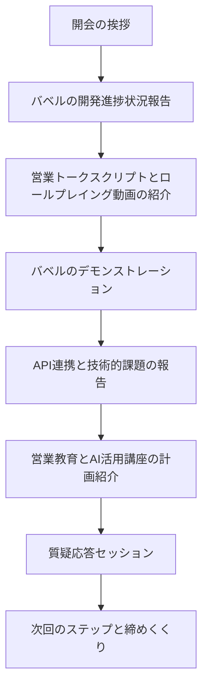

# 20241011 日立システムズ様[バベルMT]

[https://vimeo.com/1018758641/2f82c80d16?share=copy](https://vimeo.com/1018758641/2f82c80d16?share=copy)

[https://vimeo.com/1018758641/2f82c80d16?share=copy](https://vimeo.com/1018758641/2f82c80d16?share=copy)

▶️ログ：

[Transcript_2024-10-11.vtt](20241011%20%E6%97%A5%E7%AB%8B%E3%82%B7%E3%82%B9%E3%83%86%E3%83%A0%E3%82%B9%E3%82%99%E6%A7%98%5B%E3%83%8F%E3%82%99%E3%83%98%E3%82%99%E3%83%ABMT%5D%2011c31bbd522c80a19cd4eb9f29578e1e/Transcript_2024-10-11.vtt)

▶️次回：

- 一度10/31に向けたシナリオ確認をする。
- POCに向けた下地準備を入念に

↓

営業(訪問)；日立システムズ_バベル元木氏プレゼン
10月 31日 (木曜日)⋅16:00～17:30

▶️前回：

[20241002 日立システムズ様[バベルMT]](20241002%20%E6%97%A5%E7%AB%8B%E3%82%B7%E3%82%B9%E3%83%86%E3%83%A0%E3%82%B9%E3%82%99%E6%A7%98%5B%E3%83%8F%E3%82%99%E3%83%98%E3%82%99%E3%83%ABMT%5D%2011331bbd522c803a831bda72bd155a2f.md) 

[20241001 日立システムズ様[バベルMT]](20241001%20%E6%97%A5%E7%AB%8B%E3%82%B7%E3%82%B9%E3%83%86%E3%83%A0%E3%82%B9%E3%82%99%E6%A7%98%5B%E3%83%8F%E3%82%99%E3%83%98%E3%82%99%E3%83%ABMT%5D%2011231bbd522c8069846acec8f4dc8c29.md) 

[20240917 産業営定例会MT](20240917%20%E7%94%A3%E6%A5%AD%E5%96%B6%E5%AE%9A%E4%BE%8B%E4%BC%9AMT%2010531bbd522c80ce9a8fef30ae9de638.md) 

[20240913 日立システムズ様[バベルMT]](20240913%20%E6%97%A5%E7%AB%8B%E3%82%B7%E3%82%B9%E3%83%86%E3%83%A0%E3%82%B9%E3%82%99%E6%A7%98%5B%E3%83%8F%E3%82%99%E3%83%98%E3%82%99%E3%83%ABMT%5D%2010231bbd522c808e9314f0d9a0c7167e.md) 

▶️10月31日16:00 - 

ここでのプレゼンテーションを完璧なものにするために

事前にコンテンツを整備したい



**１、現場再現**

リアルな営業商談様子をなるべく商談ロープレを実施して撮っておく

　A）営業新人　１〜２年目　ヒアリング能力弱く健在ニーズを聞くのみ

　B）営業達人　１０年目　SPIN話法等のヒアリング能力熟練者、潜在ニーズまで汲み取れる

※題材を [FutureStage]とし商談の良し悪しを記録として残す

[FutureStage概要紹介資料 1.pdf](20241011%20%E6%97%A5%E7%AB%8B%E3%82%B7%E3%82%B9%E3%83%86%E3%83%A0%E3%82%B9%E3%82%99%E6%A7%98%5B%E3%83%8F%E3%82%99%E3%83%98%E3%82%99%E3%83%ABMT%5D%2011c31bbd522c80a19cd4eb9f29578e1e/FutureStage%25E6%25A6%2582%25E8%25A6%2581%25E7%25B4%25B9%25E4%25BB%258B%25E8%25B3%2587%25E6%2596%2599_1.pdf)

**バベル向け営業トークスクリプト：**

[https://tanren.notion.site/11d31bbd522c806db857d8d8f549ed6d?pvs=4](%E3%83%8F%E3%82%99%E3%83%98%E3%82%99%E3%83%AB%E7%94%A8%E5%96%B6%E6%A5%AD%E3%83%88%E3%83%BC%E3%82%AF%E3%82%B9%E3%82%AF%E3%83%AA%E3%83%95%E3%82%9A%E3%83%88%E6%A1%88%2011d31bbd522c806db857d8d8f549ed6d.md)

**２、議事録の自動生成**

[①スマホでの音声収録]から、[②一発で文字起こし]→[③議事録生成]→[④バベルへの連携]ができるようにする

　Phase１、いったん、Teamsの録画データでトライ

　Phase２、開発次第で、①②③をNoCode開発

　Phase３、＆④バベル統合

↓  営業台本をベースにした議事録ができたと[**仮定**]

例１：　営業１〜２年目　佐藤例

```markdown
---
## 生産管理パッケージソフト「FutureStage」提案に関する会議

**日時**: 2024年10月14日 14:00～14:45  
**場所**: 株式会社ABC商事 会議室  
**ZOOM ID**: 該当なし  
**参加者名**: 佐藤 (日立システムズ), 喜田めぐみ (株式会社ABC商事 製造部長)  

## 議事録の要旨
- **生産管理の煩雑化と業務効率化の必要性**: 受注増加に伴う生産管理の複雑化と手作業による効率の低下について共有。
- **「FutureStage」の機能と導入メリット**: 自動生産計画作成、リアルタイム在庫管理、データ分析機能などの具体的な機能紹介と業務効率化への貢献。
- **導入後のサポート体制とセキュリティ対策**: 専任サポートチームによる導入支援、定期トレーニング、24時間対応のサポート窓口、および最新のセキュリティ対策の説明。

### 次のステップ
- **佐藤**: 詳細なお見積りと導入プランの作成。
- **佐藤**: デモンストレーションの準備と日程調整。
- **喜田めぐみ**: 内部検討後、次回ミーティングでのフィードバック提供。

## プロジェクト概要
**佐藤 [00:00:00]**  
「FutureStage」の提案を通じて、株式会社ABC商事の生産管理業務の効率化と納期遵守率の向上を目指す。受注増加に伴う業務の煩雑化を解消し、データ分析に基づく戦略的な生産計画を実現することが目的。

### 目的
- **生産管理業務の効率化**: 手作業による生産計画作成と在庫管理の自動化。
- **納期遵守率の向上**: 正確な納期回答と生産計画の最適化。
- **在庫管理の精度向上**: リアルタイム在庫管理による無駄なコスト削減。
- **データ分析による戦略的生産計画**: 過去データを基にした需要予測とコスト分析。

### 背景
**喜田めぐみ [00:05:00]**  
株式会社ABC商事は、受注量の増加により生産管理が煩雑化し、手作業による生産計画作成や在庫管理に時間と労力がかかっている。これにより納期遅延や在庫過不足が発生し、業務効率の向上とコスト削減が求められている。

###課題の概要
**喜田めぐみ [00:10:00]**  
- **生産計画の立案と在庫管理の手作業**: データ入力ミスや情報共有の不備による納期遅延と在庫過不足。
- **ITリテラシーの低さによる新システム導入への不安**: 新しいシステム導入に対する社員の抵抗感と操作方法の習得の困難さ。

### 課題の詳細
- **現象**: 手作業による生産計画作成と在庫管理が原因で、データの正確性に欠け、納期遅延や在庫の過不足が頻発。
- **影響範囲**: 生産部門全体に影響を及ぼし、顧客満足度の低下とコスト増加を招いている。

## 原因分析

### 原因の概要
**佐藤 [00:12:00]**  
手作業による生産計画作成と在庫管理が業務効率を低下させ、データの正確性を損なっていることが主な原因。ITリテラシーの低さも新システム導入の障壁となっている。

### 詳細な原因分析
- **根本原因**: 生産管理業務の自動化が進んでおらず、属人的な作業に依存していること。ITスキル不足により、新システム導入への抵抗感が強い。
- **関連するデータや証拠**: 生産計画作成に要する時間が手作業で平均5時間/週、納期遅延が月平均3件発生している。

### 提案概要
**佐藤 [00:14:00]**  
「FutureStage」の導入により、生産計画作成と在庫管理を自動化し、業務効率を大幅に向上させる。専任サポートチームによる導入支援とトレーニングを提供し、ITリテラシーの低さによる不安を解消する。

### 提案の詳細
- **解決策の内容**: 「FutureStage」の自動生産計画作成機能とリアルタイム在庫管理機能を導入。クラウド型システムにより初期費用を抑え、導入後のメンテナンスを簡便化。
- **実施の手順**: 
  1. 導入プランの策定
  2. カスタマイズ設定
  3. システム導入と初期トレーニング
  4. 定期的なフォローアップとサポート
- **期待される効果**: 生産計画作成時間の50%削減、納期遵守率の向上、在庫コストの年間20%削減。

### アプローチの概要
**佐藤 [00:20:00]**  
品質向上のため、「FutureStage」を活用し、生産管理プロセスの標準化と効率化を図る。データ分析機能を活用して需要予測とコスト分析を実施し、戦略的な生産計画を立案する。

### 具体的な方法
- **使用ツール**: 「FutureStage」生産管理システム、クラウドプラットフォーム。
- **プロセス改善手法**: 自動化とデータ統合による業務プロセスの効率化。

## 計画の概要
**佐藤 [00:25:00]**  
今後、「FutureStage」の導入を段階的に実施。初期設定からカスタマイズ、トレーニング、運用サポートまでを包括的に行う。

### 実施ステップ
- **ステップ1**: 詳細なお見積りと導入プランの作成。
- **ステップ2**: デモンストレーションの実施と操作感の確認。
- **リソースと責任者**: 佐藤が見積り作成とデモ準備を担当。喜田部長は内部検討とフィードバックを担当。

## リスクと対策

### リスクの概要
**佐藤 [00:30:00]**  
システム導入に伴う業務停止リスク、データ移行時のトラブル、社員の操作習熟不足による抵抗感が考えられる。

### 対策
- **リスク管理方法**: 導入前に詳細な計画を策定し、段階的にシステムを導入。バックアップデータの確保と移行手順の徹底。
- **緊急時の対応策**: 専任サポートチームによる24時間対応窓口の設置。緊急時には迅速に対応可能なバックアッププランの準備。

## 作成概要
**佐藤 [00:35:00]**  
本議事録は、「FutureStage」提案に関する会議内容を詳細に記録し、次のステップを明確化するために作成。

### 作成手法
- **手法1**: 会議録音の文字起こしと要点抽出。
- **手法2**: 参加者からのフィードバックを反映し、正確な議事録を作成。

### 方法論
**佐藤 [00:40:00]**  
会議中の発言を逐次記録し、重要ポイントを整理。議事録作成後、参加者に確認を依頼し、必要に応じて修正を行う。

### 重要性
- **品質への影響**: 正確な議事録作成により、会議内容の共有と次のアクションの明確化が図られ、プロジェクトの成功に寄与。

## 開発計画

### 開発計画
**佐藤 [00:42:00]**  
「FutureStage」の導入プロジェクトを以下のフェーズで進行。
1. プランニング
2. カスタマイズ設定
3. システム導入
4. トレーニングとサポート

### 具体的な目標
- **短期目標**: 導入プランとお見積りの提供、デモ実施。
- **長期目標**: 生産管理業務の完全自動化とデータ分析による戦略的生産計画の実現。

## 結論
**佐藤 [00:44:00]**  
「FutureStage」の導入により、株式会社ABC商事の生産管理業務の効率化と納期遵守率の向上が期待できる。導入後のサポート体制も充実しており、安心してシステムを利用できる環境を提供する。

## 次回の予定
- **次回ミーティングでの議題**: 詳細なお見積りの確認とデモのフィードバック。
- **実施するアクション**: 佐藤によるお見積りの作成とデモの日程調整。喜田部長による内部検討とフィードバックの準備。

## 参考資料
- **「FutureStage」製品カタログ**: 製品の詳細機能と導入事例の説明。
- **導入事例資料**: XYZ金属株式会社の「FutureStage」導入による成果報告。

---

上記の議事録から求められるシステム要件定義書を生成する
```

例２：　営業10年目　目野健例

```markdown
---
## 株式会社ABC商事 - 生産管理システム導入検討会議

**日時**: 2024年4月27日 10:00  
**場所**: 株式会社ABC商事 会議室  
**ZOOM ID**: N/A  
**参加者名**: 目野健一（営業本部長）、喜田めぐみ（製造部長）  

## 議事録の要旨
- **現状の課題**: 受注量増加に伴う生産管理の煩雑化、納期遅延、在庫管理ミス。
- **導入提案**: 日立システムズの「FutureStage」生産管理パッケージソフトの導入による業務の標準化と効率化。
- **次のステップ**: 現状分析ミーティングの設定と具体的な導入計画の策定。
  **本議事録では、株式会社ABC商事の生産管理における現状の課題を確認し、日立システムズの「FutureStage」導入による解決策を提案。今後の具体的なアクションプランを決定した。**

### 次のステップ
- **目野健一**: 現状分析と要件定義のためのミーティングを設定。
- **喜田めぐみ**: 社内での現行システムの詳細情報を収集し、提供。
- **双方**: 導入スケジュールと具体的な見積もりの作成。

## プロジェクト概要
[目野健一][00:00:00]  
株式会社ABC商事は、受注量の増加に伴い生産管理が煩雑化し、納期遅延や在庫管理のミスが発生している。これらの課題を解決するために、新しい生産管理システムの導入を検討している。

### 目的
- **業務の標準化と効率化**: 属人的な業務を標準化し、業務効率を向上させる。
- **納期の正確性向上**: 正確な納期回答を顧客に提示できる体制を構築。
- **在庫管理の精度向上**: 無駄なコストを削減するため、在庫管理の精度を向上させる。

### 背景
- **受注量の増加**: 近年、受注量が増加し、それに伴い生産管理が複雑化。
- **現行システムの限界**: 現在はExcelや紙ベースで管理しており、リアルタイムでの情報共有が困難。
- **顧客満足度の低下**: 納期遅延が顧客満足度に悪影響を及ぼしている。

### 課題の概要
[喜田めぐみ][00:05:00]  
生産管理における手作業によるプロセスが原因で、納期設定の不正確さや在庫管理のミスが頻発。これにより、顧客からの信頼低下やコスト増加が発生している。

### 課題の詳細
- **現象**: 手作業による生産計画の遅延、在庫管理の不正確さ。
- **影響範囲**: 顧客満足度の低下、従業員のモチベーション低下、経営コストの増加。

## 原因分析

### 原因の概要
[目野健一][00:10:00]  
手作業による生産管理プロセスが属人的であり、情報の一元管理ができていないことが主な原因。

### 詳細な原因分析
- **根本原因**: 生産管理システムが手動で運用されており、自動化やデジタル化が進んでいない。
- **関連するデータや証拠**: 納期遅延の頻度増加、在庫ミスによるコスト増加の具体的な数値データ。

### 提案概要
[目野健一][00:12:00]  
「FutureStage」の導入により、生産計画の自動化、在庫管理の精度向上、情報共有の改善を図る提案。

### 提案の詳細
- **解決策の内容**: 「FutureStage」を用いた受注管理、生産計画、資材調達、在庫管理、原価管理の一元化。
- **実施の手順**: 現状分析 → システム設定・カスタマイズ → トレーニング → 運用開始。
- **期待される効果**: 納期遵守率の向上、在庫コストの削減、生産性の向上。

### アプローチの概要
[目野健一][00:14:00]  
ユーザーフレンドリーな設計と充実したサポート体制により、ITリテラシーの低いスタッフでもスムーズにシステムを導入・運用可能。

### 具体的な方法
- **使用ツール**: 「FutureStage」生産管理ソフトウェア。
- **プロセス改善手法**: 業務フローの標準化とシステム統合による効率化。

## 計画の概要
[目野健一][00:15:00]  
導入から運用開始まで約3ヶ月を予定。現状分析と要件定義のミーティングを優先的に実施し、その後システム設定・カスタマイズ、トレーニングを順次行う。

### 実施ステップ
- **ステップ1**: 現状分析と要件定義のミーティング設定。
- **ステップ2**: システムの設定・カスタマイズ実施。
- **リソースと責任者**: 日立システムズの専門チームが全面的にサポート。

## リスクと対策

### リスクの概要
[目野健一][00:17:00]  
システム導入に伴うデータ移行のリスクや、スタッフの適応に対する懸念。

### 対策
- **リスク管理方法**: 専任チームによるデータ移行サポートとバックアップ体制の強化。
- **緊急時の対応策**: トラブル発生時の迅速な対応を可能とするサポート体制の整備。

## 作成概要
[目野健一][00:18:00]  
本議事録は、SPIN話法を用いた営業ロールプレイを基に作成。顧客の潜在ニーズを深掘りし、具体的な提案内容を整理。

### 作成手法
- **手法1**: SPIN話法に基づいた対話内容の整理。
- **手法2**: 議事録フォーマットへの構造化。

### 方法論
[目野健一][00:19:00]  
対話内容をテーマごとに分類し、要点を抽出。重要なフレーズは太字で強調表示。

### 重要性
- **品質への影響**: 正確な議事録作成により、後続のアクションプランの実行が円滑に進行。

## 開発

### 開発計画
[目野健一][00:20:00]  
「FutureStage」のカスタマイズ開発を計画。ABC商事の業務フローに最適化。

### 具体的な目標
- **短期目標**: 現状分析と要件定義の完了。
- **長期目標**: システム導入による生産管理の効率化とコスト削減。

## 結論

[目野健一][00:21:00]  
「FutureStage」の導入により、ABC商事の生産管理課題を解決し、業務の標準化と効率化を実現する。今後の具体的な導入ステップを進めることで、顧客満足度の向上とコスト削減を達成する。

## 次回の予定
- **次回ミーティングでの議題**: 現状分析ミーティングの日程調整と要件定義の詳細。
- **実施するアクション**: 現状分析ミーティングの設定、必要なデータの収集と提供。

## 参考資料
- **FutureStage製品パンフレット**: システム機能詳細 [目野健一][00:22:00]
- **導入事例レポート**: 他社での導入成功事例 [目野健一][00:22:30]

---

上記の議事録から求められるシステム要件定義書を生成する
```

**３、バベルでのシステム要件定義ファイルを書き出す**

最新Verでは、チャットUIによる対話形式でのブラッシュアップ機能を模索中とのこと

→直近MTを[佐藤←→元木]間で進め、上記要求を包括できるかヒアリング予定

↓

ここではFutureStageは[パッケージ商品]における**[導入計画におけるシステム要件定義書]**だが

本来はスクラッチ開発における[０→１］の商品であるはずのでバベルに

[https://www.hitachi-systems.com/digitalization/case/index.html](https://www.hitachi-systems.com/digitalization/case/index.html)
数百の商材情報をベースに導入支援における要件定義ができるのか？

RAGからませて？

このあたりの要求整理は重要

**４、開発＆デモの完成度を高めるため**

| 期間 | 開発状況 | 作業ポイント |
| --- | --- | --- |
| 10/14(月)〜10/20 | 開発中 | 開発中 UI改善、台本運用、商談収録 |
| 10/21(月)〜10/27 | Dev | Dev 音声入力機能実装、チャットUI導入開始 |
| 10/28(月)〜10/31 | 公開 | 最終調整、デモ準備 |

▶️議事録

> **10月1日打ち合わせ後の進捗確認と今後の流れ確認**
> 
> 
> ---
> 
> ### 議事の要旨:
> 
> **10月1日の打ち合わせで好感触を得たPOC（概念実証）に関して、10月31日に各事業部長クラスへデモを行うことが決定**。POCでは、営業担当者の顧客との会話を録音し、議事録や要件定義を自動生成するシステム「**バベル**」の活用を想定。**千葉氏**は、営業担当者のヒアリング能力の標準化を目的として、実態に近い営業トークの台本作成とロールプレイング動画作成を**TANREN株式会社**側に依頼。**TANREN株式会社**は、UI改善、チャットUI導入、音声入力機能実装などを進めつつ、千葉氏から提供される資料をもとに台本作成と動画作成を進めることとなった。また、API連携に関わる費用は、**TANREN株式会社**側が一時的に負担し、後ほど請求する形で対応することになった。
> 
> ---
> 
> ## POC進捗とデモに向けた準備:
> 
> ### 10月31日デモ決定と概要:
> 
> - **各事業部長向けに10月31日に「バベル」のデモを実施することが決定 [千葉茂][00:00]**
>     - 山内氏も良い感触を得ており、早期に活用できる見込み [千葉茂][00:00]
>     - 各事業部長クラスを集めて実施予定 [千葉茂][00:00]
>         - 佐藤勝彦（**TANREN株式会社** 代表取締役社長）と元木氏で対応予定 [千葉茂][00:00]
>     - **営業担当者向けにPOCを開始予定 [千葉茂][00:01]**
>         - 営業が顧客先での会話を録音し、議事録を自動生成 [千葉茂][00:01]
>             - 録音データから要約と顧客との合意形成を行う [千葉茂][00:02]
>         - 生成された要件定義をもとに「バベル」で開発を進める [千葉茂][00:02]
>         - **人員削減と工期短縮を実現するためのPRを実施予定 [千葉茂][00:03]**
>             - デモで具体的な成果を示す [千葉茂][00:03]
>     - 予算の関係で既存の教育費用の範囲内でPOCを実施予定 [千葉茂][00:02]
>         - 下期予算が取れていないため、教育費用を活用 [千葉茂][00:02]
> 
> ### 「バベル」の現状と改善点:
> 
> - **「バベル」のUI改善が必要 [佐藤勝彦][00:03]**
>     - 現状のUIは演出効果に重きが置かれ、ビュワーとしてはブラッシュアップが必要、特に年配層には理解しづらい可能性 [佐藤勝彦][00:04]
>     - **UI改善を優先事項とする [佐藤勝彦][00:04]**
> - **チャットUIの導入で対話形式を実現 [佐藤勝彦][00:04]**
>     - 対話しながら要件定義の完成度を高める [佐藤勝彦][00:04]
>         - 30% - 60%程度の完成度で十分と山内氏は言及 [佐藤勝彦][00:04]
>         - 必要最低限のドキュメントとファイル生成で良い [佐藤勝彦][00:04]
> - **音声入力機能の検討 [佐藤勝彦][00:05]**
>     - 音声入力機能を導入し、AIとの対話を実現 [佐藤勝彦][00:05]
>         - **Whisper**などの最新APIでリアルタイム音声処理が可能に [佐藤勝彦][00:05]
>         - デモまでに音声対話の実装は難しい可能性があるが、音声入力とテキスト返答であれば実現可能 [佐藤勝彦][00:05]
> - **録音と文字起こしの方法 [佐藤勝彦][00:06]**
>     - **iPhone**や**Android**のボイスレコーダーで録音し、Webアプリにアップロード [佐藤勝彦][00:06]
>         - 議事録が自動生成され、関係者に共有される [佐藤勝彦][00:06]
>         - 要件定義が完了すると再度通知が行われる [佐藤勝彦][00:06]
>     - **PC UIとスマホUIの選択を要件定義で決定 [佐藤勝彦][00:07]**
>         - 間に合わなければ、PC UIのみで対応 [佐藤勝彦][00:07]
> 
> ---
> 
> ## Teams連携と技術的課題:
> 
> ### Teamsとの連携について:
> 
> - **Microsoft TeamsとCopilotの連携機能で要約が可能 [千葉茂][00:07]**
>     - 会議後に要約ボタンを押すと自動的に要約が生成される [千葉茂][00:08]
> - **TeamsのAPI連携は要件定義が複雑になる可能性 [佐藤勝彦][00:08]**
>     - 外部APIと接続して良いか不明 [佐藤勝彦][00:08]
>         - **OpenAI**との連携に慎重になる必要 [佐藤勝彦][00:09]
>     - **代替案として、Teamsから音声ファイルとテキストデータをダウンロードして「バベル」にアップロードする方法を提案 [佐藤勝彦][00:09]**
>         - システムが切り離されているため、POCの段階では現実的 [佐藤勝彦][00:09]
>         - 営業の手間が一つ増えるが解決可能 [佐藤勝彦][00:09]
> 
> ---
> 
> ## デモ用台本作成とロールプレイング:
> 
> ### 台本作成とロールプレイングの計画:
> 
> - **営業トークの台本を作成し、ロールプレイング動画を作成 [佐藤勝彦][00:12]**
>     - **ChatGPT**を活用して台本を生成 [佐藤勝彦][00:13]
>         - 大手SIerの商談事例をもとに台本を作成 [佐藤勝彦][00:13]
>     - 実態に近い営業トークを再現 [佐藤勝彦][00:14]
>         - ヒアリングが上手でない営業担当者を想定 [佐藤勝彦][00:14]
> - **とっちらかった会話の台本が効果的 [佐藤勝彦][00:15]**
>     - 営業の課題を明確に示すことで「バベル」の利点を強調 [佐藤勝彦][00:15]
> - **「フューチャーステージ(FutureStage)」を題材に [千葉茂][00:16]**
>     - **日立システムズ**の製品である「フューチャーステージ(FutureStage)」の営業資料を提供 [千葉茂][00:16]
>         - 提供された資料をもとに台本を作成 [佐藤勝彦][00:17]
> - **営業教育への活用提案 [千葉茂][00:19]**
>     - ロールプレイング動画を営業教育に活用 [千葉茂][00:19]
>         - 動画を見て課題点を洗い出す [千葉茂][00:19]
>         - **阿部由里子**氏による思考整理法を取り入れる [千葉茂][00:19]
>             - **一般社団法人プレゼンテーション協会**のメソッドを活用 [佐藤勝彦][00:20]
>                 - 版権問題を回避するため内容を調整 [佐藤勝彦][00:21]
> 
> ---
> 
> ## 今後のタスクと技術導入計画:
> 
> ### 営業教育とAI活用講座:
> 
> - **営業教育の新たな3か年計画を立案 [千葉茂][00:22]**
>     - 動画制作プロジェクト「動画PJ」は3月末で終了 [千葉茂][00:22]
>     - **AI活用講座（応用編）を実施予定 [千葉茂][00:22]**
>         - 佐藤勝彦氏が新しいAIの使い方を指導 [千葉茂][00:22]
>             - **GPT o1**や**gemini 1.5 pro**などの最新技術を活用 [佐藤勝彦][00:24]
>         - **マークダウン**記法の習得を推進 [佐藤勝彦][00:22]
>             - プレゼン資料作成の効率化を図る [佐藤勝彦][00:22]
>         - **Marp記法**や**Cursor**の活用も検討 [佐藤勝彦][00:24]
> - **API連携の技術的課題と対応策 [佐藤勝彦][00:25]**
>     - **OpenAI**や**Anthropic**のAPI連携費用は**TANREN株式会社**が一時的に負担 [佐藤勝彦][00:25]
>         - 後日まとめて請求する形で対応 [佐藤勝彦][00:25]
>     - **Cursor**の導入とAPI連携テストを10月31日までに完了予定 [佐藤勝彦][00:28]
>         - **日立システムズ**社内PCでの動作確認を実施 [佐藤勝彦][00:29]
> 
> ### バベル開発の進捗確認:
> 
> - **開発担当の元木氏と打ち合わせを実施予定 [佐藤勝彦][00:29]**
>     - UI改善や機能追加の進捗を確認 [佐藤勝彦][00:29]
>     - デモに向けた最終調整を行う [佐藤勝彦][00:29]
> 
> ---
> 
> ## 資料共有と次回までの課題:
> 
> ### 資料の共有と活用:
> 
> - **「フューチャーステージ(FutureStage)」の営業資料を共有 [佐々木琢丸][00:17]**
>     - 台本作成に活用し、実態に近い営業トークを再現 [佐藤勝彦][00:17]
> - **資料ダウンロードでエラーが発生 [佐藤勝彦][00:30]**
>     - 別途、メールや**Box**で資料を送付予定 [佐々木琢丸][00:30]
>         - 早急に台本作成を開始するための対応 [佐藤勝彦][00:30]
> 
> ### 次回までの主なタスク:
> 
> - **台本の作成とロールプレイング動画の撮影 [佐藤勝彦][00:30]**
>     - 提供された資料をもとに台本を作成 [佐藤勝彦][00:30]
>     - **TANREN株式会社**内で役割分担し撮影を行う [佐藤勝彦][00:15]
> - **API連携の技術検証 [佐々木琢丸][00:25]**
>     - **Cursor**の使用許可とAPIキーの設定を完了させる [佐々木琢丸][00:25]
>         - 社内規定に沿った形での導入を検討 [佐々木琢丸][00:25]
> - **バベルの機能改善とデモ準備 [佐藤勝彦][00:29]**
>     - UI改善、チャットUI導入、音声入力機能の実装を進める [佐藤勝彦][00:29]
>     - 10月31日のデモに向けて最終調整を行う [佐藤勝彦][00:29]
> 
> ---
> 
> ## 今後の予定と連絡事項:
> 
> ### デモに向けたスケジュール調整:
> 
> - **10月31日のデモに向けて、進捗状況を随時共有 [千葉茂][00:29]**
>     - 必要に応じて追加の打ち合わせを設定 [千葉茂][00:29]
> 
> ### その他の連絡事項:
> 
> - **資料共有に関する問い合わせは佐々木琢丸まで [佐々木琢丸][00:30]**
> - **技術的な問い合わせや要望は佐藤勝彦まで [佐藤勝彦][00:30]**
> 
> ---
> 
> *以上、ご確認よろしくお願いいたします。*
> 

完