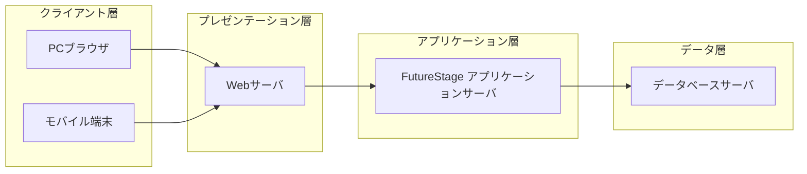
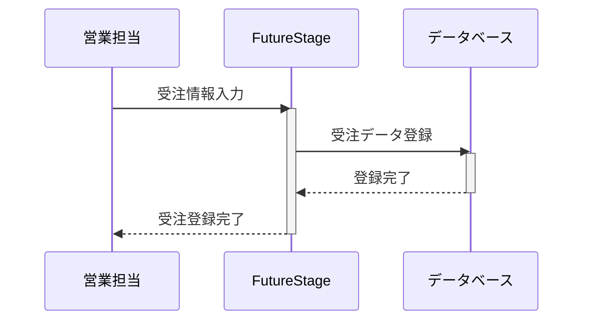
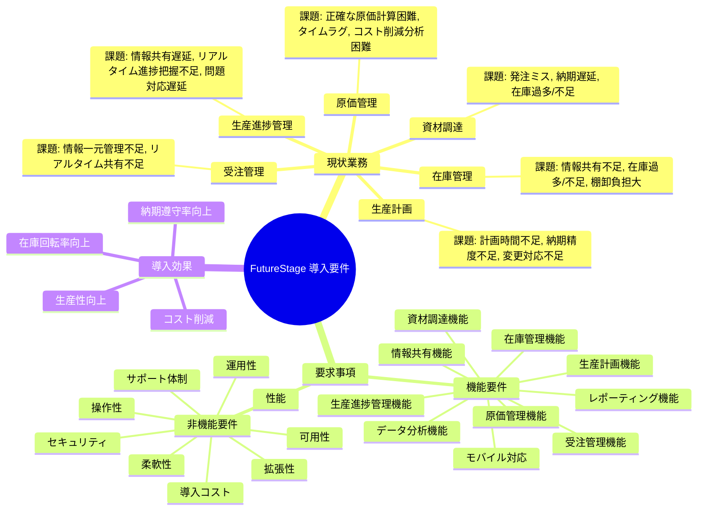
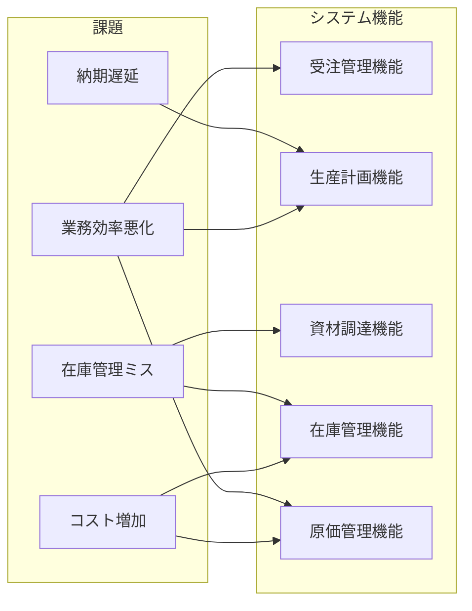
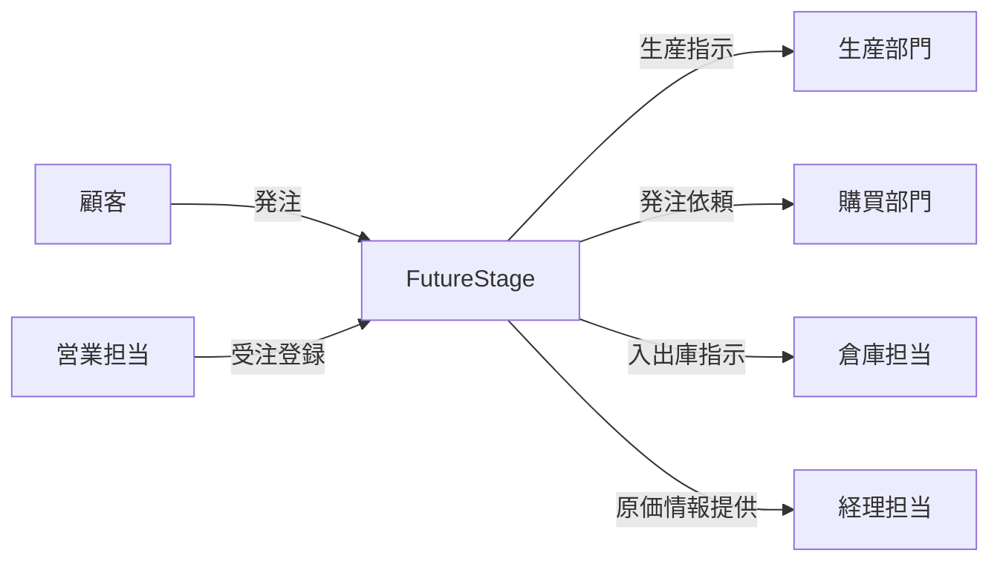

# 20241015 真・大手SIer営業のAI時代のプレゼンスタイル[超α版_AIとやってみた]

[https://vimeo.com/1019707321/a78e1dc6df?share=copy](https://vimeo.com/1019707321/a78e1dc6df?share=copy)

02:30あたりから再生ください

- **文字起こし：**
    
    ```markdown
    はい、準備できました。いつでも始めてください。
    
    あなた:
    喜田部長、本日はお時間いただきありがとうございます。 日立システムズの目野健一と申します。
    喜田部長:
    喜田部長
    目野さん、ようこそいらっしゃいました。お待ちしておりました。
    
    あなた:
    ありがとうございます。今日は弊社の生産管理パッケージソフト、FutureStageについて、 御社のニーズに合わせたご提案をさせていただきたいと思います。 早速ですが、御社が現在、抱えていらっしゃる課題についてお伺いしてもよろしいでしょうか。
    喜田部長:
    喜田部長
    ええ、最近、生産管理が煩雑になってきていまして。受注量が増えるにつれて、手作業での管理では対応が難しくなり、納期遅延や在庫管理のミスが増えてきています。それに、情報の共有もスムーズにいかず、各部署間での連携がうまく取れていません。
    
    あなた:
    なるほどですね。 受注量の増加に伴って業務が複雑化していることが考えられるわけですね。 そうすると、具体的に現在の生産管理プロセスっていうところはどういうふうになっているかっていうのをちょっと教えてもらってもよろしいでしょうか。
    喜田部長:
    喜田部長
    はい、現在は主にExcelや紙ベースで受注管理を行っています。受注が入ると、手作業で生産計画を立て、必要な資材を発注しています。生産進捗は現場で管理し、在庫状況も各部署で個別に把握しています。このため、情報がバラバラになりやすく、リアルタイムでの把握が難しい状況です。
    
    あなた:
    ありがとうございます。受注管理から生産計画、資材の発注、在庫確認まで全て手作業でやってるっていうことですよね。 そうするとこれによるこの問題とか課題とかっていうのは生じることが多いんではないかなというふうに予想されるんですけど、状況はいかがですか?
    喜田部長:
    喜田部長
    まず、生産計画に時間がかかるため、納期の設定が不正確になりがちです。その結果、顧客に対して納期を守れないことが増えてきました。また、在庫管理が属人的になっているため、在庫過多や欠品が頻繁に発生し、コストの無駄が生じています。さらに、各部署間で情報が共有されていないため、連携が取れず、効率的な業務運営が難しくなっています。
    
    あなた:
    なるほど、具体的に納期の遅延が顧客満足度にどのような影響を与えるというふうに今考えておられる
    喜田部長:
    喜田部長
    納期遅延が続くと、顧客からの信頼が低下し、最悪の場合、取引先を他社に変更されてしまう可能性があります。また、急な対応が必要になるため、現場の負担が増え、従業員のモチベーションにも悪影響を与えています。結果的に、納期遅延や在庫管理のミスが全体的な業務効率にも悪影響を及ぼし、経営にも負担がかかっています。
    
    あなた:
    なるほど。そうした問題が解決されれば、どうでしょうかね。どのような利点が 御社には一番あるというふうに考えられますかね。いくつか考えられるんですけども、一番影響がでかそうな部分というのはどういうところでしょうか。
    喜田部長:
    喜田部長
    もし生産管理がシステム化され、業務が標準化されれば、まず納期の正確性が向上し、顧客からの信頼が回復すると思います。また、在庫管理の精度が上がれば、無駄なコストを削減でき、経営効率の改善につながるでしょう。さらに、各部署間での情報共有がスムーズになれば、業務の連携が向上し、全体的な生産性が高まると考えています。これが一番大きな利点だと思います。
    
    あなた:
    ありがとうございます。具体的なニーズがお伺いできたので、非常に参考になりました。 御社が理想とする生産管理のシステムの機能についても、もう少しだけ詳しく教えてもらいたいんですけれども、 例えばどのような機能が特に重要だというふうに今お考えなんでしょうか。 いくつかある機能の中の大中小なりの機能があると思うんですけれども、どのあたりに一番重きを持っていらっしゃいますか。
    喜田部長:
    喜田部長
    そうですね、まず受注管理と生産計画の自動化が最も重要です。これにより、手作業によるミスが減り、迅速な対応が可能になります。また、在庫管理をリアルタイムで行えることも大切で、各部署間での情報共有がスムーズにできることも重要視しています。さらに、将来的にはデータ分析を活用した生産計画の最適化や、品質管理の強化も視野に入れています。
    
    あなた:
    ありがとうございます。理解しました。 そうすると、現在のシステム導入に対する 懸念点や不安点なんていうのはまた別の方向でありますかね。 なんか細かいことでも結構なんですけども、 聞いて帰りたいんですがいかがでしょうか。
    喜田部長:
    喜田部長
    一番の懸念は、ITリテラシーが高くないスタッフが新しいシステムに適応できるかどうかです。また、導入コストや運用コストがどれくらいかかるのかも気になります。さらに、既存の業務フローとの統合がスムーズに行えるかどうかも不安です。
    
    あなた:
    ありがとうございます その点においてもですね 弊社FutureStageは ユーザーフレンドリーな設計になっておりますので 導入後のトレーニングやサポート体制も充実しておりますし またクラウド型のシステムでございますので 初期投資を抑えることはもちろん可能でございますし 既存の業務フローとの統合に関してもですね 柔軟に弊社の方で対応させていただきますので 後ほどですね 具体的な導入事例についてもご紹介できますが お時間の方は大丈夫でしょうか
    喜田部長:
    喜田部長
    導入事例についてお聞きできると、具体的なイメージが湧きやすいので、ぜひお願いします。
    
    あなた:
    ありがとうございます。例えば弊社が導入を支援した 他の金属加工メーカー様ではFutureStageの導入により 生産計画の自動化が実現しまして 農機を守る率というものが20%以上も向上したんですね。 また在庫管理の精度が上がりましたので 在庫コストを15%削減することに成功しております。 さらにはデータ分析の機能を活用しまして 生産プロセスの最適化を図っているようなことで お客様からかなり満足度をいただいております。
    喜田部長:
    喜田部長
    具体的な成果が数字で示されているのは安心ですね。御社のシステムが実際に効果を上げていることが分かりました。
    
    あなた:
    ありがとうございます。では具体的にFutureStageが 御社のどの部分に最も最適に機能しそうだというところは パンフレットの中をご覧いただいている中で どこに注目されますかね?
    喜田部長:
    喜田部長
    まず、生産計画の自動化と在庫管理の精度向上が最も必要だと感じています。また、各部署間での情報共有がスムーズになることで、全体の業務効率も上がると期待しています。さらに、将来的なデータ分析による生産計画の最適化も視野に入れておりますので、その機能にも注目しています。
    
    あなた:
    理解しました ありがとうございます FutureStageはご覧のとおりですね 受注管理から生産計画 資材調達 果てには在庫管理から原価管理まで これ一貫してカバーできているため 御社のニーズに非常にマッチしているのではないかなというふうに 今日時点では考えております またクラウド型であるため 御社の導入に際し 頭のコストというものはほぼほぼかからないで 毎月の費用のみでお使いいただけますし 簡単だというところが非常に売りになっておりますので ITリテラシーが高くない方でもですね 直感的に操作できるインターフェースを採用しておりますので 教育に対してそこまで堅い列しなくてもですね スッと導入いただけるのではないかなというところが魅力になっております
    喜田部長:
    喜田部長
    それは心強いですね。具体的には、どのようなサポート体制があるのですか？
    
    あなた:
    導入前には詳細なヒアリングを もちろん行わせていただきますし 御社の業務フローに最適な提案というのを ご提案させていただきます 設定をですね ご提案させていただきます 導入後もトレーニングのセッションというのを 用意させていただいておりますので スタッフの皆様がシステムを使いこなせるよう サポートさせていただきますし また導入開始後も1000人のサポートチームを 今回編成するつもりでおりますので 問題が発生した際は 迅速に対応が可能になっております
    喜田部長:
    喜田部長
    トレーニングやサポートが充実しているのは安心です。現場のスタッフも新しいシステムに慣れるかどうかが不安でしたが、しっかりサポートしていただけるなら安心ですね。
    
    あなた:
    はい、御社がスムーズにシステム活用できるように 全力でサポートさせていただきますし また、FutureStageは拡張性が 非常に高くて評判なんですね なので、将来的なデータ設計とか分析など そういった高度な生産計画にも対応することが可能でございますし モバイル化になれば、必要に応じてカスタマイズの 需要というものも多分あろうかと思います なので、御社の成長ステージに合わせて システムの冗長性を上げていくということも可能になっております
    喜田部長:
    喜田部長
    将来的な拡張性があるのは重要ですね。今後の成長に合わせてシステムを柔軟に変更できるのは、大きなメリットです。
    
    あなた:
    その通りです。具体的には、御使者が現在使用されている システムの詳細をお伺いして、最適な連携方法を提案させていただきますので、 また、データの移行の際もスムーズに行えるように、 当社のエンジニアの方でサポートさせていただきます。
    喜田部長:
    喜田部長
    データ移行についても心配していましたが、サポートしていただけるのなら安心ですね。
    
    あなた:
    以上になります。
    ```
    

顧客ペルソナ等の設定は前回ご連絡のこちらを参照ください

バベル向け営業トークスクリプト
[https://tanren.notion.site/11d31bbd522c806db857d8d8f549ed6d](%E3%83%8F%E3%82%99%E3%83%98%E3%82%99%E3%83%AB%E7%94%A8%E5%96%B6%E6%A5%AD%E3%83%88%E3%83%BC%E3%82%AF%E3%82%B9%E3%82%AF%E3%83%AA%E3%83%95%E3%82%9A%E3%83%88%E6%A1%88%2011d31bbd522c806db857d8d8f549ed6d.md)

を

参照ください

---

上記の音声から

文字起こし→議事録が起きたとします（方法論はまた別途）

<aside>
💡

## **FutureStage導入提案に関する商談議事録**

</aside>

### 議事の要旨:

**日立システムズの目野氏が、喜田部長に対し、生産管理パッケージソフト「FutureStage」の提案を行った。喜田部長は、現在の生産管理における課題として、受注量の増加に伴う業務の煩雑化、納期遅延、在庫管理のミス、情報共有の不足などを挙げた。目野氏は、FutureStageの導入により、これらの課題を解決し、納期の正確性向上、在庫管理の精度向上、業務連携の向上などの効果が期待できることを説明した。また、喜田部長の懸念点である、システムへの適応、導入コスト、既存システムとの統合についても、FutureStageの特徴とサポート体制によって対応可能であることを示した。喜田部長は、具体的な導入事例やサポート体制の説明を受け、FutureStageへの導入に前向きな姿勢を示した。**

## 生産管理の現状と課題:

### 現状の生産管理プロセス:

- **Excelや紙ベースでの受注管理、手作業での生産計画、資材発注、在庫管理を行っている。[喜田部長][00:04]**
    - 情報がバラバラになりやすく、リアルタイムな把握が難しい。[喜田部長][00:04]

### 現状の課題:

- **生産計画に時間がかかり、納期設定が不正確になりがち。[喜田部長][00:06]**
    - 納期遅延が発生し、顧客満足度が低下。[喜田部長][00:06]
- **在庫管理が属人的で、在庫過多や欠品が頻発し、コストの無駄が多い。[喜田部長][00:06]**
- **各部署間で情報共有が不足し、連携が取れず、業務効率が悪い。[喜田部長][00:06]**
- **納期遅延は顧客からの信頼低下、取引先変更の可能性、従業員のモチベーション低下に繋がる。[喜田部長][00:08]**
    - 業務効率、経営にも悪影響。[喜田部長][00:08]

## システム導入による期待効果:

### システム導入によるメリット:

- **納期の正確性向上、顧客からの信頼回復。[喜田部長][00:10]**
- **在庫管理の精度向上、コスト削減、経営効率改善。[喜田部長][00:10]**
- **情報共有の円滑化、業務連携向上、生産性向上。[喜田部長][00:10]**

## 理想とするシステムと機能:

### 重要な機能:

- **受注管理と生産計画の自動化。[喜田部長][00:12]**
- **リアルタイムな在庫管理。[喜田部長][00:12]**
- **円滑な情報共有。[喜田部長][00:12]**
- **将来的にはデータ分析による生産計画の最適化、品質管理強化。[喜田部長][00:12]**

## システム導入への懸念点:

### 懸念点と不安点:

- **ITリテラシーが低い従業員のシステムへの適応。[喜田部長][00:14]**
- **導入コストと運用コスト。[喜田部長][00:14]**
- **既存業務フローとの統合。[喜田部長][00:14]**

## FutureStage の提案とメリット:

### FutureStage の特徴とメリット:

- **ユーザーフレンドリーな設計。[目野][00:16]**
    - 導入後のトレーニングとサポート体制が充実。[目野][00:16]
- **クラウド型システム。[目野][00:16]**
    - 初期投資を抑え、月額費用のみで利用可能。[目野][00:16]
- **既存業務フローとの柔軟な統合が可能。[目野][00:16]**
- **直感的な操作が可能なインターフェース。[目野][00:24]**
    - ITリテラシーが低い従業員でも容易に操作可能。[目野][00:24]
- **受注管理から生産計画、資材調達、在庫管理、原価管理まで一貫して管理可能。[目野][00:24]**
- **拡張性が高い。[目野][00:28]**
    - 将来的なデータ分析、高度な生産計画、モバイル化、カスタマイズに対応可能。[目野][00:28]

### 導入事例:

- **金属加工メーカーでの導入事例：**
    - 生産計画の自動化により納期遵守率が20%向上。[目野][00:18]
    - 在庫管理の精度向上により在庫コストを15%削減。[目野][00:18]
    - データ分析機能を活用し、生産プロセスを最適化。[目野][00:18]

### サポート体制:

- **導入前のヒアリングと最適なシステム設定の提案。[目野][00:30]**
- **導入後のトレーニングセッションによる操作指導。[目野][00:26]**
- **導入後のサポートチームによる迅速な問題対応。[目野][00:26]**
- **既存システムとの連携方法の提案とデータ移行のサポート。[目野][00:30]**

## 今後の検討事項:

- **具体的なシステム導入計画の検討。**
- **費用対効果の評価。**
- **導入スケジュールの調整。**
- **契約条件の確認。**

---

仮にそのままGeminiに要件定義を羅列してもらったら・・・

↓　ヒアリングした内容から仮設検証

<aside>
💡

## FutureStage導入提案に関する商談議事録に基づく要件定義項目

</aside>

**推論過程を深掘りし、サブトピックス単位でヒアリング内容を網羅した要件定義項目を以下に列挙します。**

### 1. 現状分析

### 1.1. 業務プロセス

- **1.1.1. 受注管理**
    - 現状：Excel、紙ベースで管理 [事実]
    - 課題：情報の一元管理ができていない、リアルタイムな情報共有が難しい [顕在ニーズ]
    - 潜在ニーズ：受注情報に基づいた自動的な生産計画立案、進捗管理
- **1.1.2. 生産計画**
    - 現状：手作業で計画、Excel等で管理 [事実]
    - 課題：計画に時間を要する、納期設定の精度が低い、計画変更への柔軟な対応が難しい [顕在ニーズ]
    - 潜在ニーズ：需要予測に基づいた計画立案、計画変更の自動反映、複数拠点の生産能力考慮
- **1.1.3. 資材調達**
    - 現状：生産計画に基づき、担当者が手作業で発注 [事実]
    - 課題：発注ミス、納期遅延、在庫過多/不足のリスク [顕在ニーズ]
    - 潜在ニーズ：自動発注システム、複数サプライヤーからの最適調達、資材在庫のリアルタイム連携
- **1.1.4. 生産進捗管理**
    - 現状：現場担当者による紙ベースでの管理 [事実]
    - 課題：情報共有の遅延、リアルタイムな進捗把握が難しい、問題発生時の迅速な対応が困難 [顕在ニーズ]
    - 潜在ニーズ：リアルタイム進捗把握、工程管理、品質管理、作業指示の自動化
- **1.1.5. 在庫管理**
    - 現状：各部署で個別にExcel等で管理 [事実]
    - 課題：情報共有不足による在庫過多/不足、棚卸作業の負担大、正確な在庫状況の把握が難しい [顕在ニーズ]
    - 潜在ニーズ：リアルタイム在庫管理、自動発注連携、ロケーション管理、ABC分析
- **1.1.6. 原価管理**
    - 現状：手作業による集計、分析 [事実]
    - 課題：正確な原価計算が難しい、タイムラグが発生する、コスト削減の分析が困難 [顕在ニーズ]
    - 潜在ニーズ：自動原価計算、リアルタイムな原価把握、原価差異分析、標準原価との比較
- **1.1.7. 情報共有**
    - 現状：部署間での情報共有が不足、Excelや紙ベースでの情報伝達 [事実]
    - 課題：情報伝達の遅延、誤情報伝達のリスク、情報共有不足による連携不足 [顕在ニーズ]
    - 潜在ニーズ：システム上での情報一元管理、リアルタイムな情報共有、ワークフローによる承認プロセス
- **1.1.8. ITリテラシー**
    - 現状：従業員のITリテラシーは高くない [事実]
    - 課題：新しいシステムへの抵抗感、操作習得に時間を要する可能性 [顕在ニーズ]
    - 潜在ニーズ：操作性の高いシステム、充実したトレーニング、継続的なサポート体制
- **1.1.9. 既存システムとの連携**
    - 現状：詳細不明 [事実]
    - 課題：既存システムとの連携が必要な可能性、データ移行の必要性 [潜在ニーズ]
    - 潜在ニーズ：既存システムとのAPI連携、データ移行ツール、データ互換性の確保

### 1.2. 課題

- **1.2.1. 納期遅延**
    - 現状：納期遅延が発生 [事実]
    - 課題：顧客満足度低下、信頼喪失、取引先変更の可能性 [顕在ニーズ]
    - 潜在ニーズ：納期遵守率向上、顧客との信頼関係構築、ペナルティリスク軽減
- **1.2.2. 在庫管理ミス**
    - 現状：在庫過多/不足が発生 [事実]
    - 課題：コスト増加、機会損失、倉庫スペースの圧迫 [顕在ニーズ]
    - 潜在ニーズ：在庫適正化、在庫回転率向上、倉庫スペースの効率利用
- **1.2.3. 業務効率の悪さ**
    - 現状：情報共有不足、手作業が多く非効率 [事実]
    - 課題：人材不足、残業増加、業務負荷増加 [顕在ニーズ]
    - 潜在ニーズ：業務自動化、標準化、情報共有による業務効率向上、人材配置の最適化
- **1.2.4. コスト増加**
    - 現状：在庫管理ミス、人材不足による残業増加 [事実]
    - 課題：利益率低下、競争力低下 [顕在ニーズ]
    - 潜在ニーズ：コスト削減、収益性向上、競争力強化

### 2. 要求事項

### 2.1. 機能要件

- **2.1.1. 受注管理機能**
    - 受注登録、受注情報管理、顧客情報管理、見積書作成、受注状況照会
- **2.1.2. 生産計画機能**
    - 生産計画立案、需要予測、生産能力計画、工程計画、ガントチャート表示
- **2.1.3. 資材調達機能**
    - 資材発注、発注書作成、仕入先管理、在庫連携、納期管理
- **2.1.4. 生産進捗管理機能**
    - 作業指示、進捗状況入力、実績管理、品質管理、工程管理
- **2.1.5. 在庫管理機能**
    - 入庫管理、出庫管理、在庫状況照会、棚卸、ロケーション管理
- **2.1.6. 原価管理機能**
    - 材料原価計算、労務費計算、経費計算、原価差異分析
- **2.1.7. 情報共有機能**
    - データ一元管理、リアルタイム情報共有、ワークフロー、アクセス権限設定
- **2.1.8. レポーティング機能**
    - 納期遵守率、在庫回転率、生産性、原価分析レポート
- **2.1.9. モバイル対応**
    - 生産現場での進捗入力、在庫確認等をモバイル端末で行えるようにする
- **2.1.10. データ分析機能**
    - 生産データ分析、需要予測、在庫最適化、品質改善

### 2.2. 非機能要件

- **2.2.1. 操作性**
    - 直感的な操作性、わかりやすいUI、マニュアル完備
- **2.2.2. セキュリティ**
    - アクセス権限設定、データ暗号化、不正アクセス防止
- **2.2.3. 拡張性**
    - 将来的な機能追加、データ量増加に対応できる拡張性
- **2.2.4. 柔軟性**
    - 業務フロー変更、カスタマイズに対応できる柔軟性
- **2.2.5. 性能**
    - 処理速度、レスポンス速度、大量データ処理能力
- **2.2.6. 可用性**
    - システム稼働率、障害発生時の対応
- **2.2.7. 運用性**
    - システム運用、保守の容易性
- **2.2.8. 導入コスト**
    - 初期費用、ランニングコスト
- **2.2.9. サポート体制**
    - 導入支援、操作トレーニング、ヘルプデスク

### 3. その他

- **3.1. 導入効果測定**
    - 納期遵守率向上、在庫回転率向上、生産性向上、コスト削減効果を測定
- **3.2. 関係部署との連携**
    - 生産部門、営業部門、購買部門、経理部門等との連携
- **3.3. 従業員への教育**
    - システム操作研修、業務フロー変更に関する研修
- **3.4. 将来展望**
    - 将来的なシステム拡張、機能追加、データ活用

**上記は、商談議事録に基づいた要件定義項目の例であり、実際の要件定義では、より詳細なヒアリングや現状分析を行い、お客様のニーズを具体的に把握する必要があります。**

↓議事録から判明すること

---

これらは[マーメイド記法]と呼ばれる、図解技です。

**FutureStage システムアーキテクチャー**



**FutureStage 受注登録シーケンス図**



**業務フローと課題のマインドマップ**



**システム機能と課題の関係図**



**ステークホルダーマップ**



↓　Gemini 1.5 pro にて全文RAG参照し、Marp文章化

marp記法（今回習得を目指すやり方）


- **marp原本**
    
    ```markdown
    ---
    marp: true
    theme: hitachi
    paginate: true
    ---
    
    <!-- 表紙 -->
    # 株式会社ABC商事様向け \
    生産管理システム刷新による業務効率化のご提案
    
    ## 日立システムズ
    
    ---
    
    <!-- サマリー -->
    # 本提案の概要
    
    **株式会社ABC商事様は、受注量の増加に伴い、手作業による生産管理業務が煩雑化し、納期遅延や在庫管理ミス、情報共有不足などの課題を抱えています。**
    
    本提案では、これらの課題を解決するため、クラウド型生産管理パッケージソフト「FutureStage」の導入による業務効率化と生産性向上を実現するソリューションをご提案いたします。
    
    **FutureStageの導入により、業務の自動化・標準化、リアルタイムな情報共有、データ分析に基づく意思決定が可能となり、顧客満足度向上、コスト削減、競争力強化に貢献いたします。**
    
    ---
    
    <!-- ブリッジスライド -->
    # 課題への取り組み
    
    **現状における課題を分析し、最適な解決策を検討いたします。**
    
    ---
    
    <!-- 課題：問題の特定 -->
    # 株式会社ABC商事様が抱える課題
    
    ## 生産管理業務における課題
    
    - **受注量の増加に伴う業務の煩雑化**
    - **Excelや紙ベースでの管理による情報共有不足**
    - **手作業による生産計画立案に時間がかかる**
    - **納期遅延の発生**
    - **在庫管理の精度不足**
    - **属人的な業務による非効率**
    
    ---
    
    <!-- 共感：聴衆の共感を引き出す -->
    # 多くの企業様が抱える共通の課題
    
    **生産管理業務における課題は、多くの製造業のお客様が抱えている共通の課題です。**
    
    - **市場競争の激化**
    - **顧客ニーズの多様化**
    - **製品ライフサイクルの短縮**
    - **人材不足**
    
    **これらの変化に対応するため、生産管理システムの刷新は喫緊の課題となっています。**
    
    ---
    
    <!-- 原因：問題の原因を分析 -->
    # 課題発生の要因分析
    
    ## 手作業による業務運用
    
    - 情報の一元管理ができていない
    - リアルタイムな情報共有が難しい
    - 担当者依存による属人化
    - ミスや遅延が発生しやすい
    
    ## 情報共有不足
    
    - 部署間連携が不足
    - 情報の伝達ミス、漏れが発生
    - 迅速な意思決定が困難
    
    ## システム化の遅れ
    
    - 既存システムの老朽化
    - 新システム導入への投資 reluctance
    
    ---
    
    <!-- 信頼：自分や提案の信頼性を構築 -->
    # 日立システムズだからできること
    
    ## 多数の生産管理システム導入実績
    
    - 製造業のお客様を中心に、多数の生産管理システム導入実績を有しています。
    - 豊富な経験とノウハウに基づき、お客様の課題に最適なソリューションをご提案いたします。
    
    ## 強力なパートナーシップ
    
    - 株式会社ABC商事様とは長年にわたり、強固な信頼関係を築いてきました。
    - お客様のビジネスを深く理解し、最適なシステム導入を支援いたします。
    
    ## 万全なサポート体制
    
    - 導入前後のサポートはもちろんのこと、運用保守まで、お客様をトータルにサポートいたします。
    - システムの安定稼働と業務効率向上に貢献いたします。
    
    ---
    
    <!-- ブリッジスライド -->
    # 課題解決に向けたご提案
    
    **FutureStageの導入により、課題を解決し、業務効率化と生産性向上を実現いたします。**
    
    ---
    
    <!-- 解決策：具体的な解決策を提示 -->
    # ご提案内容
    
    ## クラウド型生産管理パッケージソフト「FutureStage」の導入
    
    - 受注管理から生産計画、資材調達、在庫管理、原価管理まで一元管理
    - 業務の自動化・標準化による効率化
    - リアルタイムな情報共有による迅速な意思決定
    - データ分析機能による生産計画の最適化
    
    ## 導入支援サービス
    
    - 現状分析
    - 要件定義
    - システム設計・開発
    - データ移行
    - 操作トレーニング
    - 運用サポート
    
    ---
    
    <!-- 納得：聴衆が納得できる理由を示す -->
    # FutureStage導入のメリット
    
    ## 業務効率化
    
    - 手作業の削減による業務時間の短縮
    - 情報共有の促進による業務連携強化
    - ミス削減による品質向上
    
    ## コスト削減
    
    - 在庫管理の最適化による在庫削減
    - 生産計画の効率化による無駄なコスト削減
    - システム運用コストの削減
    
    ## 顧客満足度向上
    
    - 納期遵守率の向上
    - 製品品質の向上
    - 迅速な顧客対応
    
    ## 経営の可視化
    
    - リアルタイムなデータ分析による経営状況把握
    - データに基づいた迅速な意思決定
    - 経営戦略立案の効率化
    
    ---
    
    <!-- 効果：解決策の効果を説明 -->
    # 導入効果
    
    ## 生産性向上
    
    - 納期遵守率20%向上
    - 在庫回転率15%向上
    - 生産リードタイム10%短縮
    
    ## コスト削減
    
    - 在庫コスト10%削減
    - 人件費5%削減
    - システム運用コスト20%削減
    
    ## 顧客満足度向上
    
    - 納期遅延によるクレーム件数50%削減
    - 製品品質向上による顧客満足度10%向上
    
    ---
    
    <!-- 決断：聴衆に行動を促す -->
    # 行動に繋げる
    
    **FutureStageの導入は、株式会社ABC商事様の業務効率化と生産性向上に大きく貢献すると確信しております。**
    
    **まずは、現状の課題やニーズを詳しくお伺いし、最適なシステム導入計画をご提案させていただきます。**
    
    **ぜひ、この機会にFutureStage導入をご検討ください。**
    
    ---
    
    <!-- Appendix：書ききれない事は、本題から外し別途資料化 -->
    # Appendix
    
    - FutureStage 機能詳細資料
    - 導入事例集
    - 費用対効果シミュレーション
    
    ```
    

速報：

<aside>
💡

日立フォーマットのmarp化を実現できましたので一発変換可能です

***cssでどのアイコンをどこに配置するを、細かく定義しました***


</aside>

**PDFは綺麗に出ますが**

[株式会社ABC商事様向け_生産管理システム刷新による業務効率化のご提案.pdf](20241015%20%E7%9C%9F%E3%83%BB%E5%A4%A7%E6%89%8BSIer%E5%96%B6%E6%A5%AD%E3%81%AEAI%E6%99%82%E4%BB%A3%E3%81%AE%E3%83%95%E3%82%9A%E3%83%AC%E3%82%BB%E3%82%99%E3%83%B3%E3%82%B9%E3%82%BF%E3%82%A4%E3%83%AB%5B%E8%B6%85%CE%B1%E7%89%88_AI%E3%81%A8%E3%82%84%E3%81%A3%E3%81%A6%E3%81%BF%E3%81%9F%5D%2012031bbd522c8045abe5f11f05952c77/%25E6%25A0%25AA%25E5%25BC%258F%25E4%25BC%259A%25E7%25A4%25BEABC%25E5%2595%2586%25E4%25BA%258B%25E6%25A7%2598%25E5%2590%2591%25E3%2581%2591_%25E7%2594%259F%25E7%2594%25A3%25E7%25AE%25A1%25E7%2590%2586%25E3%2582%25B7%25E3%2582%25B9%25E3%2583%2586%25E3%2583%25A0%25E5%2588%25B7%25E6%2596%25B0%25E3%2581%25AB%25E3%2582%2588%25E3%2582%258B%25E6%25A5%25AD%25E5%258B%2599%25E5%258A%25B9%25E7%258E%2587%25E5%258C%2596%25E3%2581%25AE%25E3%2581%2593%25E3%2582%2599%25E6%258F%2590%25E6%25A1%2588.pdf)

.pptはフォント崩れ等が起こるため、やるならイルシル or Canva推奨

[株式会社ABC商事様向け_生産管理システム刷新による業務効率化のご提案.pptx](20241015%20%E7%9C%9F%E3%83%BB%E5%A4%A7%E6%89%8BSIer%E5%96%B6%E6%A5%AD%E3%81%AEAI%E6%99%82%E4%BB%A3%E3%81%AE%E3%83%95%E3%82%9A%E3%83%AC%E3%82%BB%E3%82%99%E3%83%B3%E3%82%B9%E3%82%BF%E3%82%A4%E3%83%AB%5B%E8%B6%85%CE%B1%E7%89%88_AI%E3%81%A8%E3%82%84%E3%81%A3%E3%81%A6%E3%81%BF%E3%81%9F%5D%2012031bbd522c8045abe5f11f05952c77/%25E6%25A0%25AA%25E5%25BC%258F%25E4%25BC%259A%25E7%25A4%25BEABC%25E5%2595%2586%25E4%25BA%258B%25E6%25A7%2598%25E5%2590%2591%25E3%2581%2591_%25E7%2594%259F%25E7%2594%25A3%25E7%25AE%25A1%25E7%2590%2586%25E3%2582%25B7%25E3%2582%25B9%25E3%2583%2586%25E3%2583%25A0%25E5%2588%25B7%25E6%2596%25B0%25E3%2581%25AB%25E3%2582%2588%25E3%2582%258B%25E6%25A5%25AD%25E5%258B%2599%25E5%258A%25B9%25E7%258E%2587%25E5%258C%2596%25E3%2581%25AE%25E3%2581%2593%25E3%2582%2599%25E6%258F%2590%25E6%25A1%2588.pptx)

**↓イルシル**　[https://irusiru.jp/](https://irusiru.jp/)

[https://app.irusiru.jp/slide/d826485d-5eff-4103-9eb6-8a4306aea4ea?share=true](https://app.irusiru.jp/slide/d826485d-5eff-4103-9eb6-8a4306aea4ea?share=true)

オンライン紹介可能

[株式会社ABC商事様向け 生産管理システム刷新による 業務効率化のご提案.pptx](20241015%20%E7%9C%9F%E3%83%BB%E5%A4%A7%E6%89%8BSIer%E5%96%B6%E6%A5%AD%E3%81%AEAI%E6%99%82%E4%BB%A3%E3%81%AE%E3%83%95%E3%82%9A%E3%83%AC%E3%82%BB%E3%82%99%E3%83%B3%E3%82%B9%E3%82%BF%E3%82%A4%E3%83%AB%5B%E8%B6%85%CE%B1%E7%89%88_AI%E3%81%A8%E3%82%84%E3%81%A3%E3%81%A6%E3%81%BF%E3%81%9F%5D%2012031bbd522c8045abe5f11f05952c77/%25E6%25A0%25AA%25E5%25BC%258F%25E4%25BC%259A%25E7%25A4%25BEABC%25E5%2595%2586%25E4%25BA%258B%25E6%25A7%2598%25E5%2590%2591%25E3%2581%2591_%25E7%2594%259F%25E7%2594%25A3%25E7%25AE%25A1%25E7%2590%2586%25E3%2582%25B7%25E3%2582%25B9%25E3%2583%2586%25E3%2583%25A0%25E5%2588%25B7%25E6%2596%25B0%25E3%2581%25AB%25E3%2582%2588%25E3%2582%258B_%25E6%25A5%25AD%25E5%258B%2599%25E5%258A%25B9%25E7%258E%2587%25E5%258C%2596%25E3%2581%25AE%25E3%2581%2593%25E3%2582%2599%25E6%258F%2590%25E6%25A1%2588.pptx)

[株式会社ABC商事様向け 生産管理システム刷新による 業務効率化のご提案.pdf](20241015%20%E7%9C%9F%E3%83%BB%E5%A4%A7%E6%89%8BSIer%E5%96%B6%E6%A5%AD%E3%81%AEAI%E6%99%82%E4%BB%A3%E3%81%AE%E3%83%95%E3%82%9A%E3%83%AC%E3%82%BB%E3%82%99%E3%83%B3%E3%82%B9%E3%82%BF%E3%82%A4%E3%83%AB%5B%E8%B6%85%CE%B1%E7%89%88_AI%E3%81%A8%E3%82%84%E3%81%A3%E3%81%A6%E3%81%BF%E3%81%9F%5D%2012031bbd522c8045abe5f11f05952c77/%25E6%25A0%25AA%25E5%25BC%258F%25E4%25BC%259A%25E7%25A4%25BEABC%25E5%2595%2586%25E4%25BA%258B%25E6%25A7%2598%25E5%2590%2591%25E3%2581%2591_%25E7%2594%259F%25E7%2594%25A3%25E7%25AE%25A1%25E7%2590%2586%25E3%2582%25B7%25E3%2582%25B9%25E3%2583%2586%25E3%2583%25A0%25E5%2588%25B7%25E6%2596%25B0%25E3%2581%25AB%25E3%2582%2588%25E3%2582%258B_%25E6%25A5%25AD%25E5%258B%2599%25E5%258A%25B9%25E7%258E%2587%25E5%258C%2596%25E3%2581%25AE%25E3%2581%2593%25E3%2582%2599%25E6%258F%2590%25E6%25A1%2588.pdf)

※イルシル社もエンタープライズ版で契約が入れば、カスタムテンプレートとして日立フォーマットは構成可能なので、交渉を試みます。

<aside>
💡

↑

ここまでがTANREN佐藤の技のみで実行可能

こっからが元木氏バベルの要件

↓

</aside>

ただし、バベルは現状**スクラッチでのシステム開発**要件のものなので

[ **FutureStage ]というサービスをスクラッチで実現すると過程します**


有償版がスタートしました

[https://premium.babel-ai.com/](https://premium.babel-ai.com/)


佐藤のログから

- 商談議事録

コピペで入れます


OpenAI o1-previewが要件定義を実行する


出力言語を指定する

→日立システムズ様でなにをベースに開発してるのか？を事前に察知する必要性あり

[ai_saas_100]を便宜上指定します


実際のコードは

Claude 3.5 sonnetが実行されます


初動画面

徐々に、アメーバのように増殖していき

システム全体のイメージを構成していきます。

拡大 [ピンチアップ/ダウン]


たまにマウスを近づけると・・・


マウスオーバーでファイルの中身が展開されます

.yaml 形式のひとつが

小窓ビュワーで表示されていて

中に膨大な文章が記述されていることが確認できる

↓最大化


文章情報が参照可能

↓　DLボタンで生成ファイルを落とせます


<aside>
💡

DLファイル

</aside>

[user_83809225-c170-49d1-987e-fb8e9b3ac395_20241015 FutureStage導入要件定義書_ai_saas_100.zip](20241015%20%E7%9C%9F%E3%83%BB%E5%A4%A7%E6%89%8BSIer%E5%96%B6%E6%A5%AD%E3%81%AEAI%E6%99%82%E4%BB%A3%E3%81%AE%E3%83%95%E3%82%9A%E3%83%AC%E3%82%BB%E3%82%99%E3%83%B3%E3%82%B9%E3%82%BF%E3%82%A4%E3%83%AB%5B%E8%B6%85%CE%B1%E7%89%88_AI%E3%81%A8%E3%82%84%E3%81%A3%E3%81%A6%E3%81%BF%E3%81%9F%5D%2012031bbd522c8045abe5f11f05952c77/user_83809225-c170-49d1-987e-fb8e9b3ac395_20241015_FutureStage%25E5%25B0%258E%25E5%2585%25A5%25E8%25A6%2581%25E4%25BB%25B6%25E5%25AE%259A%25E7%25BE%25A9%25E6%259B%25B8_ai_saas_100.zip)

↓ 解凍


各ファイルをエディターで参照


ものにもよるが

30 - 60%の要件定義ファイルと、それに関わるファイルが

網羅的に自動生成される

これがバベルの役割


Cursorでフォルダごと参照し

社内のエンジニアへの引き継ぎなどを実施する

最上部の

- 議事録 [markdown記法] [Gemini回答]
- 要件定義 [markdown記法] [Gemini回答]
- 図解資料 [Marmaid記法] [Gemini回答]
- スライド資料 [Marp記法] [Gemini回答]

を

佐藤の講座でマスターし

元木の提供、バベルを駆使して

初動の

- 要件定義 [対応言語プログラム] [バベル回答]
- 成果物 [プログラム言語(Python等)]

↓

Cursorなどで補正していく形式

いったん、今回はここまで

完