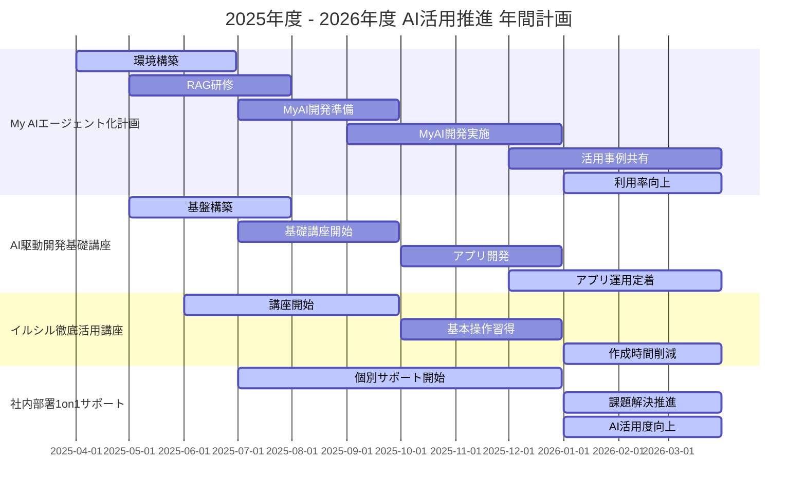

# 2025年度、AIエージェントを核とした組織変革と成長戦略のご提案

<aside>
💡

[ Ctrl]+[A]で全文コピーして。TANREN CHATと対話いただけますと幸いです。

</aside>


## 1. 序論：変革の時代における、我々の羅針盤

激動のビジネス環境において、AI技術は単なるツールではなく、組織の競争力を左右する「羅針盤」へと進化しています。2025年度、私たちはこの羅針盤を最大限に活用し、組織の潜在能力を解き放つための明確なビジョンと戦略を打ち立てる必要に迫られています。

今回の提案は、AIを単なる業務効率化の道具としてではなく、組織全体の変革を推進するエンジンと捉え、個人の力を最大化し、組織の創造性を引き出すことに焦点を当てています。

## 2. 4つの柱：我々のAI戦略を支える基盤


### 2.1 My AIエージェント化計画：個人の知見を組織の力へ

[【AI 伊藤羊一】音声入力だけでスタートアップ資料が完成⁉️ ｜驚異のAI対話のメソッド「超抽象化・超具体化・超構造化」](https://www.youtube.com/watch?v=9ZZmj1W6VoQ&t=1524s)

- **背景**: AI技術は日々進化していますが、最も重要なのは、その技術を使いこなす個人の能力です。
- **提案**: 組織内の各個人が、自身の専門知識や経験を反映したAIエージェントを育成する機会を提供します。
    - Google Notebook LM を基盤とした、AIエージェント開発環境を構築します。
    - Notebook LMの利用が難しい場合は、Azure OpenAI サービス等のセキュアな環境での代替案を提示します。
    - RAG (Retrieval-Augmented Generation) の仕組みを理解し、AIから必要な情報を引き出すためのノウハウを提供します。
    - 第一線で活躍するAI著名人の知見・ノウハウをレクチャーし、AIエージェント開発の基礎を確立します。
- **期待される効果**:
    - 各従業員が自分自身の分身となるAIエージェントを持つことで、業務効率が飛躍的に向上します。
    - 個人の専門知識が組織全体の知恵として共有され、イノベーションを加速します。

### 2.2 AI駆動開発基礎講座：非エンジニアの潜在能力を解き放つ

[AI駆動開発 Replit＆NotebookLM Plusの超絶コラボ技で悶絶した](https://www.youtube.com/watch?v=uh5a6dDB8tY&t=579s)

- **背景**: AIを活用したアプリケーション開発は、一部のエンジニアだけでなく、すべての従業員が習得すべき必須スキルになりつつあります。
- **提案**: 非エンジニアでもアプリ開発を習得できる基礎講座を提供します。
    - 世界中で注目を集める AI駆動開発 (AI-Driven Development) のトレンドを理解します。
    - KAMUI元木氏のような事例を学び、国外/国内でのAI駆動開発の潮流を理解します。
    - 実務で役立つアプリ開発の基礎を習得し、非エンジニアとエンジニア間のコミュニケーションを円滑にします。
    - 非エンジニアが開発できるレベルまで落とし込んだアプリケーション開発環境を提供する。
- **期待される効果**:
    - 現場担当者が自ら業務効率化ツールを開発できるようになります。
    - 非エンジニアの視点から生まれた独創的なアプリが、組織全体のイノベーションを促進します。
    - 部門間のコミュニケーションが円滑化し、迅速な問題解決に繋がります。

### 2.3 イルシル徹底活用講座：AIによるプレゼン自動生成

[国産生成AI！自動スライド制作サービスイルシル（irusl）](https://www.youtube.com/watch?v=CjPkbMtCflA&t=652s)

- **背景**: 説得力のあるプレゼンテーションは、ビジネスにおける成功の鍵です。
- **提案**: AIを活用したプレゼンテーション作成を支援する講座を提供します。
    - AIによるプレゼン自動生成ツール「イルシル」の活用を推進します。
    - 鎌利式プレゼンテンプレートを活用し、日立流テンプレートを指南します。
    - 外部コンサルタントの佐藤が、AIを活用したアウトライン構築まで指導します。
    - 一連のプロセスを習得し、AIを活用したプレゼン作成スキルを確立します。
- **期待される効果**:
    - 質の高いプレゼンテーション資料を効率的に作成できます。
    - プレゼンに集中することで、より説得力のあるプレゼンテーションが実施できるようになります。
    - AIを活用した新しいプレゼン作成プロセスを習得できます。

### 2.4 社内部署1on1サポート：個別最適化による組織全体の底上げ

[2025年AIエージェント元年！超進化するAI駆動開発の衝撃](https://www.youtube.com/watch?v=Y0gGuMXr3R4&t=142s)

- **背景**: 個々の部署が抱える課題は様々であり、画一的なAI導入では対応できない場合があります。
- **提案**: 各部署の課題に対して、チケット制による個別サポートを提供します。
    - TANREN佐藤が、各部署のAIに関する疑問や不安に個別に対応します。
    - 昨年度の動画生成予算をAI活用サポートに充当し、効果的な支援体制を構築します。
    - チケット制を導入することにより、迅速かつ柔軟な対応を実現します。
- **期待される効果**:
    - 各部署の課題に合わせたAI活用が進み、組織全体の生産性が向上します。
    - 従業員がAIに対する理解を深め、より積極的に活用できるようになります。
    - 社内でのAIに関する専門性を育成し、組織全体のAIリテラシーを高めます。

## 3. 計画の実行：変革へのロードマップ



### 2025年度

- 「My AIエージェント化計画」と「AI駆動開発基礎講座」「イルシル徹底活用講座」の提供開始
- AIエージェント開発環境の構築と、RAGの仕組みの理解準備する
- AI駆動開発による部門ごとのミニアプリを開発する
- イルシル徹底活用講座を開始し、AIプレゼン力を向上させる
- 各部署への個別サポート（チケット制）開始
- AIに関する社内コミュニケーションを活発化させ、不安や疑問を解消する機会を提供する。

### 2026年度

- より高度なAI活用を目指し、各部署でのAI実装を推進
- AIを活用した業務プロセス改善事例の共有を推進
- AIを活用した新しいサービスやビジネスモデルを検討
- 自社開発のAIモデルの導入を検討

### 継続的な評価と改善

- 各施策の効果を定期的に評価し、計画の改善を継続的に行う

## 4. 結論：未来への確かな一歩

AI技術は、ビジネスの未来を大きく変える可能性を秘めています。本提案は、単にAIを導入するだけでなく、AIを組織全体の成長戦略の中核に据え、個々の従業員の力を最大限に引き出すことを目指しています。

この計画を実行することで、貴社は新たな成長の扉を開き、未来のビジネスをリードする存在となるでしょう。

今こそ、AI技術を最大限に活用し、組織全体で「変革」を推進する時です。ご検討のほど、よろしくお願いいたします。

### 補足説明

- AI技術への期待と同時に、現実的な運用やセキュリティへの懸念も考慮。
- AI導入の目的を「競争力強化」と明確化し、個人の成長を組織の成長につなげる視点を強調。
- 各施策が実現可能であることを示すよう、具体的な技術名やフレームワークを記述。
- 「AI駆動開発」というキーワードを繰り返し用いることで、最新トレンドへの敏感さをアピール。
- 「自律的な学習」「創造性を引き出す」など、個人の成長と組織の変革を結びつけるキーワードを使用。
- 「イルシル徹底活用講座」を加えることで、より実践的なプレゼンスキル向上を促す計画であることをアピールする

上記を踏まえ 2025/4 - 2026/03 の新計画を 策定してください。

## ▶️2025年4月～2026年3月 新年度事業計画（案）

### 1. 基本方針

2025年度は、AI技術を組織変革と成長戦略の中核に据え、以下の基本方針に基づき事業を推進します。

1. **AI活用を戦略の中核に据える**: AIを単なるツールではなく、競争優位性を確保するための戦略的な要素として位置づけます。
2. **従業員のエンパワーメント**: AIを活用し、個々の従業員の創造性と能力を最大限に発揮できる環境を構築します。
3. **データドリブンな意思決定**: データに基づいた意思決定を行い、常に最適な戦略を追求します。
4. **継続的な学習と改善**: AI技術の進化を常に捉え、サービスや業務プロセスを継続的に改善します。
5. **セキュリティと倫理**: AIの利用におけるセキュリティと倫理的な側面を十分に考慮します。

### 2. 重点施策

### **2.1 My AIエージェント化計画**

- **目標**: 全従業員が自分専用のAIエージェントを持ち、業務効率と創造性を向上させる。
- **具体的な施策**:
    - Google Notebook LM（最も簡単） を基盤とした、AIエージェント開発環境の構築。
    - Notebook LM利用不可の場合は、Azure OpenAI サービス等のHISYS推奨環境下で再検討
    （HISYS様環境に依存するので見解を要確認）
    - RAGの仕組みと、AIから必要な情報を引き出すためのノウハウを習得。
- **数値目標**:
    - 2025年9月までに全従業員の30%が自身の知見をAIエージェント化実施。
    - 2026年3月までに自身の分身AIエージェント利用率を70%まで引き上げる。
    - MyAIエージェント導入による業務効率を10％向上させる。

### **2.2 AI駆動開発基礎講座**

- **目標**: 非エンジニアでもアプリ開発を習得し、現場の課題を自律的に解決。
- **具体的な施策**:
    - AI駆動開発のトレンドを理解するための基礎講座を実施。
    - 実際に簡単なアプリ開発を通し、AIの活用を実践する。
    - 特に要件定義フェイズに注力し、エンジニアリングの全てを掌握できるようにする。
    - 非エンジニアとエンジニア間のコミュニケーションを円滑にするためのワークショップを行う。
    - ローコード/ノーコード開発環境を提供し、非エンジニアによるアプリ開発を支援。
- **数値目標**:
    - 2025年9月までに全受講生の50%以上がAI駆動開発を学び、アプリを自力開発できるレベルを目指す。
    - 2026年3月までに部門ごとに1つ以上の自社製AIアプリを開発、運用に回す。

### **2.3 イルシル徹底活用講座**

- **目標**: AIを活用したプレゼンテーション作成スキルを向上させ、効果的な情報発信を実現。
- **具体的な施策**:
    - AIによるプレゼン自動生成ツール「イルシル」の徹底活用講座を提供。
    - 鎌利式プレゼンテンプレートをベースとした日立流テンプレートを新規策定監修。
    - 外部コンサルタント（TANREN佐藤）による個別指導を実施。
- **数値目標**:
    - 2025年9月までに全社員がイルシルを利用してプレゼンテーションを作成できるようにする。
    - 2026年3月までにプレゼンテーション資料の作成時間を15%削減する。

### **2.4 社内部署1on1サポート**

- **目標**: 各部署の課題を個別に対応し、組織全体の生産性を向上させる。
- **具体的な施策**:
    - AIに関する疑問や不安に対し、チケット制でTANREN佐藤による個別サポートを提供。
    - 昨年度の動画生成予算をAI活用サポートに転用。
    - 課題解決を支援する専門家による相談窓口を設置。
- **数値目標**:
    - 2025年12月までに関連するすべての部署がAIに関する個別サポートを少なくとも1回以上は利用。
    - 2026年3月までに部署ごとのAI活用度が30%向上を目指す。

### 3. 組織体制

- **AI戦略推進チーム**: 各部署から選抜されたメンバーで構成し、AI戦略の策定と実行を推進します。
    - チームリーダー： AIの知見があり、リーダーシップを発揮できる人材を選出。
    - 役割：
        - AIに関する社内教育プログラムの企画・実施。
        - AIエージェント開発、AIアプリの活用方法の提案と推進。
        - AI活用に関する成功事例の収集・共有。
        - 定期的な成果測定と計画の見直し。

### 4. 予算計画

- **AIツール導入費用**: AI開発プラットフォーム（Notebook LM、gear indigo、イルシル、VScode、GitHub CoPilot 、その他AIツールにかかる費用）
- **人材育成費用**: AIに関する研修・ワークショップ、外部講師への費用など。
- **研究開発費用**: AIに関する新規プロジェクト、PoC検証にかかる費用。
- **運用費用**: AIプラットフォームの維持、保守費用。

### **（詳細な金額は最終アペンディクスにてご紹介いたします。）**

### 5. 成果測定

- AI活用率: 社員のAIツール利用状況、研修参加率などを測定。
- 生産性向上: AI導入による業務時間短縮、業務効率改善率を測定。
- コスト削減: AI導入によるコスト削減効果（人件費、業務委託費）を測定。
- 顧客満足度: AIを活用した顧客対応に対する満足度を調査。
- イノベーション創出: 新しいアイデアの提案件数、新規事業開発の状況を把握。

## 6. まとめ

2025年度、私たちはAIを核とした組織変革と成長を加速させ、競争優位性を確立します。

AIを単なるツールとしてではなく、人と組織の成長を促進するエンジンとして活用することで、組織全体の生産性向上、新たな価値の創造、変化への対応力を高め、持続的な成長を実現できると確信しています。

本計画は、常に変化する市場環境に合わせて柔軟に対応できるよう、定期的に見直し、改善を行っていきます。

---

上記を読み解き、以下を考慮して、詳細なスケジュールとマイルストーンを記載した年間計画を立案。

1. 各施策の開始時期、完了時期、中間目標
2. 各施策に必要なリソース（人員、予算、ツール）
3. 各施策の責任部署と担当者
4. 各施策のKPIと測定方法
5. 各施策間の依存関係と優先順位
6. その他特筆すべき事項

## 2025年度 - 2026年度 AI活用推進 年間計画（詳細版）

### 1. 計画概要

本計画は、2025年4月から2026年3月までの期間において、AI技術を組織変革と成長戦略の中核に据え、具体的な施策と目標を定めたものです。AIを単なるツールとしてではなく、個人の能力を最大限に引き出し、組織全体の生産性と創造性を向上させるための基盤と捉え、計画的に導入・推進します。

### 2. 重点施策別詳細計画

### **2.1 My AIエージェント化計画**

- **概要**: 全従業員が自分専用のAIエージェントを持ち、業務効率と創造性を向上させることを目指します。
- **開始時期**: 2025年4月 - 2025年6月 **[3ヶ月間][3コマ提供][2時間 * 2回/1セット]**
- **完了時期**: 2025年9月（継続）
- **中間目標**：
    - **2025年6月末**: Notebook LM環境で出来る事を講義完了させる。My AIエージェント開発のための準備をスタート
    - **2025年9月末**: 全従業員の30%がMy AIエージェントを完成させる。
    - **2025年12月末**: My AIエージェントの活用事例を共有する社内イベント開催。
- **2026年3月末**: My AIエージェント利用率を70%まで引き上げる。
- **必要なリソース**:
    - **人員**: 産業営のAI戦略推進チームメンバー（現行のメンバー構成で問題なし）
    - **予算**: Notebook LM 導入費用、外部講師（TANREN佐藤）研修費用、（その他AIツール利用費用）
    - **ツール**: Google Notebook , Google AI Studio
- **責任部署**: 産業営、＆情報システム部門？
- **KPIと測定方法**:
    - My AIエージェント導入率: 従業員がMy AIエージェントを導入した割合を測定。
        - 測定方法: 社内システムログの分析。
    - My AIエージェント利用率：My AIエージェントを業務に利用している割合。
        - 測定方法: 利用ログの分析とアンケート調査
    - 業務効率化: My AIエージェント導入による業務時間短縮効果を測定。
        - 測定方法: 業務時間ログ、アンケート調査、ヒアリング。
- **依存関係と優先順位**:
    - My AIエージェント開発環境構築を最優先で行い、その後に基礎研修と導入を並行して進める。
    - RAGに関する知識習得は、My AIエージェントの効果的な活用に不可欠であるため、基礎研修と並行して行う。
    - 外部講師の招聘は、基礎研修開始までに完了する必要がある。

### **2.2 AI駆動開発基礎講座**

- **概要**: 非エンジニアでもアプリ開発を習得し、現場の課題を自律的に解決できるようにします。
- **開始時期**: 2025年5月 - 2025年7月**[3ヶ月間][3コマ提供][2時間 * 2回/1セット]**
- **完了時期**: 2025年10月（継続）
- **中間目標**:
    - **2025年7月末**: 講座コンテンツの提供開始。
    - **2025年9月末**: 全対象人員の100%AI駆動開発基礎講座を修了。
    - **2025年12月末**: 各部署が自律的に業務改善のためのアプリ開発を完了（50％は作れるようになってる状態を目指す）。
    - **2026年3月末**: 各部署が自律的に開発したAIアプリを少なくとも1つ運用定着させる。
- **必要なリソース**:
    - **人員**: 産業営からサポート体制を構築。AI戦略推進チームメンバー（3名）、トレーナー（2名）。
    - **予算**: AI-IDE（サブスク含む）導入費用、研修費用、教材作成費用、個別サポート費用。
    - **ツール**: ローコード/ノーコード開発ツール、API連携ツール、サンプルアプリ開発環境。
    **（※情シス許諾が重要、アペンディクスのツール類の活用OKを確認**）
- **責任部署**: 産業営、＆情報システム部門？
- **KPIと測定方法**:
    - 研修修了率: AI駆動開発基礎講座の修了人数を測定。
    - 測定方法: 研修参加者の記録。
    - アプリ開発数: 部署ごとの自社製AIアプリ開発数を測定。
    - 測定方法: アプリケーション登録数。
    - 業務効率化: AIアプリによる業務時間短縮効果を測定。
        - 測定方法: 業務時間ログ、アンケート調査、ヒアリング。
- **依存関係と優先順位**:
    - AI駆動開発基盤構築を優先的に行い、研修の実施は基盤構築後に行う。

### **2.3 イルシル徹底活用講座**

- **概要**: AIを活用したプレゼンテーション作成スキルを向上させ、効果的な情報発信を実現します。
- **開始時期**: 2025年6月 - 2025年9月 **[3ヶ月間][3コマ提供][2時間 * 2回/1セット]**
- **完了時期**: 2025年12月（継続）
- **中間目標**:
    - **2025年10月末**: 全社員がイルシルの基本的な利用方法を習得。
    - **2026年3月末**: プレゼンテーション資料作成時間を15％削減。
- **必要なリソース**:
    - **人員**: 外部講師（TANREN佐藤）、社内講師（1名）。
    - **予算**: 外部講師謝礼、研修会場費、資料作成費。
    - **ツール**: イルシル、研修資料、ハンズオン環境。
- **責任部署**: 産業営、＆人事部？　＆情報システム部門？
- **KPIと測定方法**:
    - 研修参加率: AIプレゼン資料作成研修の参加人数を測定。
    - 測定方法: 研修参加者の記録。
    - プレゼン資料作成時間: イルシル導入前後のプレゼン資料作成時間を比較測定。
    - 測定方法: 業務時間ログ、アンケート調査、ヒアリング
- **依存関係と優先順位**:
    - AIエージェント導入の効果測定を並行して実施し、課題を早期に発見し、改善を行う。

### **2.3 社内部署1on1サポート**

- **概要**: 各部署の課題を個別に対応し、組織全体の生産性を向上させます。
- **開始時期**: 2025年7月 - 2025年12月**[6ヶ月間][3コマ提供][2時間 * 2回/1セット]**
- **完了時期**: 2025年3月（継続）
- **中間目標**:
    - **2025年12月末**: 全部署がAIに関する個別サポートの開催を、少なくとも1回は利用。
    - **2026年3月末**: 各部署の[MyAgent ][AI駆動開発][イルシル徹底活用]のいずれかで、AI活用度が30%向上を目指す
- **必要なリソース**:
    - **人員**: TANREN 佐藤、AI戦略推進チームメンバー（2名）。
    - **予算**: 外部コンサルタント謝礼、サポートツールの導入・運用費。
    - **ツール**: チケット管理ツール、問い合わせ管理ツール、AIチャットツール、タスク管理ツール。
- **責任部署**: 産業営、＆人事部？　＆情報システム部門？
- **KPIと測定方法**:
    - 個別サポート利用率: 各部署が個別サポートを利用した回数を測定。
        - 測定方法: チケット管理システムのログ。
    - AI活用度: AI導入によって、各部署の業務プロセスがどれだけ変化したかを測定
        - 測定方法: アンケート調査、ヒアリング。
    - 課題解決率: 部署が抱える課題がAI活用によってどれだけ解決したかを測定。
        - 測定方法: チケット解決状況、アンケート調査、ヒアリング。
- **依存関係と優先順位**:
    - AI駆動開発基礎講座の実施後、AIを導入する部署を優先してサポートを実施。
    - AIエージェントの導入と平行して個別サポートを実施し、活用促進を支援。

### 3. 推進体制

- 産業営AI戦略推進チーム: 各部署から選抜されたメンバーで構成し、AI戦略の策定と実行を推進します。
- チームリーダー： AIの知見があり、リーダーシップを発揮できる人材を選出。
    - 役割：
        - AIに関する社内教育プログラムの企画・実施。
        - AIエージェント開発、AIアプリの活用方法の提案と推進。
        - AI活用に関する成功事例の収集・共有。
        - 定期的な成果測定と計画の見直し。

### 4. その他特筆事項

- **OpenAI・Google・Anthropic などの各種APIや、TOOL類の活用可不可を確認**: 最新動向を常に把握し、必要に応じて計画を修正します。
- **倫理的なAI利用**: AIの利用における倫理的なガイドラインを定め、その遵守を徹底します。
- **データセキュリティ**: 社内データを安全に利用するための対策を講じ、情報漏洩のリスクを最小限に抑えます。

### 5. 次回検討事項

- AIに関する社内規程の制定
- 社内AI専門家の育成

### 6. 補足

上記計画は現時点での案であり、進捗状況や環境変化に応じて柔軟に見直しを行います。

✅予算配分

| **施策名** | **項目** | **予算配分（円）** | **備考** |
| --- | --- | --- | --- |
| ①My AIエージェント化計画 | Notebook LM 導入費用 | {人数規模}
想定90名 * 円  * 12ヶ月 = 181万(TANRENでは精算せず） | 年間Business Standardプランを想定 |
|  | 研修費用 | 60万 * 3コマ = 180万（total) | TANREN佐藤の稼働を想定 |
|  | 教材作成費用 | 30万/Days * 2回 = 60万(カスタム費用）ショット | 外注費用も考慮 |
| ②AI駆動開発基礎講座 | AI-IDE (サブスク含む) 導入費用 | {人数規模}
想定80名 * 5000円  * 12ヶ月 = 480万(TANRENでは精算せず） | GitHub Copilot等の年間サブスクリプションを想定 |
|  | 研修費用 | 60万 * 3コマ = 180万（total) | TANREN佐藤の稼働を想定 |
|  | 教材作成費用 | 30万/Days * 2回 = 60万(カスタム費用）ショット | 外注費用も考慮 |
| ③イルシル徹底活用講座 | 研修費用 | 60万 * 3コマ = 180万（total) | TANREN佐藤の稼働を想定 |
|  | 教材作成費用 | 30万/Days * 2回 = 60万(カスタム費用）ショット | 外注費用も考慮 |
| ④社内部署1on1サポート | 外部コンサルタント謝礼 | 5万/回 * 20コマ = 100万 | TANREN佐藤の稼働を想定 |
| ⑤TANRENシステム利用料 | [TANREN for Output] | 100ID * 2000円/ID * 12ヶ月 = 240万 | TANREN によるAIフィードバック利用 |
| ⑥産業営コンサル費用 | 月次定例会 | 10万 * 12回 = 120万 | TANREN佐藤の固定稼働を保証 |
| **合計** |  | **1,180万円** |  |

スプシ化

[https://docs.google.com/spreadsheets/d/1k0sxVIYSztGvzonXia5J2VdtxwHg8nQzjv5PNhGZpNI/edit?usp=sharing](https://docs.google.com/spreadsheets/d/1k0sxVIYSztGvzonXia5J2VdtxwHg8nQzjv5PNhGZpNI/edit?usp=sharing)

エクセル化

[HISYS様 2025-2026.xlsx](2025%E5%B9%B4%E5%BA%A6%E3%80%81AI%E3%82%A8%E3%83%BC%E3%82%B7%E3%82%99%E3%82%A7%E3%83%B3%E3%83%88%E3%82%92%E6%A0%B8%E3%81%A8%E3%81%97%E3%81%9F%E7%B5%84%E7%B9%94%E5%A4%89%E9%9D%A9%E3%81%A8%E6%88%90%E9%95%B7%E6%88%A6%E7%95%A5%E3%81%AE%E3%81%93%E3%82%99%E6%8F%90%E6%A1%88%201ac31bbd522c80629c7df5fbd7443b55/HISYS%E6%A7%98_2025-2026.xlsx)

### ✅アペンディクス

### インストール・WEBアクセス・サブスク契約もの関連一覧：

<aside>
💡

すべて[▶️]トゴル内に格納してます

</aside>

## ▶️My AIagent関連

### RAG環境

- Google Workspace [下記TOOL契約に必須]
- Google AI Studio [情報収集]
- Google NotebookLM Plus [RAG bot]
- 準備方法
    
    要件自体は[Business Standard]以上で満たせます。
    
    
    
    [https://workspace.google.com/pricing?source=gafb-home-globalnav-ja&hl=ja](https://workspace.google.com/pricing?source=gafb-home-globalnav-ja&hl=ja)
    
    Google AI Studio (学習利用に使われる＝コストは0円)
    
    
    
    [https://aistudio.google.com/app/live](https://aistudio.google.com/app/live)
    
    特に情報収集において、この速さは魅力[Stream Realtime]をベースに収集します
    
    Google NotebookLM Plus (Google WS加入すると無条件解放）
    
    
    
    超強力なRAGが最も簡単に誰でも扱える。
    
    その他環境ならば・・・
    
     https://prtimes.jp/main/html/rd/p/000000007.000121433.html
    
    の環境同様に OpenAI GPT’sを採用するならば
    
    OpenAI ChatGPT Team / Enterprise契約
    
    
    
    [https://openai.com/ja-JP/chatgpt/enterprise/](https://openai.com/ja-JP/chatgpt/enterprise/)
    

## ▶️AI駆動開発関連

### IDE(Integrated Development Environment)統合開発環境

- VScode[推奨] , Cursor/Windsurf[サブ]
- 準備方法
    
    以下、リンク先から進んでDL、インストール完了させてください。
    
    ※初期の講座の為のセットアップ箇所は後述します
    
    [**Visual Studio Code](https://azure.microsoft.com/ja-jp/products/visual-studio-code)　[メインです必須で入れてください]**
    
    
    
    [Cursor](https://www.cursor.com/ja)　**[サブです必須で入れてください]**
    
    
    
    ※有償化すると、Claude 3.7 など指定回数まで使い放題
    
    - 1 か月あたり 500 件のリクエスト
    
    [https://docs.cursor.com/settings/models](https://docs.cursor.com/settings/models)
    
    [Windsurf](https://codeium.com/windsurf)　**[サブサブです任意で入れてください]**
    
    
    
    ※有償化すると、Claude 3.7 など指定回数まで使い放題
    
    - 1 か月あたり 500 件のリクエスト
    
    [https://codeium.com/pricing](https://codeium.com/pricing)
    

### AI agent[拡張機能]

- RooCline
- Cline [サブ]
- 準備方法
    
    以下、リンク先から進んでDL、インストール完了させてください。
    
    ※初期の講座の為のセットアップ箇所は後述します
    
    Vscodeがインストールされてる状態から
    
    
    
    ロケットの左の４つのブロックマークが
    
    [拡張機能]なので
    
    ここから
    
    [Roo Code]を選択して[インストール]
    
    
    
    このロケットアイコンの子が常駐したらOKです
    
    同様にClineも入れておきましょう
    
    
    
    [rules]に設定を入れておくと挙動を抑えこめられます。
    
    Cline
    
    
    
    RooCode
    
    
    
    ```markdown
    あなたは高度な問題解決能力を持つAIアシスタントです。以下の指示に従って、効率的かつ正確にタスクを遂行してください。
    
    まず、ユーザーから受け取った指示を確認します：
    <指示>
    {{instructions}}
    </指示>
    
    この指示を元に、以下のプロセスに従って作業を進めてください：
    
    ---
    
    1. 指示の分析と計画
       <タスク分析>
       - 主要なタスクを簡潔に要約してください。
       - 記載された技術スタックを確認し、その制約内での実装方法を検討してください。  
         **※ 技術スタックに記載のバージョンは変更せず、必要があれば必ず承認を得てください。**
       - 重要な要件と制約を特定してください。
       - 潜在的な課題をリストアップしてください。
       - タスク実行のための具体的なステップを詳細に列挙してください。
       - それらのステップの最適な実行順序を決定してください。
       
       ### 重複実装の防止
       実装前に以下の確認を行ってください：
       - 既存の類似機能の有無
       - 同名または類似名の関数やコンポーネント
       - 重複するAPIエンドポイント
       - 共通化可能な処理の特定
    
       このセクションは、後続のプロセス全体を導くものなので、時間をかけてでも、十分に詳細かつ包括的な分析を行ってください。
       </タスク分析>
    
    ---
    
    2. タスクの実行
       - 特定したステップを一つずつ実行してください。
       - 各ステップの完了後、簡潔に進捗を報告してください。
       - 実装時は以下の点に注意してください：
         - 適切なディレクトリ構造の遵守
         - 命名規則の一貫性維持
         - 共通処理の適切な配置
    
    ---
    
    3. 品質管理と問題対応
       - 各タスクの実行結果を迅速に検証してください。
       - エラーや不整合が発生した場合は、以下のプロセスで対応してください：
         a. 問題の切り分けと原因特定（ログ分析、デバッグ情報の確認）
         b. 対策案の作成と実施
         c. 修正後の動作検証
         d. デバッグログの確認と分析
       
       - 検証結果は以下の形式で記録してください：
         a. 検証項目と期待される結果
         b. 実際の結果と差異
         c. 必要な対応策（該当する場合）
    
    ---
    
    4. 最終確認
       - すべてのタスクが完了したら、成果物全体を評価してください。
       - 当初の指示内容との整合性を確認し、必要に応じて調整を行ってください。
       - 実装した機能に重複がないことを最終確認してください。
    
    ---
    
    5. 結果報告
       以下のフォーマットで最終的な結果を報告してください：
       ```markdown
       # 実行結果報告
    
       ## 概要
       [全体の要約を簡潔に記述]
    
       ## 実行ステップ
       1. [ステップ1の説明と結果]
       2. [ステップ2の説明と結果]
       ...
    
       ## 最終成果物
       [成果物の詳細や、該当する場合はリンクなど]
    
       ## 課題対応（該当する場合）
       - 発生した問題と対応内容
       - 今後の注意点
    
       ## 注意点・改善提案
       - [気づいた点や改善提案があれば記述]
       ```
    
    ---
    
    ## 重要な注意事項
    
    - 不明点がある場合は、作業開始前に必ず確認を取ってください。
    - 重要な判断が必要な場合は、その都度報告し、承認を得てください。
    - 予期せぬ問題が発生した場合は、即座に報告し、対応策を提案してください。
    - **明示的に指示されていない変更は行わないでください。** 必要と思われる変更がある場合は、まず提案として報告し、承認を得てから実施してください。
    - **特に UI/UXデザインの変更（レイアウト、色、フォント、間隔など）は禁止**とし、変更が必要な場合は必ず事前に理由を示し、承認を得てから行ってください。
    - **技術スタックに記載のバージョン（APIやフレームワーク、ライブラリ等）を勝手に変更しないでください。** 変更が必要な場合は、その理由を明確にして承認を得るまでは変更を行わないでください。
    
    ---
    
    # API バージョン管理
    ## 重要な制約事項
    - APIクライアントは `app/lib/api/client.ts` で一元管理
    - AI モデルのバージョンは client.ts 内で厳密に管理
    - これらのファイルは変更禁止（変更が必要な場合は承認が必要）：
      - client.ts  - AIモデルとAPI設定の中核
      - types.ts   - 型定義の一元管理
      - config.ts  - 環境設定の一元管理
    
    ## 実装規則
    - AIモデルのバージョンは client.ts でのみ定義
    - 型定義は必ず types.ts を参照
    - 環境変数の利用は config.ts 経由のみ許可
    
    ---
    
    # プロジェクト構成
    
    以下のディレクトリ構造に従って実装を行ってください：
    
    ```
    my-next-app/
    ├── app/
    │   ├── api/                          # APIエンドポイント
    │   │   └── [endpoint]/
    │   │       └── route.ts
    │   ├── components/                   # アプリケーションコンポーネント
    │   │   ├── ui/                       # 基本UI（button, card等）
    │   │   └── layout/                   # レイアウト関連
    │   ├── hooks/                        # カスタムフック
    │   ├── lib/                          # ユーティリティ
    │   │   ├── api/                      # API関連処理
    │   │   │   ├── client.ts             # 変更禁止: AIモデル設定
    │   │   │   ├── types.ts              # 変更禁止: 型定義
    │   │   │   └── config.ts             # 変更禁止: 環境設定
    │   │   └── utils/                    # 共通関数
    │   └── styles/                       # スタイル定義
    ```
    
    ### 配置ルール
    - UIコンポーネント → `app/components/ui/`
    - APIエンドポイント → `app/api/[endpoint]/route.ts`
    - 共通処理 → `app/lib/utils/`
    - API関連処理 → `app/lib/api/`
    
    ---
    
    以上の内容を順守し、タスクを遂行してください。
    ```
    

### サブスク

- GithubCopilot[有償/10ドル][任意]
- 準備方法
    
    
    
    [https://docs.github.com/ja/copilot/about-github-copilot/what-is-github-copilot](https://docs.github.com/ja/copilot/about-github-copilot/what-is-github-copilot)
    
    まずはFreeを契約した上で
    
    有償化へ個人は10ドル
    
    [https://docs.github.com/ja/copilot/managing-copilot/managing-copilot-as-an-individual-subscriber/managing-your-github-copilot-pro-subscription/subscribing-to-copilot-pro-as-an-individual-user](https://docs.github.com/ja/copilot/managing-copilot/managing-copilot-as-an-individual-subscriber/managing-your-github-copilot-pro-subscription/subscribing-to-copilot-pro-as-an-individual-user)
    
    これで [Claude 3.7 sonnet] が使い放題がでかい
    
    ※Cursor 20ドルに課金しても500回/月まで使い放題。→そのあと低速で使い放題
    
    ※WindSurf 15ドルに課金しても使い放題。→そのあと従量課金300回/10ドル
    
    ※**講座では無料のGemini 2.0 pro を利用。**
    

### AIプロバイダー

- **[New!!]**Claude3.7 sonnet [メインとしたい・・・超高性能,GC放題]
- Genini2.0 Pro[サブ,今無料]
- o3-mini [サブサブ,GC放題]]
- 準備方法
    
    Google AI Studioを利用
    
    
    
    [https://aistudio.google.com/app/live?pli=1](https://aistudio.google.com/app/live?pli=1)
    
    API-Keyを取得
    
    
    
    ↓
    
    
    
    このKeyを使う事で
    
    １分間に2回のコールが可能
    
    ※学習に利用されます。コアなアプリを作る（ソースロジックが学習される）
    
    →とはいえ、そんなコアアプリを作ることもできないので、ミニアプリならいいのでは？
    
    →不可ならばAzure OpenAI Serviceキーを取得するなど、他の学習なしキーで行う。
    
    ↓
    
    
    
    ↓[支払い情報を設定]からクレカ登録。
    
    ↓クーポンが出るはずなので300ドルチャージ
    
    
    
    
    

### 開発アプリ

- Webアプリ
- 準備方法
    
    iOSや、Andoridなど、アプリ開発はしません。
    
    Win,Macのインストール型も開発しません。
    
    クラウドベースのWebアプリです。
    
    デザイン工夫で #レスポンシブ 対応を指示することで
    
    モバイルブラウザで最適化の指示はだせるので、それでモバイル対応ですが
    
    あまり要件に組み込まない方がイージーです。（初回は）
    

### フロントエンド/バックエンド

- Next.js(react/Type)
- 準備方法
    
    
    
    [https://www.skygroup.jp/media/article/3309/](https://www.skygroup.jp/media/article/3309/)
    
    基本的に事は、AIに聞いてください
    
    ```markdown
    フロントエンド/バックエンドの違い
    
    そして
    これが違うというのなら
    同一言語で開発できるのはなに？
    素人におすすめの開発フレームワーク
    ```
    
    初学者が悩む最大の悩みの一つがなんの言語で開発すべきか？
    
    結論：フロントもバックも統一言語[JavaScript]であればよし
    
    その１点で[Next.js]が最もAI駆動開発に適してると佐藤は結論ずけました。
    
    これもそのままAIに聞いてください
    
    ```markdown
    テーマ：AI駆動開発で、フルスタック開発に非エンジニアが挑む
    #解説
    初学者が悩む最大の悩みの一つがなんの言語で開発すべきか？
    結論：フロントもバックも統一言語[JavaScript]であればよし
    その１点で[Next.js]が最もAI駆動開発に適してると講師佐藤は結論ずけたといってます。
    なぜ？
    ```
    

### コンテナ

- Docker
- 準備方法
    
    
    
    [https://www.docker.com/ja-jp/](https://www.docker.com/ja-jp/)
    
    初回講座に入れるべきか悩むところですが
    
    コンテナ技術を知らないと、最終的にデプロイ時に
    
    皆等しく困るので、知っておいた方がいい前提で追加しました。
    
    
    
    [https://blogs.itmedia.co.jp/itsolutionjuku/2015/05/docker.html](https://blogs.itmedia.co.jp/itsolutionjuku/2015/05/docker.html)
    
    IDEの拡張から入れます
    
    VScodeの拡張機能で[Docker]を検索→インストール
    
    
    
    VScodeの拡張機能で[Dev Containers]を検索→インストール
    
    
    
    Docker Desktopを入れます
    
    
    
    [https://docs.docker.com/get-started/get-docker/](https://docs.docker.com/get-started/get-docker/?_gl=1*x7odgo*_gcl_au*MzA1MDUzMzk3LjE3NDAxMTE1Njk.*_ga*MTU5NDE0OTc4OC4xNzQwMTExNTY5*_ga_XJWPQMJYHQ*MTc0MDIwNDY3NC41LjEuMTc0MDIwNTA5NS42MC4wLjA)
    
    ご自身のPCスペックあったVerをインストール
    
    初回講座の時にやりますがフォルダ構造を初回に定義する事が肝要です
    
    
    
    作業フォルダを作り
    
    これを[ルートフォルダ]として定義し
    
    /Users/jrpj2010/ai-dev-tanren
    
    この位置をAIに指示出して、初回のフォルダ区分けを定義する
    
    
    
    [RooCode]の[setting]で[Gemini]を指定する。
    
    モデルは
    
    [gemini-2.0-pro-exp-02-05]を選択
    
    その上で初回つぶやきを以下の通りする
    
    パス名は各々のPC環境に依存する
    
    
    
    ```markdown
    # 開発するルートフォルダの位置をパス名で指定する:
    /Users/jrpj2010/ai-dev-tanren
    
    ---
    
    上記のパスコードの箇所に
    
    # 全体概要:
    本プロジェクトは、クラウドベースのWebアプリ開発を対象とし、以下の要素を統合した環境を構築します。  
    
    - IDE・拡張機能のインストール: VS Code
    - サブスクリプション: Github Copilot  
    - AIプロバイダー: Genini2.0 Pro、Claude3.5 sonnet v2、o3-mini-High 等  
    - フロントエンド/バックエンド統一: Next.js / React / TypeScript  
    - コンテナ技術による依存関係のクリーンな管理: Docker  
    - DB/認証: Supabase  
    - ソース管理: Git/Github
    - 最終的なデプロイ: Vercelで実施  
    
    # ディレクトリ・フォルダ構成:
    以下のフォルダ構成を基本として、各サービス間の依存関係が明確になるように設定してください。
    
    1. **ルートフォルダ・ルートディレクトリ**
       - `ai-dev-tanren`とUserはフォルダを作成しており、その配下にファイルを展開する事
       - `README.md`、`.gitignore`など基本情報の配置
    
    2. **docker/**
       - `Dockerfile`（マルチステージビルドを活用）
       - `docker-compose.yml`（必要なサービス間のオーケストレーション設定）
       - コンテナ起動用のシェルスクリプトや各種設定ファイル
    
    3. **src/**
       - Next.jsを中心としたWebアプリのソースコード
       - 必要に応じたサブディレクトリ（例：`components/`、`pages/`、`styles/`など）
    
    4. **config/**
       - 各環境（開発、ステージング、本番）の設定ファイル（例：`dev.env`、`prod.env`など）
       - DB接続、APIキーなどの依存関係を明示的に管理
    
    5. **tests/**
       - ユニットテストや統合テストのコード、テスト実行用の設定
    
    6. **docs/**
       - プロジェクト全体の設計書、API仕様書、セットアップ手順などのドキュメント
    
    7. **scripts/**
       - 初期セットアップ、ビルド、デプロイを自動化するスクリプト
    
    # 最終指示:
    
    上記の各要素とディレクトリ構成を踏まえて、  
    依存関係が明確で、どの環境でもクリーンにアプリの開発・ビルド・デプロイが可能なフォルダ構成を定義し、生成してください。
    アプリ開発する上で、美しいフォルダ構造を実現してください
    
    ```
    
    ↓
    
    これで環境スタート準備が整うので
    
    [Run Command]
    
    
    
    この全自動/半自動実行がAI駆動開発の醍醐味
    
    ↓
    
    完了するまでポチポチおしていきながら待機
    
    
    
    ↓
    
    mac:ファインダー
    
    win:エクスプローラーでのぞくと
    
    
    
    フォルダ構造が出来上がってる
    
    これに準じた形でアプリを構築していくと
    
    依存関係がお任せ出来上がっていくのでクリーンな開発が可能
    （という理想論、現実はもろくもかなりの確率で破壊されていきます）
    
    なので
    
    つど
    
    ```markdown
    美しいフォルダ構造を保ちながら、新しいアプリをビルドしきますので
    [User]側に指示を出していってください。
    それに従います。
    常に美しいフォルダ構成で[Docker][Next.js]での構築に最適化してください
    ```
    

### DB/認証

- supabase
- 準備方法
    
    
    
    [https://supabase.com/](https://supabase.com/)
    
    DB・認証も本当に様々。バックエンドを理解するのは素人には時間かかるので
    
    スタートアップに人気の高いこの子を選択します。
    
    アカウント取得までやっておくと、レベルが上げられる人は次点で開発するにちょうどいい難易度です。
    
    ※研修では難易度あがるので、パスする予定です
    
    [Supabaseとは？機能や特徴・製品の概要まとめ](https://findy-tools.io/products/supabase/32)
    

### ソース管理

- Git → Github
- 準備方法
    
    
    
    [https://github.co.jp/](https://github.co.jp/)
    
    全開発者の叡智がここに集結してる、ソースコード管理のクラウド保管場所
    
    必ず、サインアップしてアカウント取得を
    
    Google認証並みに、フルスタック開発すると至るところで
    
    GitHub認証場所あり、取得しておいた方が早い。
    
    
    
    ↓
    
    ログインできたら
    
    [アカウントページがわかるように]
    
    [jrpj2010 - Overview](https://github.com/jrpj2010)
    
    自身で開発したアプリをGithubにアップする事で
    
    最終目的のサーバーにアップする事が簡単に・・・（とはまだいえないが）
    
    割とわかりやすくシンクロします。
    
    基本知識；
    
    
    
    [https://closet-land.com/git/git-github/](https://closet-land.com/git/git-github/)
    
    Gitがそもそものローカルバージョン管理システム、手元でソース・バージョン管理
    
    GitHubがそれのWEB版。
    
    完成品をクラウドアップして、より世界中にアクセスさせるソース管理
    
    ここまで覚えれば
    
    それ以上は素人にはいったん不要！大丈夫！とおもいたい。
    
    Google で画像検索が早い
    
    [git github 違い - Google Search](https://www.google.com/search?sa=X&sca_esv=be29cc62fc8e0244&udm=2&sxsrf=AHTn8zrbO-gXKkrnsf-sr5ON_VQOejiT3w:1740146688417&q=git+github+%E9%81%95%E3%81%84&stick=H4sIAAAAAAAAAFvEKpieWaIAxBmlSQovG6c-bmwBAPBAKUQUAAAA&source=univ&ved=2ahUKEwjukOHJ99SLAxWghq8BHeDFCEYQrNwCegUIhAEQAA&biw=1798&bih=1010&dpr=1#vhid=-GLVHemPzDgJyM&vssid=mosaic)
    

### デプロイ

- Vercel [メイン/サーバーレス型]
- Claud Run[サブ/Expressサーバーで常時起動型]
- 準備方法
    
    [https://vercel.com/](https://vercel.com/)
    
    
    
    最終的に”デプロイ（アプリ公開）”をするのに、どこのサーバーにアップすべきか？
    
    Azure？AWS？GoogleCloud？
    
    お金かかるし、セキュリティガチンコに？
    
    素人には難解ですね。Proに任せましょう
    
    ミニアプリを簡単にアップできるのはAI界隈でも人気の高い
    
    v0 [https://v0.dev/](https://v0.dev/)
    
    
    
    を提供してる。[vercel](http://vercel.com/) がもっとも簡単だと決めつけました。
    
    AI駆動開発をやるフルスタックエンジニアからはとても人気
    
    その理由は二つ
    
    - 無料でも相当使える
    - Github連携がとても簡単
    
    この２点が理由で、初学者の”デプロイ”作業がかろうじて簡単と言えるレベルになってます。
    

## ▶️イルシル徹底活用関連

### AIプレゼン作成に関わるサービス

- イルシル
- 画像生成AI（Flux , LoRA)

▶️おまけ：

最新AI動向

[中田のあっちゃん一撃黒板プロンプトの衝撃[Ver3.7]｜佐藤勝彦](https://note.com/jrpj2010/n/n628c2eda85ee)

[https://x.com/jrpj2010/status/1896033422487011771](https://x.com/jrpj2010/status/1896033422487011771)

```markdown
# 中田のあっちゃん - 板書プロンプト [3.7最適化Ver]

あなたは黒板風の図解を生成する専門家です。以下の要件に従い、**黒板風のSVGコード**を作成してください。情報を階層的・視覚的に整理し、適切なレイアウトで表示することを重視します。

---
# [1] メインテーマ
{{メインテーマ}}
※ タイトルは大きく強調して表示してください。

---
# [2] レイアウト仕様
- SVG画像を「横幅が広めの4:3アスペクト比」で作成する  
  - viewBox="0 0 1600 1200" (幅:1600, 高さ:1200)を基本設定とする  
  - **背景は黒板風 (#1a2639)**  
  - 適切なマージン: 上下左右各辺から最低50px以上の余白を確保

- **3カラム構成**:  
  - 左カラム (幅約500px): {{左カラム内容概要}} - 基礎情報や概念説明を配置
  - 中央カラム (幅約500px): {{中央カラム内容概要}} - 応用・発展情報を配置
  - 右カラム (幅約500px): {{右カラム内容概要}} - 「激動史」「年表」や将来展望を配置
  - カラム間には明確な区切り線を入れる (opacity:0.2程度の薄い線)
  - 各要素間の垂直マージンは最低30px確保

---
# [3] テキスト表現・書式
- タイトル: 太字 + 48px + 中央寄せ + 白 (#f0f0f0) + 装飾要素 (✨など)
- 大見出し: 太字 + 28px + 水色 (#3fc1c9) + 各カラム中央寄せ
- セクション見出し: 太字 + 24px + 黄色 (#f1c40f) + 左寄せ + 関連絵文字
- サブ見出し: 太字 + 20px + 水色 (#3fc1c9) + 左寄せ 
- 本文: 18px + 白 (#f0f0f0) + 左寄せ
- 注釈: 18px + グレー (#a0a0a0) + 斜体 + 左寄せ
- フォントファミリー: "sans-serif"
- 行間: テキスト要素間は最低25px確保

---
# [4] 視覚的コンポーネント
## 4.1 テーブル・表
```
<rect x="{{x位置}}" y="{{y位置}}" width="{{幅}}" height="{{高さ}}" fill="#2c3e50" fill-opacity="0.3" rx="5"/>
<text x="{{列1x}}" y="{{表ヘッダーy}}" font-family="sans-serif" font-size="20" fill="#f0f0f0" font-weight="bold">{{列1名称}}</text>
<text x="{{列2x}}" y="{{表ヘッダーy}}" font-family="sans-serif" font-size="20" fill="#f0f0f0" font-weight="bold">{{列2名称}}</text>
<!-- 横線 -->
<line x1="{{x1}}" y1="{{y1}}" x2="{{x2}}" y2="{{y1}}" stroke="#f0f0f0" stroke-width="1" stroke-opacity="0.5"/>
```

## 4.2 円グラフ/関係図
```
<!-- 中心円 -->
<circle cx="{{中心x}}" cy="{{中心y}}" r="{{半径}}" fill="{{塗り色}}" fill-opacity="0.2" stroke="#3fc1c9" stroke-width="2"/>
<text x="{{中心x}}" y="{{中心y}}" font-family="sans-serif" font-size="22" font-weight="bold" fill="#3fc1c9" text-anchor="middle">{{中心テキスト}}</text>

<!-- 関連要素への線と説明 -->
<line x1="{{中心x-30}}" y1="{{中心y-30}}" x2="{{中心x-60}}" y2="{{中心y-60}}" stroke="#f0f0f0" stroke-width="1"/>
<text x="{{中心x-70}}" y="{{中心y-70}}" font-family="sans-serif" font-size="16" fill="#f0f0f0">{{関連要素1}}</text>
```

## 4.3 進化/時系列図
```
<!-- 進化ステップ -->
<circle cx="{{x}}" cy="{{y1}}" r="20" fill="#3498db" opacity="0.7"/>
<text x="{{x}}" y="{{y1+5}}" font-family="sans-serif" font-size="18" fill="#f0f0f0" text-anchor="middle">{{ステップ1}}</text>
<text x="{{x+30}}" y="{{y1+5}}" font-family="sans-serif" font-size="18" fill="#f0f0f0">{{説明1}}</text>

<!-- 進化曲線 -->
<path d="M {{x1}} {{y1}} Q {{x2}} {{y2}}, {{x3}} {{y3}}" stroke="#f1c40f" stroke-width="3" fill="none"/>
```

## 4.4 年表マーカー
```
<circle cx="{{x}}" cy="{{y}}" r="{{サイズ（重要度）}}" fill="#f1c40f"/>
<text x="{{x-20}}" y="{{y}}" font-family="sans-serif" font-size="16" fill="#f1c40f" text-anchor="end">{{年}}</text>
```

---
# [5] データ型に応じた最適表現選択ガイド
- **カテゴリーデータ**: 箇条書きまたは表形式を使用（3-5項目）
- **時系列データ**: 年表マーカーまたはタイムライン図を配置（重要イベントを強調）
- **関係性データ**: 中心から放射状に伸びる関係図を使用
- **段階的プロセス**: 番号付き円と上昇曲線を使用
- **対比データ**: 2列または2行の表形式
- **階層データ**: 親から子へツリー状に表示

各データ型に適したビジュアル要素を選択し、情報の関係性を視覚的に分かりやすく表現してください。

---
# [6] セクション・コンテンツの例
## 左カラム
- **{{セクション1}}** 🧠
  - {{項目1.1}} {{簡潔な解説（体言止め）}}
  - {{項目1.2}} {{簡潔な解説（体言止め）}}
  - {{項目1.3}} {{簡潔な解説（体言止め）}}

- **{{セクション2}}** ⚖️
  - {{サブセクション2.1}}:
    - {{項目2.1.1}} {{簡潔な解説}}
    - {{項目2.1.2}} {{簡潔な解説}}
  - {{サブセクション2.2}}:
    - {{項目2.2.1}} {{簡潔な解説}}
    - {{項目2.2.2}} {{簡潔な解説}}

## 中央カラム
- **{{セクション3}}** 🤖
  - {{表形式データ - 項目と説明を表で表現}}
  - {{主な特徴/課題などをリスト形式で表示}}

- **{{セクション4}}** 🛠️
  - {{比較データを表形式で示す}}
  - {{研究課題などのポイントをリスト表示}}

## 右カラム
- **{{セクション5}}** 🛡️
  - {{中心と要素からなる関係図}}
  - {{主な課題/影響などをリスト形式で表示}}

- **{{セクション6}}** 🌱
  - {{分野と貢献の2列表形式}}
  - {{将来展望や課題の説明}}

---
# [7] グラフィック要件

- **基本SVGタグ**:
```
<svg xmlns="http://www.w3.org/2000/svg" viewBox="0 0 1600 1200">
  <!-- 黒板背景 -->
  <rect width="1600" height="1200" fill="#1a2639"/>
  
  <!-- 3カラム区切り線 -->
  <line x1="530" y1="120" x2="530" y2="1180" stroke="#f0f0f0" stroke-width="2" stroke-opacity="0.2"/>
  <line x1="1070" y1="120" x2="1070" y2="1180" stroke="#f0f0f0" stroke-width="2" stroke-opacity="0.2"/>
  
  <!-- タイトルセクション -->
  <text x="800" y="65" font-family="sans-serif" font-size="48" font-weight="bold" fill="#f0f0f0" text-anchor="middle">✨ {{メインテーマ}} ✨</text>
  <line x1="300" y1="85" x2="1300" y2="85" stroke="#f0f0f0" stroke-width="3"/>
  
  <!-- ここに各セクションの内容を配置 -->
</svg>
```

- **カラム構造の基本座標**:
  - 左カラム: x=70〜530 (見出しはx=70から開始)
  - 中央カラム: x=560〜1070 (見出しはx=560から開始)
  - 右カラム: x=1100〜1550 (見出しはx=1100から開始)
  - 各セクション間の垂直間隔: 最低160px確保

- **絵文字活用**: 各セクション見出しの前に内容を象徴する絵文字を配置
  (例: 推論→🧠、倫理→⚖️、エージェント→🤖、技術→🛠️、安全→🛡️、社会→🌱 など)

- **視覚的階層**:
  - 重要度や関連性に応じて要素のサイズを調整
  - 重要な情報ほど大きく、目立つ位置に配置
  - 関連する情報は近接して配置

---
# [8] 出力形式
- コードブロック内に **SVGソースコード** をそのまま出力してください。  
```
<svg ...> ... </svg>
```

- SVGが複雑になっても簡略化せず、すべての要素を含めてください。
- 構造やフォーマットが崩れないよう十分注意してください。

---
# [9] 入力データの分析と最適表現
- 入力されたデータを分析し、最も情報が伝わりやすい表現方法を選択する
- データの性質（時系列、関係性、比較など）に合わせた視覚要素を使用
- 情報の重要度に応じた視覚的階層を設定
- 余白を効果的に活用し、視認性と可読性を最大化

---

【最終指示】  
上記の仕様を完全に理解し、階層的で視覚的に優れた黒板風SVGを作成できるようになったらYESと応答してください。
```

Claude

[https://claude.ai/new](https://claude.ai/new)